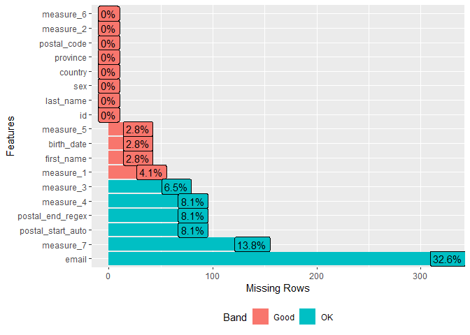
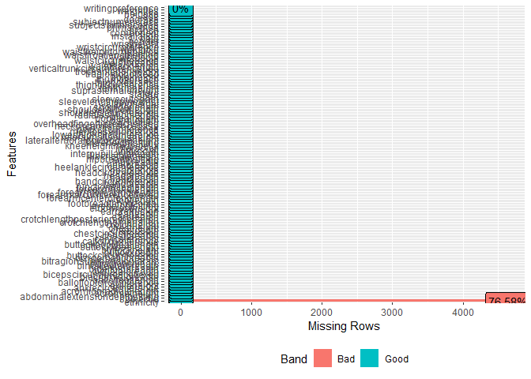
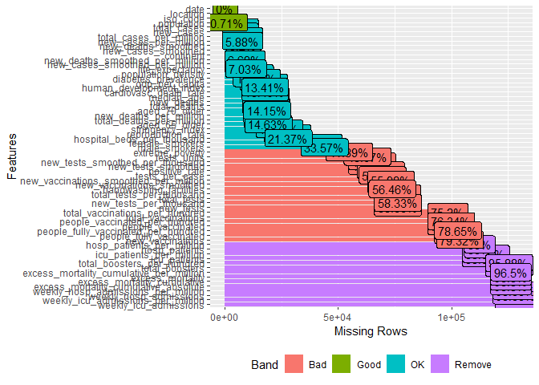
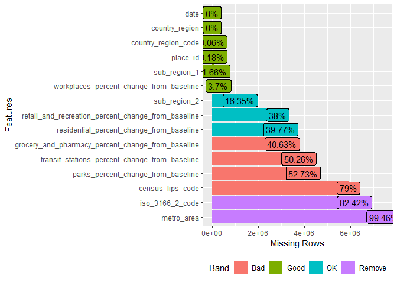

rmd\_test
================
Olivia de Goede
16/11/2021

## Intro

### Package info

These were the packages tested:

-   DataExplorer ([link](http://boxuancui.github.io/DataExplorer/))
-   skimr ([link](https://docs.ropensci.org/skimr/articles/skimr.html))
-   dlookr ([link](https://github.com/choonghyunryu/dlookr))
-   validate
    ([link](https://data-cleaning.github.io/validate/index.html))

All of these are CRAN packages, and they are all available on the HDP
CRAN website. <br /> <br />

## tl;dr

`DataExplorer`, `skimr`, and `dlookr` do fairly similar things (overall
summaries of data, basic initial exploration). Of the three, `dlookr`
was my preference; it had more thorough documentation, generated better
quality plots, and the web report it makes looks a bit more slick than
the ones made by the other packages.

The `validate` package lets the user create rules, and then tests those
rules in the dataset. I can picture us packaging and sharing rules,
e.g. postal code checks, date checks, etc., for users to apply to their
own data that they’ve brought in (there are a couple of options for how
to share rules described in this package’s extensive documentation).
Users could also improve on our rules and suggest new ones that we could
add to our data profiling.

I think a combo of `dlookr` and `validate` would be a good starting
point for data profiling in R. <br /> <br />

## Set-up

### Install packages

``` r
library(DataExplorer)
library(skimr)
library(dlookr)
library(validate)
```

### Toy datasets

I’m mostly using `fake_ppl`, which is a mock dataset I made of 1000 fake
people with some “personal info” and some nonsensical numeric data. It
incorporates some missingness, and the postal codes are deliberately
messy.

`ergo` is from [calmcode](https://calmcode.io/datasets.html), and has a
lot of numeric data that behaves like real data (body measurements of
people). Some missingness.

`owid_covid` is COVID data (number of cases, hospitalizations,
vaccinations, etc.), aggregated by geographic region. It’s from [Our
World in
Data](https://github.com/owid/covid-19-data/tree/master/public/data).

`glob_mob` summarizes global mobility: change in travel during COVID,
aggregated by geographic region. It’s a [Google
dataset](https://www.google.com/covid19/mobility/). It is a very big
dataset, so it’s good for testing the limits of these packages (7.5
million rows).

``` r
fake_ppl <- read_csv(file = "toy_data/mockaroo_edited_MOCK_DATA.csv",
                     show_col_types = FALSE)
ergo <- read_csv(file = "toy_data/calmcode_ergonomics.csv",
                 show_col_types = FALSE)
owid_covid <- read_csv(file = "toy_data/our_world_in_data_covid_data.csv",
                       show_col_types = FALSE)
glob_mob <- read_csv(file = "toy_data/google_Global_Mobility_Report.csv",
                     show_col_types = FALSE)
tibble(dataset = c("fake_ppl", "ergo", "owid_covid", "glob_mob"),
       n_rows = c(nrow(fake_ppl), nrow(ergo), nrow(owid_covid), nrow(glob_mob)), 
       n_cols = c(ncol(fake_ppl), ncol(ergo), ncol(owid_covid), ncol(glob_mob)))
```

    ## # A tibble: 4 x 3
    ##   dataset     n_rows n_cols
    ##   <chr>        <int>  <int>
    ## 1 fake_ppl      1000     18
    ## 2 ergo          6068    108
    ## 3 owid_covid  130813     65
    ## 4 glob_mob   7500160     15

<br /> <br />

## 1. DataExplorer

### Examples of tables and graphs made by this package

`introduce` produces a general overview table of your data:

``` r
introduce(fake_ppl)
```

    ## # A tibble: 1 x 9
    ##    rows columns discrete_columns continuous_columns all_missing_columns
    ##   <int>   <int>            <int>              <int>               <int>
    ## 1  1000      18               13                  5                   0
    ## # ... with 4 more variables: total_missing_values <int>, complete_rows <int>,
    ## #   total_observations <int>, memory_usage <dbl>

``` r
t(introduce(fake_ppl))
```

    ##                        [,1]
    ## rows                   1000
    ## columns                  18
    ## discrete_columns         13
    ## continuous_columns        5
    ## all_missing_columns       0
    ## total_missing_values    897
    ## complete_rows           466
    ## total_observations    18000
    ## memory_usage         466672

``` r
t(introduce(ergo))
```

    ##                         [,1]
    ## rows                    6068
    ## columns                  108
    ## discrete_columns           9
    ## continuous_columns        99
    ## all_missing_columns        0
    ## total_missing_values    4647
    ## complete_rows           1421
    ## total_observations    655344
    ## memory_usage         5324952

``` r
t(introduce(owid_covid))
```

    ##                          [,1]
    ## rows                   130813
    ## columns                    65
    ## discrete_columns            5
    ## continuous_columns         60
    ## all_missing_columns         0
    ## total_missing_values  3799701
    ## complete_rows               0
    ## total_observations    8502845
    ## memory_usage         68066976

``` r
t(introduce(glob_mob))
```

    ##                           [,1]
    ## rows                   7500160
    ## columns                     15
    ## discrete_columns             9
    ## continuous_columns           6
    ## all_missing_columns          0
    ## total_missing_values  37817588
    ## complete_rows                0
    ## total_observations   112502400
    ## memory_usage         902187624

There is also a plot form of this, which you can see in the final
reports, but IMO the table form is more compact and useful.

<br />

`plot_missing` makes a handy plot of the number of missing values for
each field.

``` r
plot_missing(fake_ppl)
```

<!-- -->

``` r
plot_missing(ergo)
```

<!-- -->

``` r
plot_missing(owid_covid)
```

<!-- -->

``` r
plot_missing(glob_mob)
```

<!-- -->

<br />
