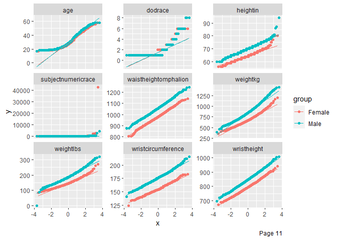

Testing R packages for exploratory data analysis and data profiling
================
Olivia de Goede
05/11/2021

## Intro

### Package info

These were the packages tested:

-   DataExplorer ([link](http://boxuancui.github.io/DataExplorer/))
-   skimr ([link](https://docs.ropensci.org/skimr/articles/skimr.html))
-   dlookr ([link](https://github.com/choonghyunryu/dlookr))
-   validate
    ([link](https://data-cleaning.github.io/validate/index.html))

All of these are CRAN packages, and they are all available on the HDP
CRAN website. <br /> <br />

## tl;dr

`DataExplorer`, `skimr`, and `dlookr` do fairly similar things (overall
summaries of data, basic initial exploration). Of the three, `dlookr`
was my preference; it had more thorough documentation, generated better
quality plots, and the web report it makes looks a bit more slick than
the ones made by the other packages.

The `validate` package lets the user create rules, and then tests those
rules in the dataset. I can picture us packaging and sharing rules,
e.g. postal code checks, date checks, etc., for users to apply to their
own data that they’ve brought in (there are a couple of options for how
to share rules described in this package’s extensive documentation).
Users could also improve on our rules and suggest new ones that we could
add to our data profiling.

I think a combo of `dlookr` and `validate` would be a good starting
point for data profiling in R. <br /> <br />

## Set-up

### Install packages

``` r
library(DataExplorer)
library(skimr)
library(dlookr)
library(validate)
```

### Toy datasets

I’m mostly using `fake_ppl`, which is a mock dataset I made of 1000 fake
people with some “personal info” and some nonsensical numeric data. It
incorporates some missingness, and the postal codes are deliberately
messy.

`ergo` is from [calmcode](https://calmcode.io/datasets.html), and has a
lot of numeric data that behaves like real data (body measurements of
people). Some missingness.

`owid_covid` is COVID data (number of cases, hospitalizations,
vaccinations, etc.), aggregated by geographic region. It’s from [Our
World in
Data](https://github.com/owid/covid-19-data/tree/master/public/data).

`glob_mob` summarizes global mobility: change in travel during COVID,
aggregated by geographic region. It’s a [Google
dataset](https://www.google.com/covid19/mobility/). It is a very big
dataset, so it’s good for testing the limits of these packages (7.5
million rows).

``` r
fake_ppl <- read_csv(file = "toy_data/mockaroo_edited_MOCK_DATA.csv",
                     show_col_types = FALSE)
ergo <- read_csv(file = "toy_data/calmcode_ergonomics.csv",
                 show_col_types = FALSE)
owid_covid <- read_csv(file = "toy_data/our_world_in_data_covid_data.csv",
                       show_col_types = FALSE)
glob_mob <- read_csv(file = "toy_data/google_Global_Mobility_Report.csv",
                     show_col_types = FALSE)
tibble(dataset = c("fake_ppl", "ergo", "owid_covid", "glob_mob"),
       n_rows = c(nrow(fake_ppl), nrow(ergo), nrow(owid_covid), nrow(glob_mob)), 
       n_cols = c(ncol(fake_ppl), ncol(ergo), ncol(owid_covid), ncol(glob_mob)))
```

    ## # A tibble: 4 x 3
    ##   dataset     n_rows n_cols
    ##   <chr>        <int>  <int>
    ## 1 fake_ppl      1000     18
    ## 2 ergo          6068    108
    ## 3 owid_covid  130813     65
    ## 4 glob_mob   7500160     15

<br /> <br />

## 1. DataExplorer

### Examples of tables and graphs made by this package

`introduce` produces a general overview table of your data:

``` r
introduce(fake_ppl)
```

    ## # A tibble: 1 x 9
    ##    rows columns discrete_columns continuous_columns all_missing_columns
    ##   <int>   <int>            <int>              <int>               <int>
    ## 1  1000      18               13                  5                   0
    ## # ... with 4 more variables: total_missing_values <int>, complete_rows <int>,
    ## #   total_observations <int>, memory_usage <dbl>

``` r
t(introduce(fake_ppl))
```

    ##                        [,1]
    ## rows                   1000
    ## columns                  18
    ## discrete_columns         13
    ## continuous_columns        5
    ## all_missing_columns       0
    ## total_missing_values    897
    ## complete_rows           466
    ## total_observations    18000
    ## memory_usage         466672

``` r
t(introduce(ergo))
```

    ##                         [,1]
    ## rows                    6068
    ## columns                  108
    ## discrete_columns           9
    ## continuous_columns        99
    ## all_missing_columns        0
    ## total_missing_values    4647
    ## complete_rows           1421
    ## total_observations    655344
    ## memory_usage         5324952

``` r
t(introduce(owid_covid))
```

    ##                          [,1]
    ## rows                   130813
    ## columns                    65
    ## discrete_columns            5
    ## continuous_columns         60
    ## all_missing_columns         0
    ## total_missing_values  3799701
    ## complete_rows               0
    ## total_observations    8502845
    ## memory_usage         68066976

``` r
t(introduce(glob_mob))
```

    ##                           [,1]
    ## rows                   7500160
    ## columns                     15
    ## discrete_columns             9
    ## continuous_columns           6
    ## all_missing_columns          0
    ## total_missing_values  37817588
    ## complete_rows                0
    ## total_observations   112502400
    ## memory_usage         902187624

There is also a plot form of this, which you can see in the final
reports, but IMO the table form is more compact and useful.

<br />

`plot_missing` makes a handy plot of the number of missing values for
each field.

``` r
plot_missing(fake_ppl)
```

<!-- -->

``` r
plot_missing(ergo)
```

<!-- -->

``` r
plot_missing(owid_covid)
```

<!-- -->

``` r
plot_missing(glob_mob)
```

<!-- -->

<br />

`plot_bar` shows the frequency of categories for each discrete data
element. It ignores columns with &gt;50 categores (this can be
customized). Leaving `glob_mob` out, because of how long it takes to
plot.

``` r
plot_bar(fake_ppl)
```

    ## 8 columns ignored with more than 50 categories.
    ## id: 1000 categories
    ## first_name: 912 categories
    ## last_name: 988 categories
    ## email: 675 categories
    ## postal_code: 919 categories
    ## postal_start_auto: 65 categories
    ## postal_end_regex: 758 categories
    ## birth_date: 962 categories

<!-- -->

``` r
plot_bar(ergo)
```

    ## 4 columns ignored with more than 50 categories.
    ## date: 253 categories
    ## primarymos: 285 categories
    ## subjectsbirthlocation: 152 categories
    ## ethnicity: 210 categories

<!-- -->

``` r
plot_bar(owid_covid)
```

    ## 3 columns ignored with more than 50 categories.
    ## iso_code: 237 categories
    ## location: 237 categories
    ## date: 673 categories

<!-- -->

It can be customized, e.g. group the data by an additional variable, or
plot only a few variables of interest:

``` r
plot_bar(fake_ppl, by = "sex")
```

    ## 8 columns ignored with more than 50 categories.
    ## id: 1000 categories
    ## first_name: 912 categories
    ## last_name: 988 categories
    ## email: 675 categories
    ## postal_code: 919 categories
    ## postal_start_auto: 65 categories
    ## postal_end_regex: 758 categories
    ## birth_date: 962 categories

<!-- -->

``` r
fake_ppl %>%
  select(measure_4, measure_2) %>%
  plot_bar()
```

<!-- -->

<br />

`plot_histogram` shows the distribution of continuous data. Leaving
`glob_mob` out, because of how long it takes to plot.

``` r
plot_histogram(fake_ppl)
```

<!-- -->

``` r
plot_histogram(ergo)
```

<!-- --><!-- --><!-- --><!-- --><!-- --><!-- --><!-- -->

``` r
plot_histogram(owid_covid)
```

<!-- --><!-- --><!-- --><!-- -->

<br />

`plot_qq` compares the data with a given distribution (by default,
normal distribution). Leaving `glob_mob` out, because of how long it
takes to plot.

``` r
plot_qq(fake_ppl)
```

    ## Warning: Removed 244 rows containing non-finite values (stat_qq).

    ## Warning: Removed 244 rows containing non-finite values (stat_qq_line).

<!-- -->

``` r
plot_qq(ergo, by = "gender")
```

<!-- --><!-- --><!-- --><!-- --><!-- --><!-- --><!-- --><!-- --><!-- --><!-- --><!-- -->

``` r
plot_qq(owid_covid)
```

    ## Warning: Removed 90483 rows containing non-finite values (stat_qq).

    ## Warning: Removed 90483 rows containing non-finite values (stat_qq_line).

<!-- -->

    ## Warning: Removed 658423 rows containing non-finite values (stat_qq).

    ## Warning: Removed 658423 rows containing non-finite values (stat_qq_line).

<!-- -->

    ## Warning: Removed 821379 rows containing non-finite values (stat_qq).

    ## Warning: Removed 821379 rows containing non-finite values (stat_qq_line).

<!-- -->

    ## Warning: Removed 840255 rows containing non-finite values (stat_qq).

    ## Warning: Removed 840255 rows containing non-finite values (stat_qq_line).

<!-- -->

    ## Warning: Removed 475784 rows containing non-finite values (stat_qq).

    ## Warning: Removed 475784 rows containing non-finite values (stat_qq_line).

<!-- -->

    ## Warning: Removed 310448 rows containing non-finite values (stat_qq).

    ## Warning: Removed 310448 rows containing non-finite values (stat_qq_line).

<!-- -->

    ## Warning: Removed 531680 rows containing non-finite values (stat_qq).

    ## Warning: Removed 531680 rows containing non-finite values (stat_qq_line).

<!-- -->

<br />

There’s also a correlation heatmap. Showing just for `ergo`, since that
was the only dataset that worked well with this (`fake_ppl` doesn’t have
many variables, `owid_covid` has too much missingness, `glob_mob` is too
big).

``` r
plot_correlation(ergo)
```

    ## 4 features with more than 20 categories ignored!
    ## date: 253 categories
    ## primarymos: 285 categories
    ## subjectsbirthlocation: 152 categories
    ## ethnicity: 210 categories

<!-- -->

<br />

There are also some PCA plotting functions, not sure if that will be
necessary for our purposes. Showing just for `ergo`, since that was the
only dataset that worked well with this (`fake_ppl` doesn’t have many
variables, `owid_covid` has too much missingness, `glob_mob` is too
big).

``` r
plot_prcomp(ergo)
```

    ## 4 features with more than 50 categories ignored!
    ## date: 253 categories
    ## primarymos: 285 categories
    ## subjectsbirthlocation: 152 categories
    ## ethnicity: 210 categories

<!-- --><!-- --><!-- -->

<br />

Plots not shown: boxplots and scatterplots. Could be useful if there’s a
grouping variable of interest (boxplots) or a particularly important
continuous variable that you want to see how everything else stacks up
against (scatterplots) <br /> <br />

### Comments on reports

Example line to make a report (commented out because I’ve already
generated the report, and don’t actually want it to run):

``` r
# create_report(fake_ppl, output_file = "dataexplorer_report_fakeppl.html", output_dir = "output/")
```

Reports for `fake_ppl`, `ergo`, and `owid_covid` were produced and are
in the output directory.

For `glob_mob`, I bumped up the memory limit, and things were going
pretty well. But, after \~10 min, the report quit with an error message
that was related to the data itself, rather than memory limits or time
limits. (“all discrete features ignored! Nothing to plot!”). Basically,
for all categorical variables, there were too many categories for the
`plot_bar()` threshold. Rather than skip the graph and move on, the
report terminated entirely. This approach isn’t very flexible for
running on datasets where you don’t know exactly what the layout is yet.

<br /> <br />

### Main takeaways for DataExplorer

-   CRAN package
-   code is straightforward and interpretable, but limited customization
-   reports are fast with smaller datasets (i.e. a few thousand rows),
    but on the slow side for big ones
-   reports might just fail if a dataset doesn’t conform to the
    package’s requirements (e.g. with `glob_mob`)
-   doesn’t provide many summary stats on continuous data, just plots

<br /> <br />

## 2. skimr

skimr just does summary statistics, in a nice little report. It looks
good, but is fairly limited, and the histogram that is included in the
report has such large bins (and is so small) that I didn’t find them
particularly useful.

Here’s `skim()` on all datasets. For `glob_mob`, it took 3-4 minutes to
run.

``` r
skim(fake_ppl)
```

<table style="width: auto;" class="table table-condensed">
<caption>
Data summary
</caption>
<thead>
<tr>
<th style="text-align:left;">
</th>
<th style="text-align:left;">
</th>
</tr>
</thead>
<tbody>
<tr>
<td style="text-align:left;">
Name
</td>
<td style="text-align:left;">
fake\_ppl
</td>
</tr>
<tr>
<td style="text-align:left;">
Number of rows
</td>
<td style="text-align:left;">
1000
</td>
</tr>
<tr>
<td style="text-align:left;">
Number of columns
</td>
<td style="text-align:left;">
18
</td>
</tr>
<tr>
<td style="text-align:left;">
\_\_\_\_\_\_\_\_\_\_\_\_\_\_\_\_\_\_\_\_\_\_\_
</td>
<td style="text-align:left;">
</td>
</tr>
<tr>
<td style="text-align:left;">
Column type frequency:
</td>
<td style="text-align:left;">
</td>
</tr>
<tr>
<td style="text-align:left;">
character
</td>
<td style="text-align:left;">
10
</td>
</tr>
<tr>
<td style="text-align:left;">
Date
</td>
<td style="text-align:left;">
1
</td>
</tr>
<tr>
<td style="text-align:left;">
logical
</td>
<td style="text-align:left;">
2
</td>
</tr>
<tr>
<td style="text-align:left;">
numeric
</td>
<td style="text-align:left;">
5
</td>
</tr>
<tr>
<td style="text-align:left;">
\_\_\_\_\_\_\_\_\_\_\_\_\_\_\_\_\_\_\_\_\_\_\_\_
</td>
<td style="text-align:left;">
</td>
</tr>
<tr>
<td style="text-align:left;">
Group variables
</td>
<td style="text-align:left;">
None
</td>
</tr>
</tbody>
</table>

**Variable type: character**

<table>
<thead>
<tr>
<th style="text-align:left;">
skim\_variable
</th>
<th style="text-align:right;">
n\_missing
</th>
<th style="text-align:right;">
complete\_rate
</th>
<th style="text-align:right;">
min
</th>
<th style="text-align:right;">
max
</th>
<th style="text-align:right;">
empty
</th>
<th style="text-align:right;">
n\_unique
</th>
<th style="text-align:right;">
whitespace
</th>
</tr>
</thead>
<tbody>
<tr>
<td style="text-align:left;">
id
</td>
<td style="text-align:right;">
0
</td>
<td style="text-align:right;">
1.00
</td>
<td style="text-align:right;">
10
</td>
<td style="text-align:right;">
10
</td>
<td style="text-align:right;">
0
</td>
<td style="text-align:right;">
1000
</td>
<td style="text-align:right;">
0
</td>
</tr>
<tr>
<td style="text-align:left;">
first\_name
</td>
<td style="text-align:right;">
28
</td>
<td style="text-align:right;">
0.97
</td>
<td style="text-align:right;">
2
</td>
<td style="text-align:right;">
11
</td>
<td style="text-align:right;">
0
</td>
<td style="text-align:right;">
911
</td>
<td style="text-align:right;">
0
</td>
</tr>
<tr>
<td style="text-align:left;">
last\_name
</td>
<td style="text-align:right;">
0
</td>
<td style="text-align:right;">
1.00
</td>
<td style="text-align:right;">
3
</td>
<td style="text-align:right;">
14
</td>
<td style="text-align:right;">
0
</td>
<td style="text-align:right;">
988
</td>
<td style="text-align:right;">
0
</td>
</tr>
<tr>
<td style="text-align:left;">
email
</td>
<td style="text-align:right;">
326
</td>
<td style="text-align:right;">
0.67
</td>
<td style="text-align:right;">
13
</td>
<td style="text-align:right;">
35
</td>
<td style="text-align:right;">
0
</td>
<td style="text-align:right;">
674
</td>
<td style="text-align:right;">
0
</td>
</tr>
<tr>
<td style="text-align:left;">
sex
</td>
<td style="text-align:right;">
0
</td>
<td style="text-align:right;">
1.00
</td>
<td style="text-align:right;">
1
</td>
<td style="text-align:right;">
1
</td>
<td style="text-align:right;">
0
</td>
<td style="text-align:right;">
2
</td>
<td style="text-align:right;">
0
</td>
</tr>
<tr>
<td style="text-align:left;">
country
</td>
<td style="text-align:right;">
0
</td>
<td style="text-align:right;">
1.00
</td>
<td style="text-align:right;">
6
</td>
<td style="text-align:right;">
6
</td>
<td style="text-align:right;">
0
</td>
<td style="text-align:right;">
1
</td>
<td style="text-align:right;">
0
</td>
</tr>
<tr>
<td style="text-align:left;">
province
</td>
<td style="text-align:right;">
0
</td>
<td style="text-align:right;">
1.00
</td>
<td style="text-align:right;">
2
</td>
<td style="text-align:right;">
2
</td>
<td style="text-align:right;">
0
</td>
<td style="text-align:right;">
1
</td>
<td style="text-align:right;">
0
</td>
</tr>
<tr>
<td style="text-align:left;">
postal\_code
</td>
<td style="text-align:right;">
0
</td>
<td style="text-align:right;">
1.00
</td>
<td style="text-align:right;">
5
</td>
<td style="text-align:right;">
7
</td>
<td style="text-align:right;">
0
</td>
<td style="text-align:right;">
919
</td>
<td style="text-align:right;">
0
</td>
</tr>
<tr>
<td style="text-align:left;">
postal\_start\_auto
</td>
<td style="text-align:right;">
81
</td>
<td style="text-align:right;">
0.92
</td>
<td style="text-align:right;">
3
</td>
<td style="text-align:right;">
3
</td>
<td style="text-align:right;">
0
</td>
<td style="text-align:right;">
64
</td>
<td style="text-align:right;">
0
</td>
</tr>
<tr>
<td style="text-align:left;">
postal\_end\_regex
</td>
<td style="text-align:right;">
81
</td>
<td style="text-align:right;">
0.92
</td>
<td style="text-align:right;">
3
</td>
<td style="text-align:right;">
3
</td>
<td style="text-align:right;">
0
</td>
<td style="text-align:right;">
757
</td>
<td style="text-align:right;">
0
</td>
</tr>
</tbody>
</table>

**Variable type: Date**

<table>
<thead>
<tr>
<th style="text-align:left;">
skim\_variable
</th>
<th style="text-align:right;">
n\_missing
</th>
<th style="text-align:right;">
complete\_rate
</th>
<th style="text-align:left;">
min
</th>
<th style="text-align:left;">
max
</th>
<th style="text-align:left;">
median
</th>
<th style="text-align:right;">
n\_unique
</th>
</tr>
</thead>
<tbody>
<tr>
<td style="text-align:left;">
birth\_date
</td>
<td style="text-align:right;">
28
</td>
<td style="text-align:right;">
0.97
</td>
<td style="text-align:left;">
1910-04-24
</td>
<td style="text-align:left;">
2010-11-13
</td>
<td style="text-align:left;">
1962-04-21
</td>
<td style="text-align:right;">
961
</td>
</tr>
</tbody>
</table>

**Variable type: logical**

<table>
<thead>
<tr>
<th style="text-align:left;">
skim\_variable
</th>
<th style="text-align:right;">
n\_missing
</th>
<th style="text-align:right;">
complete\_rate
</th>
<th style="text-align:right;">
mean
</th>
<th style="text-align:left;">
count
</th>
</tr>
</thead>
<tbody>
<tr>
<td style="text-align:left;">
measure\_4
</td>
<td style="text-align:right;">
81
</td>
<td style="text-align:right;">
0.92
</td>
<td style="text-align:right;">
0.52
</td>
<td style="text-align:left;">
TRU: 474, FAL: 445
</td>
</tr>
<tr>
<td style="text-align:left;">
measure\_5
</td>
<td style="text-align:right;">
28
</td>
<td style="text-align:right;">
0.97
</td>
<td style="text-align:right;">
0.49
</td>
<td style="text-align:left;">
FAL: 491, TRU: 481
</td>
</tr>
</tbody>
</table>

**Variable type: numeric**

<table>
<thead>
<tr>
<th style="text-align:left;">
skim\_variable
</th>
<th style="text-align:right;">
n\_missing
</th>
<th style="text-align:right;">
complete\_rate
</th>
<th style="text-align:right;">
mean
</th>
<th style="text-align:right;">
sd
</th>
<th style="text-align:right;">
p0
</th>
<th style="text-align:right;">
p25
</th>
<th style="text-align:right;">
p50
</th>
<th style="text-align:right;">
p75
</th>
<th style="text-align:right;">
p100
</th>
<th style="text-align:left;">
hist
</th>
</tr>
</thead>
<tbody>
<tr>
<td style="text-align:left;">
measure\_1
</td>
<td style="text-align:right;">
41
</td>
<td style="text-align:right;">
0.96
</td>
<td style="text-align:right;">
0.70
</td>
<td style="text-align:right;">
0.46
</td>
<td style="text-align:right;">
0
</td>
<td style="text-align:right;">
0
</td>
<td style="text-align:right;">
1
</td>
<td style="text-align:right;">
1.00
</td>
<td style="text-align:right;">
1
</td>
<td style="text-align:left;">
&lt;U+2583&gt;&lt;U+2581&gt;&lt;U+2581&gt;&lt;U+2581&gt;&lt;U+2587&gt;
</td>
</tr>
<tr>
<td style="text-align:left;">
measure\_2
</td>
<td style="text-align:right;">
0
</td>
<td style="text-align:right;">
1.00
</td>
<td style="text-align:right;">
0.12
</td>
<td style="text-align:right;">
0.33
</td>
<td style="text-align:right;">
0
</td>
<td style="text-align:right;">
0
</td>
<td style="text-align:right;">
0
</td>
<td style="text-align:right;">
0.00
</td>
<td style="text-align:right;">
1
</td>
<td style="text-align:left;">
&lt;U+2587&gt;&lt;U+2581&gt;&lt;U+2581&gt;&lt;U+2581&gt;&lt;U+2581&gt;
</td>
</tr>
<tr>
<td style="text-align:left;">
measure\_3
</td>
<td style="text-align:right;">
65
</td>
<td style="text-align:right;">
0.94
</td>
<td style="text-align:right;">
0.36
</td>
<td style="text-align:right;">
0.48
</td>
<td style="text-align:right;">
0
</td>
<td style="text-align:right;">
0
</td>
<td style="text-align:right;">
0
</td>
<td style="text-align:right;">
1.00
</td>
<td style="text-align:right;">
1
</td>
<td style="text-align:left;">
&lt;U+2587&gt;&lt;U+2581&gt;&lt;U+2581&gt;&lt;U+2581&gt;&lt;U+2585&gt;
</td>
</tr>
<tr>
<td style="text-align:left;">
measure\_6
</td>
<td style="text-align:right;">
0
</td>
<td style="text-align:right;">
1.00
</td>
<td style="text-align:right;">
74.86
</td>
<td style="text-align:right;">
14.88
</td>
<td style="text-align:right;">
50
</td>
<td style="text-align:right;">
62
</td>
<td style="text-align:right;">
74
</td>
<td style="text-align:right;">
88.00
</td>
<td style="text-align:right;">
100
</td>
<td style="text-align:left;">
&lt;U+2587&gt;&lt;U+2587&gt;&lt;U+2586&gt;&lt;U+2587&gt;&lt;U+2587&gt;
</td>
</tr>
<tr>
<td style="text-align:left;">
measure\_7
</td>
<td style="text-align:right;">
138
</td>
<td style="text-align:right;">
0.86
</td>
<td style="text-align:right;">
199.98
</td>
<td style="text-align:right;">
28.95
</td>
<td style="text-align:right;">
150
</td>
<td style="text-align:right;">
175
</td>
<td style="text-align:right;">
200
</td>
<td style="text-align:right;">
224.75
</td>
<td style="text-align:right;">
250
</td>
<td style="text-align:left;">
&lt;U+2587&gt;&lt;U+2587&gt;&lt;U+2587&gt;&lt;U+2587&gt;&lt;U+2587&gt;
</td>
</tr>
</tbody>
</table>

``` r
skim(ergo)
```

<table style="width: auto;" class="table table-condensed">
<caption>
Data summary
</caption>
<thead>
<tr>
<th style="text-align:left;">
</th>
<th style="text-align:left;">
</th>
</tr>
</thead>
<tbody>
<tr>
<td style="text-align:left;">
Name
</td>
<td style="text-align:left;">
ergo
</td>
</tr>
<tr>
<td style="text-align:left;">
Number of rows
</td>
<td style="text-align:left;">
6068
</td>
</tr>
<tr>
<td style="text-align:left;">
Number of columns
</td>
<td style="text-align:left;">
108
</td>
</tr>
<tr>
<td style="text-align:left;">
\_\_\_\_\_\_\_\_\_\_\_\_\_\_\_\_\_\_\_\_\_\_\_
</td>
<td style="text-align:left;">
</td>
</tr>
<tr>
<td style="text-align:left;">
Column type frequency:
</td>
<td style="text-align:left;">
</td>
</tr>
<tr>
<td style="text-align:left;">
character
</td>
<td style="text-align:left;">
9
</td>
</tr>
<tr>
<td style="text-align:left;">
numeric
</td>
<td style="text-align:left;">
99
</td>
</tr>
<tr>
<td style="text-align:left;">
\_\_\_\_\_\_\_\_\_\_\_\_\_\_\_\_\_\_\_\_\_\_\_\_
</td>
<td style="text-align:left;">
</td>
</tr>
<tr>
<td style="text-align:left;">
Group variables
</td>
<td style="text-align:left;">
None
</td>
</tr>
</tbody>
</table>

**Variable type: character**

<table>
<thead>
<tr>
<th style="text-align:left;">
skim\_variable
</th>
<th style="text-align:right;">
n\_missing
</th>
<th style="text-align:right;">
complete\_rate
</th>
<th style="text-align:right;">
min
</th>
<th style="text-align:right;">
max
</th>
<th style="text-align:right;">
empty
</th>
<th style="text-align:right;">
n\_unique
</th>
<th style="text-align:right;">
whitespace
</th>
</tr>
</thead>
<tbody>
<tr>
<td style="text-align:left;">
gender
</td>
<td style="text-align:right;">
0
</td>
<td style="text-align:right;">
1.00
</td>
<td style="text-align:right;">
4
</td>
<td style="text-align:right;">
6
</td>
<td style="text-align:right;">
0
</td>
<td style="text-align:right;">
2
</td>
<td style="text-align:right;">
0
</td>
</tr>
<tr>
<td style="text-align:left;">
date
</td>
<td style="text-align:right;">
0
</td>
<td style="text-align:right;">
1.00
</td>
<td style="text-align:right;">
8
</td>
<td style="text-align:right;">
9
</td>
<td style="text-align:right;">
0
</td>
<td style="text-align:right;">
253
</td>
<td style="text-align:right;">
0
</td>
</tr>
<tr>
<td style="text-align:left;">
installation
</td>
<td style="text-align:right;">
0
</td>
<td style="text-align:right;">
1.00
</td>
<td style="text-align:right;">
8
</td>
<td style="text-align:right;">
14
</td>
<td style="text-align:right;">
0
</td>
<td style="text-align:right;">
12
</td>
<td style="text-align:right;">
0
</td>
</tr>
<tr>
<td style="text-align:left;">
component
</td>
<td style="text-align:right;">
0
</td>
<td style="text-align:right;">
1.00
</td>
<td style="text-align:right;">
12
</td>
<td style="text-align:right;">
19
</td>
<td style="text-align:right;">
0
</td>
<td style="text-align:right;">
3
</td>
<td style="text-align:right;">
0
</td>
</tr>
<tr>
<td style="text-align:left;">
branch
</td>
<td style="text-align:right;">
0
</td>
<td style="text-align:right;">
1.00
</td>
<td style="text-align:right;">
11
</td>
<td style="text-align:right;">
22
</td>
<td style="text-align:right;">
0
</td>
<td style="text-align:right;">
3
</td>
<td style="text-align:right;">
0
</td>
</tr>
<tr>
<td style="text-align:left;">
primarymos
</td>
<td style="text-align:right;">
0
</td>
<td style="text-align:right;">
1.00
</td>
<td style="text-align:right;">
3
</td>
<td style="text-align:right;">
4
</td>
<td style="text-align:right;">
0
</td>
<td style="text-align:right;">
285
</td>
<td style="text-align:right;">
0
</td>
</tr>
<tr>
<td style="text-align:left;">
subjectsbirthlocation
</td>
<td style="text-align:right;">
0
</td>
<td style="text-align:right;">
1.00
</td>
<td style="text-align:right;">
4
</td>
<td style="text-align:right;">
24
</td>
<td style="text-align:right;">
0
</td>
<td style="text-align:right;">
152
</td>
<td style="text-align:right;">
0
</td>
</tr>
<tr>
<td style="text-align:left;">
ethnicity
</td>
<td style="text-align:right;">
4647
</td>
<td style="text-align:right;">
0.23
</td>
<td style="text-align:right;">
3
</td>
<td style="text-align:right;">
50
</td>
<td style="text-align:right;">
0
</td>
<td style="text-align:right;">
209
</td>
<td style="text-align:right;">
0
</td>
</tr>
<tr>
<td style="text-align:left;">
writingpreference
</td>
<td style="text-align:right;">
0
</td>
<td style="text-align:right;">
1.00
</td>
<td style="text-align:right;">
9
</td>
<td style="text-align:right;">
27
</td>
<td style="text-align:right;">
0
</td>
<td style="text-align:right;">
3
</td>
<td style="text-align:right;">
0
</td>
</tr>
</tbody>
</table>

**Variable type: numeric**

<table>
<thead>
<tr>
<th style="text-align:left;">
skim\_variable
</th>
<th style="text-align:right;">
n\_missing
</th>
<th style="text-align:right;">
complete\_rate
</th>
<th style="text-align:right;">
mean
</th>
<th style="text-align:right;">
sd
</th>
<th style="text-align:right;">
p0
</th>
<th style="text-align:right;">
p25
</th>
<th style="text-align:right;">
p50
</th>
<th style="text-align:right;">
p75
</th>
<th style="text-align:right;">
p100
</th>
<th style="text-align:left;">
hist
</th>
</tr>
</thead>
<tbody>
<tr>
<td style="text-align:left;">
subjectid
</td>
<td style="text-align:right;">
0
</td>
<td style="text-align:right;">
1
</td>
<td style="text-align:right;">
20757.20
</td>
<td style="text-align:right;">
13159.39
</td>
<td style="text-align:right;">
10027
</td>
<td style="text-align:right;">
14841.75
</td>
<td style="text-align:right;">
20063.5
</td>
<td style="text-align:right;">
27234.50
</td>
<td style="text-align:right;">
920103
</td>
<td style="text-align:left;">
&lt;U+2587&gt;&lt;U+2581&gt;&lt;U+2581&gt;&lt;U+2581&gt;&lt;U+2581&gt;
</td>
</tr>
<tr>
<td style="text-align:left;">
abdominalextensiondepthsitting
</td>
<td style="text-align:right;">
0
</td>
<td style="text-align:right;">
1
</td>
<td style="text-align:right;">
246.47
</td>
<td style="text-align:right;">
37.40
</td>
<td style="text-align:right;">
155
</td>
<td style="text-align:right;">
219.00
</td>
<td style="text-align:right;">
242.0
</td>
<td style="text-align:right;">
271.00
</td>
<td style="text-align:right;">
451
</td>
<td style="text-align:left;">
&lt;U+2583&gt;&lt;U+2587&gt;&lt;U+2583&gt;&lt;U+2581&gt;&lt;U+2581&gt;
</td>
</tr>
<tr>
<td style="text-align:left;">
acromialheight
</td>
<td style="text-align:right;">
0
</td>
<td style="text-align:right;">
1
</td>
<td style="text-align:right;">
1406.16
</td>
<td style="text-align:right;">
79.09
</td>
<td style="text-align:right;">
1115
</td>
<td style="text-align:right;">
1350.00
</td>
<td style="text-align:right;">
1410.0
</td>
<td style="text-align:right;">
1462.00
</td>
<td style="text-align:right;">
1683
</td>
<td style="text-align:left;">
&lt;U+2581&gt;&lt;U+2583&gt;&lt;U+2587&gt;&lt;U+2585&gt;&lt;U+2581&gt;
</td>
</tr>
<tr>
<td style="text-align:left;">
acromionradialelength
</td>
<td style="text-align:right;">
0
</td>
<td style="text-align:right;">
1
</td>
<td style="text-align:right;">
327.37
</td>
<td style="text-align:right;">
20.72
</td>
<td style="text-align:right;">
249
</td>
<td style="text-align:right;">
313.00
</td>
<td style="text-align:right;">
328.0
</td>
<td style="text-align:right;">
341.25
</td>
<td style="text-align:right;">
393
</td>
<td style="text-align:left;">
&lt;U+2581&gt;&lt;U+2582&gt;&lt;U+2587&gt;&lt;U+2585&gt;&lt;U+2581&gt;
</td>
</tr>
<tr>
<td style="text-align:left;">
anklecircumference
</td>
<td style="text-align:right;">
0
</td>
<td style="text-align:right;">
1
</td>
<td style="text-align:right;">
224.89
</td>
<td style="text-align:right;">
16.05
</td>
<td style="text-align:right;">
156
</td>
<td style="text-align:right;">
214.00
</td>
<td style="text-align:right;">
225.0
</td>
<td style="text-align:right;">
235.00
</td>
<td style="text-align:right;">
293
</td>
<td style="text-align:left;">
&lt;U+2581&gt;&lt;U+2582&gt;&lt;U+2587&gt;&lt;U+2582&gt;&lt;U+2581&gt;
</td>
</tr>
<tr>
<td style="text-align:left;">
axillaheight
</td>
<td style="text-align:right;">
0
</td>
<td style="text-align:right;">
1
</td>
<td style="text-align:right;">
1299.61
</td>
<td style="text-align:right;">
72.02
</td>
<td style="text-align:right;">
1038
</td>
<td style="text-align:right;">
1249.00
</td>
<td style="text-align:right;">
1302.0
</td>
<td style="text-align:right;">
1349.00
</td>
<td style="text-align:right;">
1553
</td>
<td style="text-align:left;">
&lt;U+2581&gt;&lt;U+2583&gt;&lt;U+2587&gt;&lt;U+2583&gt;&lt;U+2581&gt;
</td>
</tr>
<tr>
<td style="text-align:left;">
balloffootcircumference
</td>
<td style="text-align:right;">
0
</td>
<td style="text-align:right;">
1
</td>
<td style="text-align:right;">
244.19
</td>
<td style="text-align:right;">
16.85
</td>
<td style="text-align:right;">
186
</td>
<td style="text-align:right;">
232.00
</td>
<td style="text-align:right;">
245.0
</td>
<td style="text-align:right;">
256.00
</td>
<td style="text-align:right;">
306
</td>
<td style="text-align:left;">
&lt;U+2581&gt;&lt;U+2585&gt;&lt;U+2587&gt;&lt;U+2583&gt;&lt;U+2581&gt;
</td>
</tr>
<tr>
<td style="text-align:left;">
balloffootlength
</td>
<td style="text-align:right;">
0
</td>
<td style="text-align:right;">
1
</td>
<td style="text-align:right;">
194.75
</td>
<td style="text-align:right;">
13.52
</td>
<td style="text-align:right;">
151
</td>
<td style="text-align:right;">
185.00
</td>
<td style="text-align:right;">
195.0
</td>
<td style="text-align:right;">
204.00
</td>
<td style="text-align:right;">
245
</td>
<td style="text-align:left;">
&lt;U+2581&gt;&lt;U+2585&gt;&lt;U+2587&gt;&lt;U+2582&gt;&lt;U+2581&gt;
</td>
</tr>
<tr>
<td style="text-align:left;">
biacromialbreadth
</td>
<td style="text-align:right;">
0
</td>
<td style="text-align:right;">
1
</td>
<td style="text-align:right;">
399.20
</td>
<td style="text-align:right;">
30.24
</td>
<td style="text-align:right;">
283
</td>
<td style="text-align:right;">
376.00
</td>
<td style="text-align:right;">
404.0
</td>
<td style="text-align:right;">
421.00
</td>
<td style="text-align:right;">
489
</td>
<td style="text-align:left;">
&lt;U+2581&gt;&lt;U+2583&gt;&lt;U+2587&gt;&lt;U+2587&gt;&lt;U+2581&gt;
</td>
</tr>
<tr>
<td style="text-align:left;">
bicepscircumferenceflexed
</td>
<td style="text-align:right;">
0
</td>
<td style="text-align:right;">
1
</td>
<td style="text-align:right;">
340.93
</td>
<td style="text-align:right;">
41.52
</td>
<td style="text-align:right;">
216
</td>
<td style="text-align:right;">
311.00
</td>
<td style="text-align:right;">
341.0
</td>
<td style="text-align:right;">
370.00
</td>
<td style="text-align:right;">
490
</td>
<td style="text-align:left;">
&lt;U+2581&gt;&lt;U+2586&gt;&lt;U+2587&gt;&lt;U+2583&gt;&lt;U+2581&gt;
</td>
</tr>
<tr>
<td style="text-align:left;">
bicristalbreadth
</td>
<td style="text-align:right;">
0
</td>
<td style="text-align:right;">
1
</td>
<td style="text-align:right;">
274.74
</td>
<td style="text-align:right;">
19.22
</td>
<td style="text-align:right;">
197
</td>
<td style="text-align:right;">
262.00
</td>
<td style="text-align:right;">
274.0
</td>
<td style="text-align:right;">
288.00
</td>
<td style="text-align:right;">
362
</td>
<td style="text-align:left;">
&lt;U+2581&gt;&lt;U+2583&gt;&lt;U+2587&gt;&lt;U+2582&gt;&lt;U+2581&gt;
</td>
</tr>
<tr>
<td style="text-align:left;">
bideltoidbreadth
</td>
<td style="text-align:right;">
0
</td>
<td style="text-align:right;">
1
</td>
<td style="text-align:right;">
490.75
</td>
<td style="text-align:right;">
42.14
</td>
<td style="text-align:right;">
357
</td>
<td style="text-align:right;">
460.00
</td>
<td style="text-align:right;">
492.0
</td>
<td style="text-align:right;">
520.00
</td>
<td style="text-align:right;">
637
</td>
<td style="text-align:left;">
&lt;U+2581&gt;&lt;U+2585&gt;&lt;U+2587&gt;&lt;U+2583&gt;&lt;U+2581&gt;
</td>
</tr>
<tr>
<td style="text-align:left;">
bimalleolarbreadth
</td>
<td style="text-align:right;">
0
</td>
<td style="text-align:right;">
1
</td>
<td style="text-align:right;">
72.25
</td>
<td style="text-align:right;">
5.34
</td>
<td style="text-align:right;">
55
</td>
<td style="text-align:right;">
68.00
</td>
<td style="text-align:right;">
72.0
</td>
<td style="text-align:right;">
76.00
</td>
<td style="text-align:right;">
91
</td>
<td style="text-align:left;">
&lt;U+2581&gt;&lt;U+2585&gt;&lt;U+2587&gt;&lt;U+2583&gt;&lt;U+2581&gt;
</td>
</tr>
<tr>
<td style="text-align:left;">
bitragionchinarc
</td>
<td style="text-align:right;">
0
</td>
<td style="text-align:right;">
1
</td>
<td style="text-align:right;">
324.90
</td>
<td style="text-align:right;">
17.09
</td>
<td style="text-align:right;">
267
</td>
<td style="text-align:right;">
314.00
</td>
<td style="text-align:right;">
326.0
</td>
<td style="text-align:right;">
336.00
</td>
<td style="text-align:right;">
385
</td>
<td style="text-align:left;">
&lt;U+2581&gt;&lt;U+2583&gt;&lt;U+2587&gt;&lt;U+2583&gt;&lt;U+2581&gt;
</td>
</tr>
<tr>
<td style="text-align:left;">
bitragionsubmandibulararc
</td>
<td style="text-align:right;">
0
</td>
<td style="text-align:right;">
1
</td>
<td style="text-align:right;">
306.64
</td>
<td style="text-align:right;">
20.79
</td>
<td style="text-align:right;">
245
</td>
<td style="text-align:right;">
292.00
</td>
<td style="text-align:right;">
307.0
</td>
<td style="text-align:right;">
321.00
</td>
<td style="text-align:right;">
390
</td>
<td style="text-align:left;">
&lt;U+2581&gt;&lt;U+2586&gt;&lt;U+2587&gt;&lt;U+2582&gt;&lt;U+2581&gt;
</td>
</tr>
<tr>
<td style="text-align:left;">
bizygomaticbreadth
</td>
<td style="text-align:right;">
0
</td>
<td style="text-align:right;">
1
</td>
<td style="text-align:right;">
139.72
</td>
<td style="text-align:right;">
7.31
</td>
<td style="text-align:right;">
116
</td>
<td style="text-align:right;">
135.00
</td>
<td style="text-align:right;">
140.0
</td>
<td style="text-align:right;">
145.00
</td>
<td style="text-align:right;">
174
</td>
<td style="text-align:left;">
&lt;U+2581&gt;&lt;U+2587&gt;&lt;U+2587&gt;&lt;U+2581&gt;&lt;U+2581&gt;
</td>
</tr>
<tr>
<td style="text-align:left;">
buttockcircumference
</td>
<td style="text-align:right;">
0
</td>
<td style="text-align:right;">
1
</td>
<td style="text-align:right;">
1020.08
</td>
<td style="text-align:right;">
76.42
</td>
<td style="text-align:right;">
737
</td>
<td style="text-align:right;">
968.00
</td>
<td style="text-align:right;">
1017.0
</td>
<td style="text-align:right;">
1068.00
</td>
<td style="text-align:right;">
1341
</td>
<td style="text-align:left;">
&lt;U+2581&gt;&lt;U+2585&gt;&lt;U+2587&gt;&lt;U+2582&gt;&lt;U+2581&gt;
</td>
</tr>
<tr>
<td style="text-align:left;">
buttockdepth
</td>
<td style="text-align:right;">
0
</td>
<td style="text-align:right;">
1
</td>
<td style="text-align:right;">
241.62
</td>
<td style="text-align:right;">
26.48
</td>
<td style="text-align:right;">
168
</td>
<td style="text-align:right;">
222.00
</td>
<td style="text-align:right;">
241.0
</td>
<td style="text-align:right;">
259.00
</td>
<td style="text-align:right;">
349
</td>
<td style="text-align:left;">
&lt;U+2581&gt;&lt;U+2587&gt;&lt;U+2587&gt;&lt;U+2582&gt;&lt;U+2581&gt;
</td>
</tr>
<tr>
<td style="text-align:left;">
buttockheight
</td>
<td style="text-align:right;">
0
</td>
<td style="text-align:right;">
1
</td>
<td style="text-align:right;">
870.15
</td>
<td style="text-align:right;">
54.82
</td>
<td style="text-align:right;">
656
</td>
<td style="text-align:right;">
832.00
</td>
<td style="text-align:right;">
868.0
</td>
<td style="text-align:right;">
906.25
</td>
<td style="text-align:right;">
1080
</td>
<td style="text-align:left;">
&lt;U+2581&gt;&lt;U+2583&gt;&lt;U+2587&gt;&lt;U+2583&gt;&lt;U+2581&gt;
</td>
</tr>
<tr>
<td style="text-align:left;">
buttockkneelength
</td>
<td style="text-align:right;">
0
</td>
<td style="text-align:right;">
1
</td>
<td style="text-align:right;">
609.00
</td>
<td style="text-align:right;">
33.79
</td>
<td style="text-align:right;">
466
</td>
<td style="text-align:right;">
586.00
</td>
<td style="text-align:right;">
609.0
</td>
<td style="text-align:right;">
632.00
</td>
<td style="text-align:right;">
736
</td>
<td style="text-align:left;">
&lt;U+2581&gt;&lt;U+2582&gt;&lt;U+2587&gt;&lt;U+2583&gt;&lt;U+2581&gt;
</td>
</tr>
<tr>
<td style="text-align:left;">
buttockpopliteallength
</td>
<td style="text-align:right;">
0
</td>
<td style="text-align:right;">
1
</td>
<td style="text-align:right;">
497.10
</td>
<td style="text-align:right;">
29.08
</td>
<td style="text-align:right;">
367
</td>
<td style="text-align:right;">
477.00
</td>
<td style="text-align:right;">
497.0
</td>
<td style="text-align:right;">
517.00
</td>
<td style="text-align:right;">
605
</td>
<td style="text-align:left;">
&lt;U+2581&gt;&lt;U+2582&gt;&lt;U+2587&gt;&lt;U+2585&gt;&lt;U+2581&gt;
</td>
</tr>
<tr>
<td style="text-align:left;">
calfcircumference
</td>
<td style="text-align:right;">
0
</td>
<td style="text-align:right;">
1
</td>
<td style="text-align:right;">
386.04
</td>
<td style="text-align:right;">
30.65
</td>
<td style="text-align:right;">
266
</td>
<td style="text-align:right;">
364.75
</td>
<td style="text-align:right;">
385.0
</td>
<td style="text-align:right;">
406.00
</td>
<td style="text-align:right;">
523
</td>
<td style="text-align:left;">
&lt;U+2581&gt;&lt;U+2585&gt;&lt;U+2587&gt;&lt;U+2582&gt;&lt;U+2581&gt;
</td>
</tr>
<tr>
<td style="text-align:left;">
cervicaleheight
</td>
<td style="text-align:right;">
0
</td>
<td style="text-align:right;">
1
</td>
<td style="text-align:right;">
1477.49
</td>
<td style="text-align:right;">
84.32
</td>
<td style="text-align:right;">
1184
</td>
<td style="text-align:right;">
1418.00
</td>
<td style="text-align:right;">
1484.0
</td>
<td style="text-align:right;">
1537.00
</td>
<td style="text-align:right;">
1738
</td>
<td style="text-align:left;">
&lt;U+2581&gt;&lt;U+2583&gt;&lt;U+2587&gt;&lt;U+2586&gt;&lt;U+2581&gt;
</td>
</tr>
<tr>
<td style="text-align:left;">
chestbreadth
</td>
<td style="text-align:right;">
0
</td>
<td style="text-align:right;">
1
</td>
<td style="text-align:right;">
282.86
</td>
<td style="text-align:right;">
20.66
</td>
<td style="text-align:right;">
213
</td>
<td style="text-align:right;">
268.00
</td>
<td style="text-align:right;">
283.0
</td>
<td style="text-align:right;">
297.00
</td>
<td style="text-align:right;">
363
</td>
<td style="text-align:left;">
&lt;U+2581&gt;&lt;U+2585&gt;&lt;U+2587&gt;&lt;U+2582&gt;&lt;U+2581&gt;
</td>
</tr>
<tr>
<td style="text-align:left;">
chestcircumference
</td>
<td style="text-align:right;">
0
</td>
<td style="text-align:right;">
1
</td>
<td style="text-align:right;">
1022.10
</td>
<td style="text-align:right;">
100.67
</td>
<td style="text-align:right;">
695
</td>
<td style="text-align:right;">
949.00
</td>
<td style="text-align:right;">
1020.5
</td>
<td style="text-align:right;">
1092.00
</td>
<td style="text-align:right;">
1469
</td>
<td style="text-align:left;">
&lt;U+2581&gt;&lt;U+2587&gt;&lt;U+2587&gt;&lt;U+2582&gt;&lt;U+2581&gt;
</td>
</tr>
<tr>
<td style="text-align:left;">
chestdepth
</td>
<td style="text-align:right;">
0
</td>
<td style="text-align:right;">
1
</td>
<td style="text-align:right;">
251.74
</td>
<td style="text-align:right;">
26.78
</td>
<td style="text-align:right;">
170
</td>
<td style="text-align:right;">
233.00
</td>
<td style="text-align:right;">
251.0
</td>
<td style="text-align:right;">
270.00
</td>
<td style="text-align:right;">
383
</td>
<td style="text-align:left;">
&lt;U+2581&gt;&lt;U+2587&gt;&lt;U+2586&gt;&lt;U+2581&gt;&lt;U+2581&gt;
</td>
</tr>
<tr>
<td style="text-align:left;">
chestheight
</td>
<td style="text-align:right;">
0
</td>
<td style="text-align:right;">
1
</td>
<td style="text-align:right;">
1252.01
</td>
<td style="text-align:right;">
79.58
</td>
<td style="text-align:right;">
984
</td>
<td style="text-align:right;">
1196.00
</td>
<td style="text-align:right;">
1259.0
</td>
<td style="text-align:right;">
1309.00
</td>
<td style="text-align:right;">
1506
</td>
<td style="text-align:left;">
&lt;U+2581&gt;&lt;U+2583&gt;&lt;U+2587&gt;&lt;U+2585&gt;&lt;U+2581&gt;
</td>
</tr>
<tr>
<td style="text-align:left;">
crotchheight
</td>
<td style="text-align:right;">
0
</td>
<td style="text-align:right;">
1
</td>
<td style="text-align:right;">
825.11
</td>
<td style="text-align:right;">
54.75
</td>
<td style="text-align:right;">
610
</td>
<td style="text-align:right;">
787.00
</td>
<td style="text-align:right;">
825.0
</td>
<td style="text-align:right;">
863.00
</td>
<td style="text-align:right;">
1031
</td>
<td style="text-align:left;">
&lt;U+2581&gt;&lt;U+2583&gt;&lt;U+2587&gt;&lt;U+2583&gt;&lt;U+2581&gt;
</td>
</tr>
<tr>
<td style="text-align:left;">
crotchlengthomphalion
</td>
<td style="text-align:right;">
0
</td>
<td style="text-align:right;">
1
</td>
<td style="text-align:right;">
621.85
</td>
<td style="text-align:right;">
45.33
</td>
<td style="text-align:right;">
473
</td>
<td style="text-align:right;">
590.00
</td>
<td style="text-align:right;">
620.0
</td>
<td style="text-align:right;">
651.00
</td>
<td style="text-align:right;">
799
</td>
<td style="text-align:left;">
&lt;U+2581&gt;&lt;U+2586&gt;&lt;U+2587&gt;&lt;U+2582&gt;&lt;U+2581&gt;
</td>
</tr>
<tr>
<td style="text-align:left;">
crotchlengthposterioromphalion
</td>
<td style="text-align:right;">
0
</td>
<td style="text-align:right;">
1
</td>
<td style="text-align:right;">
351.32
</td>
<td style="text-align:right;">
29.94
</td>
<td style="text-align:right;">
243
</td>
<td style="text-align:right;">
330.00
</td>
<td style="text-align:right;">
350.0
</td>
<td style="text-align:right;">
372.00
</td>
<td style="text-align:right;">
468
</td>
<td style="text-align:left;">
&lt;U+2581&gt;&lt;U+2585&gt;&lt;U+2587&gt;&lt;U+2582&gt;&lt;U+2581&gt;
</td>
</tr>
<tr>
<td style="text-align:left;">
earbreadth
</td>
<td style="text-align:right;">
0
</td>
<td style="text-align:right;">
1
</td>
<td style="text-align:right;">
35.13
</td>
<td style="text-align:right;">
3.23
</td>
<td style="text-align:right;">
25
</td>
<td style="text-align:right;">
33.00
</td>
<td style="text-align:right;">
35.0
</td>
<td style="text-align:right;">
37.00
</td>
<td style="text-align:right;">
46
</td>
<td style="text-align:left;">
&lt;U+2581&gt;&lt;U+2585&gt;&lt;U+2587&gt;&lt;U+2583&gt;&lt;U+2581&gt;
</td>
</tr>
<tr>
<td style="text-align:left;">
earlength
</td>
<td style="text-align:right;">
0
</td>
<td style="text-align:right;">
1
</td>
<td style="text-align:right;">
62.63
</td>
<td style="text-align:right;">
4.88
</td>
<td style="text-align:right;">
46
</td>
<td style="text-align:right;">
59.00
</td>
<td style="text-align:right;">
62.0
</td>
<td style="text-align:right;">
66.00
</td>
<td style="text-align:right;">
81
</td>
<td style="text-align:left;">
&lt;U+2581&gt;&lt;U+2586&gt;&lt;U+2587&gt;&lt;U+2582&gt;&lt;U+2581&gt;
</td>
</tr>
<tr>
<td style="text-align:left;">
earprotrusion
</td>
<td style="text-align:right;">
0
</td>
<td style="text-align:right;">
1
</td>
<td style="text-align:right;">
22.26
</td>
<td style="text-align:right;">
3.17
</td>
<td style="text-align:right;">
13
</td>
<td style="text-align:right;">
20.00
</td>
<td style="text-align:right;">
22.0
</td>
<td style="text-align:right;">
24.00
</td>
<td style="text-align:right;">
34
</td>
<td style="text-align:left;">
&lt;U+2581&gt;&lt;U+2587&gt;&lt;U+2587&gt;&lt;U+2582&gt;&lt;U+2581&gt;
</td>
</tr>
<tr>
<td style="text-align:left;">
elbowrestheight
</td>
<td style="text-align:right;">
0
</td>
<td style="text-align:right;">
1
</td>
<td style="text-align:right;">
240.91
</td>
<td style="text-align:right;">
28.51
</td>
<td style="text-align:right;">
138
</td>
<td style="text-align:right;">
222.00
</td>
<td style="text-align:right;">
241.0
</td>
<td style="text-align:right;">
261.00
</td>
<td style="text-align:right;">
345
</td>
<td style="text-align:left;">
&lt;U+2581&gt;&lt;U+2583&gt;&lt;U+2587&gt;&lt;U+2583&gt;&lt;U+2581&gt;
</td>
</tr>
<tr>
<td style="text-align:left;">
eyeheightsitting
</td>
<td style="text-align:right;">
0
</td>
<td style="text-align:right;">
1
</td>
<td style="text-align:right;">
785.91
</td>
<td style="text-align:right;">
41.87
</td>
<td style="text-align:right;">
654
</td>
<td style="text-align:right;">
757.00
</td>
<td style="text-align:right;">
787.0
</td>
<td style="text-align:right;">
815.00
</td>
<td style="text-align:right;">
912
</td>
<td style="text-align:left;">
&lt;U+2581&gt;&lt;U+2585&gt;&lt;U+2587&gt;&lt;U+2585&gt;&lt;U+2581&gt;
</td>
</tr>
<tr>
<td style="text-align:left;">
footbreadthhorizontal
</td>
<td style="text-align:right;">
0
</td>
<td style="text-align:right;">
1
</td>
<td style="text-align:right;">
98.87
</td>
<td style="text-align:right;">
6.66
</td>
<td style="text-align:right;">
77
</td>
<td style="text-align:right;">
94.00
</td>
<td style="text-align:right;">
99.0
</td>
<td style="text-align:right;">
104.00
</td>
<td style="text-align:right;">
126
</td>
<td style="text-align:left;">
&lt;U+2581&gt;&lt;U+2585&gt;&lt;U+2587&gt;&lt;U+2582&gt;&lt;U+2581&gt;
</td>
</tr>
<tr>
<td style="text-align:left;">
footlength
</td>
<td style="text-align:right;">
0
</td>
<td style="text-align:right;">
1
</td>
<td style="text-align:right;">
263.03
</td>
<td style="text-align:right;">
17.39
</td>
<td style="text-align:right;">
198
</td>
<td style="text-align:right;">
251.00
</td>
<td style="text-align:right;">
264.0
</td>
<td style="text-align:right;">
276.00
</td>
<td style="text-align:right;">
323
</td>
<td style="text-align:left;">
&lt;U+2581&gt;&lt;U+2583&gt;&lt;U+2587&gt;&lt;U+2585&gt;&lt;U+2581&gt;
</td>
</tr>
<tr>
<td style="text-align:left;">
forearmcenterofgriplength
</td>
<td style="text-align:right;">
0
</td>
<td style="text-align:right;">
1
</td>
<td style="text-align:right;">
338.77
</td>
<td style="text-align:right;">
23.24
</td>
<td style="text-align:right;">
258
</td>
<td style="text-align:right;">
322.00
</td>
<td style="text-align:right;">
340.0
</td>
<td style="text-align:right;">
355.00
</td>
<td style="text-align:right;">
416
</td>
<td style="text-align:left;">
&lt;U+2581&gt;&lt;U+2583&gt;&lt;U+2587&gt;&lt;U+2585&gt;&lt;U+2581&gt;
</td>
</tr>
<tr>
<td style="text-align:left;">
forearmcircumferenceflexed
</td>
<td style="text-align:right;">
0
</td>
<td style="text-align:right;">
1
</td>
<td style="text-align:right;">
295.01
</td>
<td style="text-align:right;">
30.05
</td>
<td style="text-align:right;">
200
</td>
<td style="text-align:right;">
272.00
</td>
<td style="text-align:right;">
297.0
</td>
<td style="text-align:right;">
317.00
</td>
<td style="text-align:right;">
402
</td>
<td style="text-align:left;">
&lt;U+2581&gt;&lt;U+2585&gt;&lt;U+2587&gt;&lt;U+2583&gt;&lt;U+2581&gt;
</td>
</tr>
<tr>
<td style="text-align:left;">
forearmforearmbreadth
</td>
<td style="text-align:right;">
0
</td>
<td style="text-align:right;">
1
</td>
<td style="text-align:right;">
552.08
</td>
<td style="text-align:right;">
62.37
</td>
<td style="text-align:right;">
376
</td>
<td style="text-align:right;">
505.00
</td>
<td style="text-align:right;">
553.0
</td>
<td style="text-align:right;">
597.00
</td>
<td style="text-align:right;">
778
</td>
<td style="text-align:left;">
&lt;U+2581&gt;&lt;U+2586&gt;&lt;U+2587&gt;&lt;U+2582&gt;&lt;U+2581&gt;
</td>
</tr>
<tr>
<td style="text-align:left;">
forearmhandlength
</td>
<td style="text-align:right;">
0
</td>
<td style="text-align:right;">
1
</td>
<td style="text-align:right;">
467.01
</td>
<td style="text-align:right;">
30.03
</td>
<td style="text-align:right;">
342
</td>
<td style="text-align:right;">
446.00
</td>
<td style="text-align:right;">
469.0
</td>
<td style="text-align:right;">
488.00
</td>
<td style="text-align:right;">
574
</td>
<td style="text-align:left;">
&lt;U+2581&gt;&lt;U+2582&gt;&lt;U+2587&gt;&lt;U+2585&gt;&lt;U+2581&gt;
</td>
</tr>
<tr>
<td style="text-align:left;">
functionalleglength
</td>
<td style="text-align:right;">
0
</td>
<td style="text-align:right;">
1
</td>
<td style="text-align:right;">
1102.05
</td>
<td style="text-align:right;">
68.55
</td>
<td style="text-align:right;">
835
</td>
<td style="text-align:right;">
1055.00
</td>
<td style="text-align:right;">
1104.0
</td>
<td style="text-align:right;">
1149.00
</td>
<td style="text-align:right;">
1316
</td>
<td style="text-align:left;">
&lt;U+2581&gt;&lt;U+2582&gt;&lt;U+2587&gt;&lt;U+2586&gt;&lt;U+2581&gt;
</td>
</tr>
<tr>
<td style="text-align:left;">
handbreadth
</td>
<td style="text-align:right;">
0
</td>
<td style="text-align:right;">
1
</td>
<td style="text-align:right;">
84.95
</td>
<td style="text-align:right;">
6.35
</td>
<td style="text-align:right;">
67
</td>
<td style="text-align:right;">
80.00
</td>
<td style="text-align:right;">
86.0
</td>
<td style="text-align:right;">
90.00
</td>
<td style="text-align:right;">
105
</td>
<td style="text-align:left;">
&lt;U+2581&gt;&lt;U+2586&gt;&lt;U+2587&gt;&lt;U+2585&gt;&lt;U+2581&gt;
</td>
</tr>
<tr>
<td style="text-align:left;">
handcircumference
</td>
<td style="text-align:right;">
0
</td>
<td style="text-align:right;">
1
</td>
<td style="text-align:right;">
203.86
</td>
<td style="text-align:right;">
15.55
</td>
<td style="text-align:right;">
152
</td>
<td style="text-align:right;">
192.00
</td>
<td style="text-align:right;">
206.0
</td>
<td style="text-align:right;">
215.00
</td>
<td style="text-align:right;">
248
</td>
<td style="text-align:left;">
&lt;U+2581&gt;&lt;U+2585&gt;&lt;U+2587&gt;&lt;U+2587&gt;&lt;U+2581&gt;
</td>
</tr>
<tr>
<td style="text-align:left;">
handlength
</td>
<td style="text-align:right;">
0
</td>
<td style="text-align:right;">
1
</td>
<td style="text-align:right;">
189.29
</td>
<td style="text-align:right;">
11.51
</td>
<td style="text-align:right;">
145
</td>
<td style="text-align:right;">
181.00
</td>
<td style="text-align:right;">
189.5
</td>
<td style="text-align:right;">
197.00
</td>
<td style="text-align:right;">
239
</td>
<td style="text-align:left;">
&lt;U+2581&gt;&lt;U+2583&gt;&lt;U+2587&gt;&lt;U+2582&gt;&lt;U+2581&gt;
</td>
</tr>
<tr>
<td style="text-align:left;">
headbreadth
</td>
<td style="text-align:right;">
0
</td>
<td style="text-align:right;">
1
</td>
<td style="text-align:right;">
152.18
</td>
<td style="text-align:right;">
6.24
</td>
<td style="text-align:right;">
131
</td>
<td style="text-align:right;">
148.00
</td>
<td style="text-align:right;">
152.0
</td>
<td style="text-align:right;">
156.00
</td>
<td style="text-align:right;">
180
</td>
<td style="text-align:left;">
&lt;U+2581&gt;&lt;U+2586&gt;&lt;U+2587&gt;&lt;U+2581&gt;&lt;U+2581&gt;
</td>
</tr>
<tr>
<td style="text-align:left;">
headcircumference
</td>
<td style="text-align:right;">
0
</td>
<td style="text-align:right;">
1
</td>
<td style="text-align:right;">
570.04
</td>
<td style="text-align:right;">
18.29
</td>
<td style="text-align:right;">
500
</td>
<td style="text-align:right;">
557.00
</td>
<td style="text-align:right;">
570.0
</td>
<td style="text-align:right;">
582.00
</td>
<td style="text-align:right;">
635
</td>
<td style="text-align:left;">
&lt;U+2581&gt;&lt;U+2583&gt;&lt;U+2587&gt;&lt;U+2583&gt;&lt;U+2581&gt;
</td>
</tr>
<tr>
<td style="text-align:left;">
headlength
</td>
<td style="text-align:right;">
0
</td>
<td style="text-align:right;">
1
</td>
<td style="text-align:right;">
196.33
</td>
<td style="text-align:right;">
8.49
</td>
<td style="text-align:right;">
168
</td>
<td style="text-align:right;">
191.00
</td>
<td style="text-align:right;">
197.0
</td>
<td style="text-align:right;">
202.00
</td>
<td style="text-align:right;">
225
</td>
<td style="text-align:left;">
&lt;U+2581&gt;&lt;U+2583&gt;&lt;U+2587&gt;&lt;U+2583&gt;&lt;U+2581&gt;
</td>
</tr>
<tr>
<td style="text-align:left;">
heelanklecircumference
</td>
<td style="text-align:right;">
0
</td>
<td style="text-align:right;">
1
</td>
<td style="text-align:right;">
332.62
</td>
<td style="text-align:right;">
22.46
</td>
<td style="text-align:right;">
258
</td>
<td style="text-align:right;">
316.00
</td>
<td style="text-align:right;">
334.0
</td>
<td style="text-align:right;">
348.00
</td>
<td style="text-align:right;">
403
</td>
<td style="text-align:left;">
&lt;U+2581&gt;&lt;U+2585&gt;&lt;U+2587&gt;&lt;U+2585&gt;&lt;U+2581&gt;
</td>
</tr>
<tr>
<td style="text-align:left;">
heelbreadth
</td>
<td style="text-align:right;">
0
</td>
<td style="text-align:right;">
1
</td>
<td style="text-align:right;">
70.76
</td>
<td style="text-align:right;">
5.93
</td>
<td style="text-align:right;">
48
</td>
<td style="text-align:right;">
67.00
</td>
<td style="text-align:right;">
70.0
</td>
<td style="text-align:right;">
75.00
</td>
<td style="text-align:right;">
93
</td>
<td style="text-align:left;">
&lt;U+2581&gt;&lt;U+2583&gt;&lt;U+2587&gt;&lt;U+2583&gt;&lt;U+2581&gt;
</td>
</tr>
<tr>
<td style="text-align:left;">
hipbreadth
</td>
<td style="text-align:right;">
0
</td>
<td style="text-align:right;">
1
</td>
<td style="text-align:right;">
348.39
</td>
<td style="text-align:right;">
25.30
</td>
<td style="text-align:right;">
264
</td>
<td style="text-align:right;">
332.00
</td>
<td style="text-align:right;">
347.0
</td>
<td style="text-align:right;">
364.00
</td>
<td style="text-align:right;">
473
</td>
<td style="text-align:left;">
&lt;U+2581&gt;&lt;U+2587&gt;&lt;U+2587&gt;&lt;U+2581&gt;&lt;U+2581&gt;
</td>
</tr>
<tr>
<td style="text-align:left;">
hipbreadthsitting
</td>
<td style="text-align:right;">
0
</td>
<td style="text-align:right;">
1
</td>
<td style="text-align:right;">
385.73
</td>
<td style="text-align:right;">
32.40
</td>
<td style="text-align:right;">
280
</td>
<td style="text-align:right;">
364.00
</td>
<td style="text-align:right;">
384.0
</td>
<td style="text-align:right;">
406.00
</td>
<td style="text-align:right;">
541
</td>
<td style="text-align:left;">
&lt;U+2581&gt;&lt;U+2587&gt;&lt;U+2587&gt;&lt;U+2581&gt;&lt;U+2581&gt;
</td>
</tr>
<tr>
<td style="text-align:left;">
iliocristaleheight
</td>
<td style="text-align:right;">
0
</td>
<td style="text-align:right;">
1
</td>
<td style="text-align:right;">
1040.06
</td>
<td style="text-align:right;">
59.87
</td>
<td style="text-align:right;">
816
</td>
<td style="text-align:right;">
998.00
</td>
<td style="text-align:right;">
1040.0
</td>
<td style="text-align:right;">
1081.00
</td>
<td style="text-align:right;">
1253
</td>
<td style="text-align:left;">
&lt;U+2581&gt;&lt;U+2583&gt;&lt;U+2587&gt;&lt;U+2583&gt;&lt;U+2581&gt;
</td>
</tr>
<tr>
<td style="text-align:left;">
interpupillarybreadth
</td>
<td style="text-align:right;">
0
</td>
<td style="text-align:right;">
1
</td>
<td style="text-align:right;">
632.60
</td>
<td style="text-align:right;">
36.51
</td>
<td style="text-align:right;">
510
</td>
<td style="text-align:right;">
610.00
</td>
<td style="text-align:right;">
635.0
</td>
<td style="text-align:right;">
655.00
</td>
<td style="text-align:right;">
770
</td>
<td style="text-align:left;">
&lt;U+2581&gt;&lt;U+2583&gt;&lt;U+2587&gt;&lt;U+2582&gt;&lt;U+2581&gt;
</td>
</tr>
<tr>
<td style="text-align:left;">
interscyei
</td>
<td style="text-align:right;">
0
</td>
<td style="text-align:right;">
1
</td>
<td style="text-align:right;">
412.04
</td>
<td style="text-align:right;">
43.07
</td>
<td style="text-align:right;">
270
</td>
<td style="text-align:right;">
381.00
</td>
<td style="text-align:right;">
411.0
</td>
<td style="text-align:right;">
442.00
</td>
<td style="text-align:right;">
562
</td>
<td style="text-align:left;">
&lt;U+2581&gt;&lt;U+2585&gt;&lt;U+2587&gt;&lt;U+2583&gt;&lt;U+2581&gt;
</td>
</tr>
<tr>
<td style="text-align:left;">
interscyeii
</td>
<td style="text-align:right;">
0
</td>
<td style="text-align:right;">
1
</td>
<td style="text-align:right;">
432.34
</td>
<td style="text-align:right;">
38.66
</td>
<td style="text-align:right;">
306
</td>
<td style="text-align:right;">
405.00
</td>
<td style="text-align:right;">
434.0
</td>
<td style="text-align:right;">
460.00
</td>
<td style="text-align:right;">
577
</td>
<td style="text-align:left;">
&lt;U+2581&gt;&lt;U+2585&gt;&lt;U+2587&gt;&lt;U+2583&gt;&lt;U+2581&gt;
</td>
</tr>
<tr>
<td style="text-align:left;">
kneeheightmidpatella
</td>
<td style="text-align:right;">
0
</td>
<td style="text-align:right;">
1
</td>
<td style="text-align:right;">
475.51
</td>
<td style="text-align:right;">
33.07
</td>
<td style="text-align:right;">
346
</td>
<td style="text-align:right;">
452.00
</td>
<td style="text-align:right;">
476.0
</td>
<td style="text-align:right;">
497.00
</td>
<td style="text-align:right;">
612
</td>
<td style="text-align:left;">
&lt;U+2581&gt;&lt;U+2583&gt;&lt;U+2587&gt;&lt;U+2582&gt;&lt;U+2581&gt;
</td>
</tr>
<tr>
<td style="text-align:left;">
kneeheightsitting
</td>
<td style="text-align:right;">
0
</td>
<td style="text-align:right;">
1
</td>
<td style="text-align:right;">
540.12
</td>
<td style="text-align:right;">
34.20
</td>
<td style="text-align:right;">
407
</td>
<td style="text-align:right;">
516.00
</td>
<td style="text-align:right;">
541.0
</td>
<td style="text-align:right;">
564.00
</td>
<td style="text-align:right;">
666
</td>
<td style="text-align:left;">
&lt;U+2581&gt;&lt;U+2583&gt;&lt;U+2587&gt;&lt;U+2583&gt;&lt;U+2581&gt;
</td>
</tr>
<tr>
<td style="text-align:left;">
lateralfemoralepicondyleheight
</td>
<td style="text-align:right;">
0
</td>
<td style="text-align:right;">
1
</td>
<td style="text-align:right;">
483.24
</td>
<td style="text-align:right;">
29.36
</td>
<td style="text-align:right;">
352
</td>
<td style="text-align:right;">
463.00
</td>
<td style="text-align:right;">
483.0
</td>
<td style="text-align:right;">
503.00
</td>
<td style="text-align:right;">
594
</td>
<td style="text-align:left;">
&lt;U+2581&gt;&lt;U+2582&gt;&lt;U+2587&gt;&lt;U+2585&gt;&lt;U+2581&gt;
</td>
</tr>
<tr>
<td style="text-align:left;">
lateralmalleolusheight
</td>
<td style="text-align:right;">
0
</td>
<td style="text-align:right;">
1
</td>
<td style="text-align:right;">
69.58
</td>
<td style="text-align:right;">
7.27
</td>
<td style="text-align:right;">
43
</td>
<td style="text-align:right;">
65.00
</td>
<td style="text-align:right;">
70.0
</td>
<td style="text-align:right;">
75.00
</td>
<td style="text-align:right;">
93
</td>
<td style="text-align:left;">
&lt;U+2581&gt;&lt;U+2583&gt;&lt;U+2587&gt;&lt;U+2585&gt;&lt;U+2581&gt;
</td>
</tr>
<tr>
<td style="text-align:left;">
lowerthighcircumference
</td>
<td style="text-align:right;">
0
</td>
<td style="text-align:right;">
1
</td>
<td style="text-align:right;">
406.48
</td>
<td style="text-align:right;">
33.23
</td>
<td style="text-align:right;">
290
</td>
<td style="text-align:right;">
384.00
</td>
<td style="text-align:right;">
405.0
</td>
<td style="text-align:right;">
427.00
</td>
<td style="text-align:right;">
600
</td>
<td style="text-align:left;">
&lt;U+2581&gt;&lt;U+2587&gt;&lt;U+2585&gt;&lt;U+2581&gt;&lt;U+2581&gt;
</td>
</tr>
<tr>
<td style="text-align:left;">
mentonsellionlength
</td>
<td style="text-align:right;">
0
</td>
<td style="text-align:right;">
1
</td>
<td style="text-align:right;">
119.52
</td>
<td style="text-align:right;">
7.88
</td>
<td style="text-align:right;">
91
</td>
<td style="text-align:right;">
114.00
</td>
<td style="text-align:right;">
120.0
</td>
<td style="text-align:right;">
125.00
</td>
<td style="text-align:right;">
156
</td>
<td style="text-align:left;">
&lt;U+2581&gt;&lt;U+2586&gt;&lt;U+2587&gt;&lt;U+2581&gt;&lt;U+2581&gt;
</td>
</tr>
<tr>
<td style="text-align:left;">
neckcircumference
</td>
<td style="text-align:right;">
0
</td>
<td style="text-align:right;">
1
</td>
<td style="text-align:right;">
375.44
</td>
<td style="text-align:right;">
39.77
</td>
<td style="text-align:right;">
275
</td>
<td style="text-align:right;">
342.00
</td>
<td style="text-align:right;">
380.0
</td>
<td style="text-align:right;">
404.00
</td>
<td style="text-align:right;">
514
</td>
<td style="text-align:left;">
&lt;U+2582&gt;&lt;U+2585&gt;&lt;U+2587&gt;&lt;U+2582&gt;&lt;U+2581&gt;
</td>
</tr>
<tr>
<td style="text-align:left;">
neckcircumferencebase
</td>
<td style="text-align:right;">
0
</td>
<td style="text-align:right;">
1
</td>
<td style="text-align:right;">
413.83
</td>
<td style="text-align:right;">
38.16
</td>
<td style="text-align:right;">
302
</td>
<td style="text-align:right;">
382.00
</td>
<td style="text-align:right;">
418.0
</td>
<td style="text-align:right;">
442.00
</td>
<td style="text-align:right;">
545
</td>
<td style="text-align:left;">
&lt;U+2581&gt;&lt;U+2586&gt;&lt;U+2587&gt;&lt;U+2583&gt;&lt;U+2581&gt;
</td>
</tr>
<tr>
<td style="text-align:left;">
overheadfingertipreachsitting
</td>
<td style="text-align:right;">
0
</td>
<td style="text-align:right;">
1
</td>
<td style="text-align:right;">
1388.40
</td>
<td style="text-align:right;">
85.85
</td>
<td style="text-align:right;">
1111
</td>
<td style="text-align:right;">
1327.00
</td>
<td style="text-align:right;">
1393.0
</td>
<td style="text-align:right;">
1449.00
</td>
<td style="text-align:right;">
1651
</td>
<td style="text-align:left;">
&lt;U+2581&gt;&lt;U+2585&gt;&lt;U+2587&gt;&lt;U+2585&gt;&lt;U+2581&gt;
</td>
</tr>
<tr>
<td style="text-align:left;">
palmlength
</td>
<td style="text-align:right;">
0
</td>
<td style="text-align:right;">
1
</td>
<td style="text-align:right;">
113.92
</td>
<td style="text-align:right;">
7.14
</td>
<td style="text-align:right;">
88
</td>
<td style="text-align:right;">
109.00
</td>
<td style="text-align:right;">
114.0
</td>
<td style="text-align:right;">
118.00
</td>
<td style="text-align:right;">
140
</td>
<td style="text-align:left;">
&lt;U+2581&gt;&lt;U+2583&gt;&lt;U+2587&gt;&lt;U+2583&gt;&lt;U+2581&gt;
</td>
</tr>
<tr>
<td style="text-align:left;">
poplitealheight
</td>
<td style="text-align:right;">
0
</td>
<td style="text-align:right;">
1
</td>
<td style="text-align:right;">
416.19
</td>
<td style="text-align:right;">
31.27
</td>
<td style="text-align:right;">
305
</td>
<td style="text-align:right;">
394.00
</td>
<td style="text-align:right;">
417.0
</td>
<td style="text-align:right;">
438.00
</td>
<td style="text-align:right;">
525
</td>
<td style="text-align:left;">
&lt;U+2581&gt;&lt;U+2583&gt;&lt;U+2587&gt;&lt;U+2583&gt;&lt;U+2581&gt;
</td>
</tr>
<tr>
<td style="text-align:left;">
radialestylionlength
</td>
<td style="text-align:right;">
0
</td>
<td style="text-align:right;">
1
</td>
<td style="text-align:right;">
259.19
</td>
<td style="text-align:right;">
19.78
</td>
<td style="text-align:right;">
169
</td>
<td style="text-align:right;">
245.00
</td>
<td style="text-align:right;">
260.0
</td>
<td style="text-align:right;">
273.00
</td>
<td style="text-align:right;">
328
</td>
<td style="text-align:left;">
&lt;U+2581&gt;&lt;U+2582&gt;&lt;U+2587&gt;&lt;U+2586&gt;&lt;U+2581&gt;
</td>
</tr>
<tr>
<td style="text-align:left;">
shouldercircumference
</td>
<td style="text-align:right;">
0
</td>
<td style="text-align:right;">
1
</td>
<td style="text-align:right;">
1129.36
</td>
<td style="text-align:right;">
92.83
</td>
<td style="text-align:right;">
852
</td>
<td style="text-align:right;">
1057.00
</td>
<td style="text-align:right;">
1139.0
</td>
<td style="text-align:right;">
1197.00
</td>
<td style="text-align:right;">
1413
</td>
<td style="text-align:left;">
&lt;U+2581&gt;&lt;U+2585&gt;&lt;U+2587&gt;&lt;U+2585&gt;&lt;U+2581&gt;
</td>
</tr>
<tr>
<td style="text-align:left;">
shoulderelbowlength
</td>
<td style="text-align:right;">
0
</td>
<td style="text-align:right;">
1
</td>
<td style="text-align:right;">
354.08
</td>
<td style="text-align:right;">
22.60
</td>
<td style="text-align:right;">
271
</td>
<td style="text-align:right;">
338.00
</td>
<td style="text-align:right;">
355.0
</td>
<td style="text-align:right;">
370.00
</td>
<td style="text-align:right;">
423
</td>
<td style="text-align:left;">
&lt;U+2581&gt;&lt;U+2583&gt;&lt;U+2587&gt;&lt;U+2586&gt;&lt;U+2581&gt;
</td>
</tr>
<tr>
<td style="text-align:left;">
shoulderlength
</td>
<td style="text-align:right;">
0
</td>
<td style="text-align:right;">
1
</td>
<td style="text-align:right;">
145.07
</td>
<td style="text-align:right;">
12.42
</td>
<td style="text-align:right;">
107
</td>
<td style="text-align:right;">
137.00
</td>
<td style="text-align:right;">
145.0
</td>
<td style="text-align:right;">
154.00
</td>
<td style="text-align:right;">
185
</td>
<td style="text-align:left;">
&lt;U+2581&gt;&lt;U+2585&gt;&lt;U+2587&gt;&lt;U+2585&gt;&lt;U+2581&gt;
</td>
</tr>
<tr>
<td style="text-align:left;">
sittingheight
</td>
<td style="text-align:right;">
0
</td>
<td style="text-align:right;">
1
</td>
<td style="text-align:right;">
898.11
</td>
<td style="text-align:right;">
45.30
</td>
<td style="text-align:right;">
750
</td>
<td style="text-align:right;">
866.00
</td>
<td style="text-align:right;">
900.0
</td>
<td style="text-align:right;">
930.00
</td>
<td style="text-align:right;">
1039
</td>
<td style="text-align:left;">
&lt;U+2581&gt;&lt;U+2583&gt;&lt;U+2587&gt;&lt;U+2585&gt;&lt;U+2581&gt;
</td>
</tr>
<tr>
<td style="text-align:left;">
sleevelengthspinewrist
</td>
<td style="text-align:right;">
0
</td>
<td style="text-align:right;">
1
</td>
<td style="text-align:right;">
866.67
</td>
<td style="text-align:right;">
57.52
</td>
<td style="text-align:right;">
636
</td>
<td style="text-align:right;">
824.00
</td>
<td style="text-align:right;">
872.0
</td>
<td style="text-align:right;">
910.00
</td>
<td style="text-align:right;">
1058
</td>
<td style="text-align:left;">
&lt;U+2581&gt;&lt;U+2583&gt;&lt;U+2587&gt;&lt;U+2586&gt;&lt;U+2581&gt;
</td>
</tr>
<tr>
<td style="text-align:left;">
sleeveoutseam
</td>
<td style="text-align:right;">
0
</td>
<td style="text-align:right;">
1
</td>
<td style="text-align:right;">
576.90
</td>
<td style="text-align:right;">
38.26
</td>
<td style="text-align:right;">
410
</td>
<td style="text-align:right;">
550.00
</td>
<td style="text-align:right;">
578.0
</td>
<td style="text-align:right;">
603.00
</td>
<td style="text-align:right;">
709
</td>
<td style="text-align:left;">
&lt;U+2581&gt;&lt;U+2582&gt;&lt;U+2587&gt;&lt;U+2586&gt;&lt;U+2581&gt;
</td>
</tr>
<tr>
<td style="text-align:left;">
span
</td>
<td style="text-align:right;">
0
</td>
<td style="text-align:right;">
1
</td>
<td style="text-align:right;">
1763.79
</td>
<td style="text-align:right;">
110.83
</td>
<td style="text-align:right;">
1323
</td>
<td style="text-align:right;">
1686.75
</td>
<td style="text-align:right;">
1771.0
</td>
<td style="text-align:right;">
1842.00
</td>
<td style="text-align:right;">
2121
</td>
<td style="text-align:left;">
&lt;U+2581&gt;&lt;U+2582&gt;&lt;U+2587&gt;&lt;U+2586&gt;&lt;U+2581&gt;
</td>
</tr>
<tr>
<td style="text-align:left;">
stature
</td>
<td style="text-align:right;">
0
</td>
<td style="text-align:right;">
1
</td>
<td style="text-align:right;">
1714.41
</td>
<td style="text-align:right;">
90.02
</td>
<td style="text-align:right;">
1409
</td>
<td style="text-align:right;">
1651.75
</td>
<td style="text-align:right;">
1719.0
</td>
<td style="text-align:right;">
1779.00
</td>
<td style="text-align:right;">
1993
</td>
<td style="text-align:left;">
&lt;U+2581&gt;&lt;U+2583&gt;&lt;U+2587&gt;&lt;U+2586&gt;&lt;U+2581&gt;
</td>
</tr>
<tr>
<td style="text-align:left;">
suprasternaleheight
</td>
<td style="text-align:right;">
0
</td>
<td style="text-align:right;">
1
</td>
<td style="text-align:right;">
1402.95
</td>
<td style="text-align:right;">
78.77
</td>
<td style="text-align:right;">
1131
</td>
<td style="text-align:right;">
1348.00
</td>
<td style="text-align:right;">
1407.0
</td>
<td style="text-align:right;">
1459.00
</td>
<td style="text-align:right;">
1650
</td>
<td style="text-align:left;">
&lt;U+2581&gt;&lt;U+2583&gt;&lt;U+2587&gt;&lt;U+2585&gt;&lt;U+2581&gt;
</td>
</tr>
<tr>
<td style="text-align:left;">
tenthribheight
</td>
<td style="text-align:right;">
0
</td>
<td style="text-align:right;">
1
</td>
<td style="text-align:right;">
1099.59
</td>
<td style="text-align:right;">
60.54
</td>
<td style="text-align:right;">
868
</td>
<td style="text-align:right;">
1057.00
</td>
<td style="text-align:right;">
1099.0
</td>
<td style="text-align:right;">
1141.00
</td>
<td style="text-align:right;">
1305
</td>
<td style="text-align:left;">
&lt;U+2581&gt;&lt;U+2583&gt;&lt;U+2587&gt;&lt;U+2585&gt;&lt;U+2581&gt;
</td>
</tr>
<tr>
<td style="text-align:left;">
thighcircumference
</td>
<td style="text-align:right;">
0
</td>
<td style="text-align:right;">
1
</td>
<td style="text-align:right;">
622.20
</td>
<td style="text-align:right;">
57.75
</td>
<td style="text-align:right;">
412
</td>
<td style="text-align:right;">
583.00
</td>
<td style="text-align:right;">
621.0
</td>
<td style="text-align:right;">
659.00
</td>
<td style="text-align:right;">
870
</td>
<td style="text-align:left;">
&lt;U+2581&gt;&lt;U+2585&gt;&lt;U+2587&gt;&lt;U+2582&gt;&lt;U+2581&gt;
</td>
</tr>
<tr>
<td style="text-align:left;">
thighclearance
</td>
<td style="text-align:right;">
0
</td>
<td style="text-align:right;">
1
</td>
<td style="text-align:right;">
176.34
</td>
<td style="text-align:right;">
16.22
</td>
<td style="text-align:right;">
121
</td>
<td style="text-align:right;">
165.00
</td>
<td style="text-align:right;">
175.0
</td>
<td style="text-align:right;">
187.00
</td>
<td style="text-align:right;">
259
</td>
<td style="text-align:left;">
&lt;U+2581&gt;&lt;U+2587&gt;&lt;U+2587&gt;&lt;U+2581&gt;&lt;U+2581&gt;
</td>
</tr>
<tr>
<td style="text-align:left;">
thumbtipreach
</td>
<td style="text-align:right;">
0
</td>
<td style="text-align:right;">
1
</td>
<td style="text-align:right;">
789.70
</td>
<td style="text-align:right;">
53.82
</td>
<td style="text-align:right;">
602
</td>
<td style="text-align:right;">
753.00
</td>
<td style="text-align:right;">
792.0
</td>
<td style="text-align:right;">
826.00
</td>
<td style="text-align:right;">
998
</td>
<td style="text-align:left;">
&lt;U+2581&gt;&lt;U+2585&gt;&lt;U+2587&gt;&lt;U+2582&gt;&lt;U+2581&gt;
</td>
</tr>
<tr>
<td style="text-align:left;">
tibialheight
</td>
<td style="text-align:right;">
0
</td>
<td style="text-align:right;">
1
</td>
<td style="text-align:right;">
458.24
</td>
<td style="text-align:right;">
29.76
</td>
<td style="text-align:right;">
344
</td>
<td style="text-align:right;">
437.00
</td>
<td style="text-align:right;">
458.0
</td>
<td style="text-align:right;">
478.00
</td>
<td style="text-align:right;">
584
</td>
<td style="text-align:left;">
&lt;U+2581&gt;&lt;U+2583&gt;&lt;U+2587&gt;&lt;U+2582&gt;&lt;U+2581&gt;
</td>
</tr>
<tr>
<td style="text-align:left;">
tragiontopofhead
</td>
<td style="text-align:right;">
0
</td>
<td style="text-align:right;">
1
</td>
<td style="text-align:right;">
129.62
</td>
<td style="text-align:right;">
6.66
</td>
<td style="text-align:right;">
105
</td>
<td style="text-align:right;">
125.00
</td>
<td style="text-align:right;">
130.0
</td>
<td style="text-align:right;">
134.00
</td>
<td style="text-align:right;">
150
</td>
<td style="text-align:left;">
&lt;U+2581&gt;&lt;U+2582&gt;&lt;U+2587&gt;&lt;U+2585&gt;&lt;U+2581&gt;
</td>
</tr>
<tr>
<td style="text-align:left;">
trochanterionheight
</td>
<td style="text-align:right;">
0
</td>
<td style="text-align:right;">
1
</td>
<td style="text-align:right;">
882.74
</td>
<td style="text-align:right;">
54.40
</td>
<td style="text-align:right;">
660
</td>
<td style="text-align:right;">
845.00
</td>
<td style="text-align:right;">
882.0
</td>
<td style="text-align:right;">
918.00
</td>
<td style="text-align:right;">
1095
</td>
<td style="text-align:left;">
&lt;U+2581&gt;&lt;U+2582&gt;&lt;U+2587&gt;&lt;U+2583&gt;&lt;U+2581&gt;
</td>
</tr>
<tr>
<td style="text-align:left;">
verticaltrunkcircumferenceusa
</td>
<td style="text-align:right;">
0
</td>
<td style="text-align:right;">
1
</td>
<td style="text-align:right;">
1630.31
</td>
<td style="text-align:right;">
98.62
</td>
<td style="text-align:right;">
1342
</td>
<td style="text-align:right;">
1558.00
</td>
<td style="text-align:right;">
1628.0
</td>
<td style="text-align:right;">
1695.00
</td>
<td style="text-align:right;">
1991
</td>
<td style="text-align:left;">
&lt;U+2581&gt;&lt;U+2586&gt;&lt;U+2587&gt;&lt;U+2582&gt;&lt;U+2581&gt;
</td>
</tr>
<tr>
<td style="text-align:left;">
waistbacklength
</td>
<td style="text-align:right;">
0
</td>
<td style="text-align:right;">
1
</td>
<td style="text-align:right;">
460.52
</td>
<td style="text-align:right;">
36.68
</td>
<td style="text-align:right;">
345
</td>
<td style="text-align:right;">
435.00
</td>
<td style="text-align:right;">
463.0
</td>
<td style="text-align:right;">
486.00
</td>
<td style="text-align:right;">
598
</td>
<td style="text-align:left;">
&lt;U+2581&gt;&lt;U+2585&gt;&lt;U+2587&gt;&lt;U+2582&gt;&lt;U+2581&gt;
</td>
</tr>
<tr>
<td style="text-align:left;">
waistbreadth
</td>
<td style="text-align:right;">
0
</td>
<td style="text-align:right;">
1
</td>
<td style="text-align:right;">
317.75
</td>
<td style="text-align:right;">
36.36
</td>
<td style="text-align:right;">
211
</td>
<td style="text-align:right;">
292.00
</td>
<td style="text-align:right;">
316.0
</td>
<td style="text-align:right;">
343.00
</td>
<td style="text-align:right;">
461
</td>
<td style="text-align:left;">
&lt;U+2581&gt;&lt;U+2587&gt;&lt;U+2587&gt;&lt;U+2582&gt;&lt;U+2581&gt;
</td>
</tr>
<tr>
<td style="text-align:left;">
waistcircumference
</td>
<td style="text-align:right;">
0
</td>
<td style="text-align:right;">
1
</td>
<td style="text-align:right;">
914.50
</td>
<td style="text-align:right;">
114.27
</td>
<td style="text-align:right;">
611
</td>
<td style="text-align:right;">
829.00
</td>
<td style="text-align:right;">
907.0
</td>
<td style="text-align:right;">
992.00
</td>
<td style="text-align:right;">
1379
</td>
<td style="text-align:left;">
&lt;U+2582&gt;&lt;U+2587&gt;&lt;U+2586&gt;&lt;U+2582&gt;&lt;U+2581&gt;
</td>
</tr>
<tr>
<td style="text-align:left;">
waistdepth
</td>
<td style="text-align:right;">
0
</td>
<td style="text-align:right;">
1
</td>
<td style="text-align:right;">
229.67
</td>
<td style="text-align:right;">
35.61
</td>
<td style="text-align:right;">
138
</td>
<td style="text-align:right;">
203.00
</td>
<td style="text-align:right;">
226.0
</td>
<td style="text-align:right;">
252.25
</td>
<td style="text-align:right;">
406
</td>
<td style="text-align:left;">
&lt;U+2582&gt;&lt;U+2587&gt;&lt;U+2583&gt;&lt;U+2581&gt;&lt;U+2581&gt;
</td>
</tr>
<tr>
<td style="text-align:left;">
waistfrontlengthsitting
</td>
<td style="text-align:right;">
0
</td>
<td style="text-align:right;">
1
</td>
<td style="text-align:right;">
377.00
</td>
<td style="text-align:right;">
31.62
</td>
<td style="text-align:right;">
289
</td>
<td style="text-align:right;">
355.00
</td>
<td style="text-align:right;">
375.0
</td>
<td style="text-align:right;">
398.00
</td>
<td style="text-align:right;">
494
</td>
<td style="text-align:left;">
&lt;U+2581&gt;&lt;U+2587&gt;&lt;U+2587&gt;&lt;U+2582&gt;&lt;U+2581&gt;
</td>
</tr>
<tr>
<td style="text-align:left;">
waistheightomphalion
</td>
<td style="text-align:right;">
0
</td>
<td style="text-align:right;">
1
</td>
<td style="text-align:right;">
1031.50
</td>
<td style="text-align:right;">
62.70
</td>
<td style="text-align:right;">
805
</td>
<td style="text-align:right;">
988.00
</td>
<td style="text-align:right;">
1033.0
</td>
<td style="text-align:right;">
1076.00
</td>
<td style="text-align:right;">
1245
</td>
<td style="text-align:left;">
&lt;U+2581&gt;&lt;U+2583&gt;&lt;U+2587&gt;&lt;U+2585&gt;&lt;U+2581&gt;
</td>
</tr>
<tr>
<td style="text-align:left;">
weightkg
</td>
<td style="text-align:right;">
0
</td>
<td style="text-align:right;">
1
</td>
<td style="text-align:right;">
797.09
</td>
<td style="text-align:right;">
156.53
</td>
<td style="text-align:right;">
358
</td>
<td style="text-align:right;">
682.00
</td>
<td style="text-align:right;">
785.0
</td>
<td style="text-align:right;">
896.00
</td>
<td style="text-align:right;">
1442
</td>
<td style="text-align:left;">
&lt;U+2581&gt;&lt;U+2587&gt;&lt;U+2587&gt;&lt;U+2582&gt;&lt;U+2581&gt;
</td>
</tr>
<tr>
<td style="text-align:left;">
wristcircumference
</td>
<td style="text-align:right;">
0
</td>
<td style="text-align:right;">
1
</td>
<td style="text-align:right;">
169.00
</td>
<td style="text-align:right;">
13.12
</td>
<td style="text-align:right;">
124
</td>
<td style="text-align:right;">
159.00
</td>
<td style="text-align:right;">
170.0
</td>
<td style="text-align:right;">
179.00
</td>
<td style="text-align:right;">
216
</td>
<td style="text-align:left;">
&lt;U+2581&gt;&lt;U+2585&gt;&lt;U+2587&gt;&lt;U+2583&gt;&lt;U+2581&gt;
</td>
</tr>
<tr>
<td style="text-align:left;">
wristheight
</td>
<td style="text-align:right;">
0
</td>
<td style="text-align:right;">
1
</td>
<td style="text-align:right;">
830.06
</td>
<td style="text-align:right;">
47.65
</td>
<td style="text-align:right;">
672
</td>
<td style="text-align:right;">
797.00
</td>
<td style="text-align:right;">
830.0
</td>
<td style="text-align:right;">
863.00
</td>
<td style="text-align:right;">
1009
</td>
<td style="text-align:left;">
&lt;U+2581&gt;&lt;U+2585&gt;&lt;U+2587&gt;&lt;U+2582&gt;&lt;U+2581&gt;
</td>
</tr>
<tr>
<td style="text-align:left;">
subjectnumericrace
</td>
<td style="text-align:right;">
0
</td>
<td style="text-align:right;">
1
</td>
<td style="text-align:right;">
17.52
</td>
<td style="text-align:right;">
550.95
</td>
<td style="text-align:right;">
1
</td>
<td style="text-align:right;">
1.00
</td>
<td style="text-align:right;">
1.0
</td>
<td style="text-align:right;">
2.00
</td>
<td style="text-align:right;">
42351
</td>
<td style="text-align:left;">
&lt;U+2587&gt;&lt;U+2581&gt;&lt;U+2581&gt;&lt;U+2581&gt;&lt;U+2581&gt;
</td>
</tr>
<tr>
<td style="text-align:left;">
dodrace
</td>
<td style="text-align:right;">
0
</td>
<td style="text-align:right;">
1
</td>
<td style="text-align:right;">
1.62
</td>
<td style="text-align:right;">
0.98
</td>
<td style="text-align:right;">
1
</td>
<td style="text-align:right;">
1.00
</td>
<td style="text-align:right;">
1.0
</td>
<td style="text-align:right;">
2.00
</td>
<td style="text-align:right;">
8
</td>
<td style="text-align:left;">
&lt;U+2587&gt;&lt;U+2581&gt;&lt;U+2581&gt;&lt;U+2581&gt;&lt;U+2581&gt;
</td>
</tr>
<tr>
<td style="text-align:left;">
age
</td>
<td style="text-align:right;">
0
</td>
<td style="text-align:right;">
1
</td>
<td style="text-align:right;">
29.76
</td>
<td style="text-align:right;">
8.67
</td>
<td style="text-align:right;">
17
</td>
<td style="text-align:right;">
23.00
</td>
<td style="text-align:right;">
28.0
</td>
<td style="text-align:right;">
36.00
</td>
<td style="text-align:right;">
58
</td>
<td style="text-align:left;">
&lt;U+2587&gt;&lt;U+2586&gt;&lt;U+2583&gt;&lt;U+2582&gt;&lt;U+2581&gt;
</td>
</tr>
<tr>
<td style="text-align:left;">
heightin
</td>
<td style="text-align:right;">
0
</td>
<td style="text-align:right;">
1
</td>
<td style="text-align:right;">
68.26
</td>
<td style="text-align:right;">
3.86
</td>
<td style="text-align:right;">
56
</td>
<td style="text-align:right;">
66.00
</td>
<td style="text-align:right;">
68.0
</td>
<td style="text-align:right;">
71.00
</td>
<td style="text-align:right;">
94
</td>
<td style="text-align:left;">
&lt;U+2582&gt;&lt;U+2587&gt;&lt;U+2582&gt;&lt;U+2581&gt;&lt;U+2581&gt;
</td>
</tr>
<tr>
<td style="text-align:left;">
weightlbs
</td>
<td style="text-align:right;">
0
</td>
<td style="text-align:right;">
1
</td>
<td style="text-align:right;">
174.75
</td>
<td style="text-align:right;">
33.69
</td>
<td style="text-align:right;">
0
</td>
<td style="text-align:right;">
150.00
</td>
<td style="text-align:right;">
173.0
</td>
<td style="text-align:right;">
196.00
</td>
<td style="text-align:right;">
321
</td>
<td style="text-align:left;">
&lt;U+2581&gt;&lt;U+2581&gt;&lt;U+2587&gt;&lt;U+2583&gt;&lt;U+2581&gt;
</td>
</tr>
</tbody>
</table>

``` r
skim(owid_covid)
```

<table style="width: auto;" class="table table-condensed">
<caption>
Data summary
</caption>
<thead>
<tr>
<th style="text-align:left;">
</th>
<th style="text-align:left;">
</th>
</tr>
</thead>
<tbody>
<tr>
<td style="text-align:left;">
Name
</td>
<td style="text-align:left;">
owid\_covid
</td>
</tr>
<tr>
<td style="text-align:left;">
Number of rows
</td>
<td style="text-align:left;">
130813
</td>
</tr>
<tr>
<td style="text-align:left;">
Number of columns
</td>
<td style="text-align:left;">
65
</td>
</tr>
<tr>
<td style="text-align:left;">
\_\_\_\_\_\_\_\_\_\_\_\_\_\_\_\_\_\_\_\_\_\_\_
</td>
<td style="text-align:left;">
</td>
</tr>
<tr>
<td style="text-align:left;">
Column type frequency:
</td>
<td style="text-align:left;">
</td>
</tr>
<tr>
<td style="text-align:left;">
character
</td>
<td style="text-align:left;">
4
</td>
</tr>
<tr>
<td style="text-align:left;">
Date
</td>
<td style="text-align:left;">
1
</td>
</tr>
<tr>
<td style="text-align:left;">
numeric
</td>
<td style="text-align:left;">
60
</td>
</tr>
<tr>
<td style="text-align:left;">
\_\_\_\_\_\_\_\_\_\_\_\_\_\_\_\_\_\_\_\_\_\_\_\_
</td>
<td style="text-align:left;">
</td>
</tr>
<tr>
<td style="text-align:left;">
Group variables
</td>
<td style="text-align:left;">
None
</td>
</tr>
</tbody>
</table>

**Variable type: character**

<table>
<thead>
<tr>
<th style="text-align:left;">
skim\_variable
</th>
<th style="text-align:right;">
n\_missing
</th>
<th style="text-align:right;">
complete\_rate
</th>
<th style="text-align:right;">
min
</th>
<th style="text-align:right;">
max
</th>
<th style="text-align:right;">
empty
</th>
<th style="text-align:right;">
n\_unique
</th>
<th style="text-align:right;">
whitespace
</th>
</tr>
</thead>
<tbody>
<tr>
<td style="text-align:left;">
iso\_code
</td>
<td style="text-align:right;">
0
</td>
<td style="text-align:right;">
1.00
</td>
<td style="text-align:right;">
3
</td>
<td style="text-align:right;">
8
</td>
<td style="text-align:right;">
0
</td>
<td style="text-align:right;">
237
</td>
<td style="text-align:right;">
0
</td>
</tr>
<tr>
<td style="text-align:left;">
continent
</td>
<td style="text-align:right;">
8370
</td>
<td style="text-align:right;">
0.94
</td>
<td style="text-align:right;">
4
</td>
<td style="text-align:right;">
13
</td>
<td style="text-align:right;">
0
</td>
<td style="text-align:right;">
6
</td>
<td style="text-align:right;">
0
</td>
</tr>
<tr>
<td style="text-align:left;">
location
</td>
<td style="text-align:right;">
0
</td>
<td style="text-align:right;">
1.00
</td>
<td style="text-align:right;">
4
</td>
<td style="text-align:right;">
32
</td>
<td style="text-align:right;">
0
</td>
<td style="text-align:right;">
237
</td>
<td style="text-align:right;">
0
</td>
</tr>
<tr>
<td style="text-align:left;">
tests\_units
</td>
<td style="text-align:right;">
62879
</td>
<td style="text-align:right;">
0.52
</td>
<td style="text-align:right;">
13
</td>
<td style="text-align:right;">
15
</td>
<td style="text-align:right;">
0
</td>
<td style="text-align:right;">
4
</td>
<td style="text-align:right;">
0
</td>
</tr>
</tbody>
</table>

**Variable type: Date**

<table>
<thead>
<tr>
<th style="text-align:left;">
skim\_variable
</th>
<th style="text-align:right;">
n\_missing
</th>
<th style="text-align:right;">
complete\_rate
</th>
<th style="text-align:left;">
min
</th>
<th style="text-align:left;">
max
</th>
<th style="text-align:left;">
median
</th>
<th style="text-align:right;">
n\_unique
</th>
</tr>
</thead>
<tbody>
<tr>
<td style="text-align:left;">
date
</td>
<td style="text-align:right;">
0
</td>
<td style="text-align:right;">
1
</td>
<td style="text-align:left;">
2020-01-01
</td>
<td style="text-align:left;">
2021-11-03
</td>
<td style="text-align:left;">
2021-01-20
</td>
<td style="text-align:right;">
673
</td>
</tr>
</tbody>
</table>

**Variable type: numeric**

<table>
<thead>
<tr>
<th style="text-align:left;">
skim\_variable
</th>
<th style="text-align:right;">
n\_missing
</th>
<th style="text-align:right;">
complete\_rate
</th>
<th style="text-align:right;">
mean
</th>
<th style="text-align:right;">
sd
</th>
<th style="text-align:right;">
p0
</th>
<th style="text-align:right;">
p25
</th>
<th style="text-align:right;">
p50
</th>
<th style="text-align:right;">
p75
</th>
<th style="text-align:right;">
p100
</th>
<th style="text-align:left;">
hist
</th>
</tr>
</thead>
<tbody>
<tr>
<td style="text-align:left;">
total\_cases
</td>
<td style="text-align:right;">
7059
</td>
<td style="text-align:right;">
0.95
</td>
<td style="text-align:right;">
1998883.22
</td>
<td style="text-align:right;">
11430138.54
</td>
<td style="text-align:right;">
1.00
</td>
<td style="text-align:right;">
2322.25
</td>
<td style="text-align:right;">
26154.00
</td>
<td style="text-align:right;">
257938.00
</td>
<td style="text-align:right;">
2.480936e+08
</td>
<td style="text-align:left;">
&lt;U+2587&gt;&lt;U+2581&gt;&lt;U+2581&gt;&lt;U+2581&gt;&lt;U+2581&gt;
</td>
</tr>
<tr>
<td style="text-align:left;">
new\_cases
</td>
<td style="text-align:right;">
7061
</td>
<td style="text-align:right;">
0.95
</td>
<td style="text-align:right;">
8330.09
</td>
<td style="text-align:right;">
43506.37
</td>
<td style="text-align:right;">
-74347.00
</td>
<td style="text-align:right;">
3.00
</td>
<td style="text-align:right;">
104.00
</td>
<td style="text-align:right;">
1070.00
</td>
<td style="text-align:right;">
9.059750e+05
</td>
<td style="text-align:left;">
&lt;U+2587&gt;&lt;U+2581&gt;&lt;U+2581&gt;&lt;U+2581&gt;&lt;U+2581&gt;
</td>
</tr>
<tr>
<td style="text-align:left;">
new\_cases\_smoothed
</td>
<td style="text-align:right;">
8104
</td>
<td style="text-align:right;">
0.94
</td>
<td style="text-align:right;">
8355.26
</td>
<td style="text-align:right;">
43028.46
</td>
<td style="text-align:right;">
-6223.00
</td>
<td style="text-align:right;">
10.29
</td>
<td style="text-align:right;">
129.57
</td>
<td style="text-align:right;">
1126.57
</td>
<td style="text-align:right;">
8.264676e+05
</td>
<td style="text-align:left;">
&lt;U+2587&gt;&lt;U+2581&gt;&lt;U+2581&gt;&lt;U+2581&gt;&lt;U+2581&gt;
</td>
</tr>
<tr>
<td style="text-align:left;">
total\_deaths
</td>
<td style="text-align:right;">
18112
</td>
<td style="text-align:right;">
0.86
</td>
<td style="text-align:right;">
49671.93
</td>
<td style="text-align:right;">
255149.17
</td>
<td style="text-align:right;">
1.00
</td>
<td style="text-align:right;">
79.00
</td>
<td style="text-align:right;">
721.00
</td>
<td style="text-align:right;">
6379.00
</td>
<td style="text-align:right;">
5.021914e+06
</td>
<td style="text-align:left;">
&lt;U+2587&gt;&lt;U+2581&gt;&lt;U+2581&gt;&lt;U+2581&gt;&lt;U+2581&gt;
</td>
</tr>
<tr>
<td style="text-align:left;">
new\_deaths
</td>
<td style="text-align:right;">
17916
</td>
<td style="text-align:right;">
0.86
</td>
<td style="text-align:right;">
184.44
</td>
<td style="text-align:right;">
873.86
</td>
<td style="text-align:right;">
-1918.00
</td>
<td style="text-align:right;">
0.00
</td>
<td style="text-align:right;">
2.00
</td>
<td style="text-align:right;">
22.00
</td>
<td style="text-align:right;">
1.800700e+04
</td>
<td style="text-align:left;">
&lt;U+2587&gt;&lt;U+2581&gt;&lt;U+2581&gt;&lt;U+2581&gt;&lt;U+2581&gt;
</td>
</tr>
<tr>
<td style="text-align:left;">
new\_deaths\_smoothed
</td>
<td style="text-align:right;">
8104
</td>
<td style="text-align:right;">
0.94
</td>
<td style="text-align:right;">
168.98
</td>
<td style="text-align:right;">
819.85
</td>
<td style="text-align:right;">
-232.14
</td>
<td style="text-align:right;">
0.14
</td>
<td style="text-align:right;">
2.00
</td>
<td style="text-align:right;">
18.43
</td>
<td style="text-align:right;">
1.470329e+04
</td>
<td style="text-align:left;">
&lt;U+2587&gt;&lt;U+2581&gt;&lt;U+2581&gt;&lt;U+2581&gt;&lt;U+2581&gt;
</td>
</tr>
<tr>
<td style="text-align:left;">
total\_cases\_per\_million
</td>
<td style="text-align:right;">
7695
</td>
<td style="text-align:right;">
0.94
</td>
<td style="text-align:right;">
19214.68
</td>
<td style="text-align:right;">
32050.08
</td>
<td style="text-align:right;">
0.00
</td>
<td style="text-align:right;">
397.27
</td>
<td style="text-align:right;">
3067.21
</td>
<td style="text-align:right;">
24104.44
</td>
<td style="text-align:right;">
2.323633e+05
</td>
<td style="text-align:left;">
&lt;U+2587&gt;&lt;U+2581&gt;&lt;U+2581&gt;&lt;U+2581&gt;&lt;U+2581&gt;
</td>
</tr>
<tr>
<td style="text-align:left;">
new\_cases\_per\_million
</td>
<td style="text-align:right;">
7697
</td>
<td style="text-align:right;">
0.94
</td>
<td style="text-align:right;">
85.27
</td>
<td style="text-align:right;">
196.70
</td>
<td style="text-align:right;">
-3125.83
</td>
<td style="text-align:right;">
0.34
</td>
<td style="text-align:right;">
11.27
</td>
<td style="text-align:right;">
82.64
</td>
<td style="text-align:right;">
8.620690e+03
</td>
<td style="text-align:left;">
&lt;U+2581&gt;&lt;U+2587&gt;&lt;U+2581&gt;&lt;U+2581&gt;&lt;U+2581&gt;
</td>
</tr>
<tr>
<td style="text-align:left;">
new\_cases\_smoothed\_per\_million
</td>
<td style="text-align:right;">
8735
</td>
<td style="text-align:right;">
0.93
</td>
<td style="text-align:right;">
85.26
</td>
<td style="text-align:right;">
166.41
</td>
<td style="text-align:right;">
-272.97
</td>
<td style="text-align:right;">
1.65
</td>
<td style="text-align:right;">
15.77
</td>
<td style="text-align:right;">
92.14
</td>
<td style="text-align:right;">
3.385470e+03
</td>
<td style="text-align:left;">
&lt;U+2587&gt;&lt;U+2581&gt;&lt;U+2581&gt;&lt;U+2581&gt;&lt;U+2581&gt;
</td>
</tr>
<tr>
<td style="text-align:left;">
total\_deaths\_per\_million
</td>
<td style="text-align:right;">
18735
</td>
<td style="text-align:right;">
0.86
</td>
<td style="text-align:right;">
395.74
</td>
<td style="text-align:right;">
654.56
</td>
<td style="text-align:right;">
0.00
</td>
<td style="text-align:right;">
11.58
</td>
<td style="text-align:right;">
77.25
</td>
<td style="text-align:right;">
504.40
</td>
<td style="text-align:right;">
6.005080e+03
</td>
<td style="text-align:left;">
&lt;U+2587&gt;&lt;U+2581&gt;&lt;U+2581&gt;&lt;U+2581&gt;&lt;U+2581&gt;
</td>
</tr>
<tr>
<td style="text-align:left;">
new\_deaths\_per\_million
</td>
<td style="text-align:right;">
18539
</td>
<td style="text-align:right;">
0.86
</td>
<td style="text-align:right;">
1.57
</td>
<td style="text-align:right;">
4.10
</td>
<td style="text-align:right;">
-75.91
</td>
<td style="text-align:right;">
0.00
</td>
<td style="text-align:right;">
0.16
</td>
<td style="text-align:right;">
1.38
</td>
<td style="text-align:right;">
2.035100e+02
</td>
<td style="text-align:left;">
&lt;U+2581&gt;&lt;U+2587&gt;&lt;U+2581&gt;&lt;U+2581&gt;&lt;U+2581&gt;
</td>
</tr>
<tr>
<td style="text-align:left;">
new\_deaths\_smoothed\_per\_million
</td>
<td style="text-align:right;">
8735
</td>
<td style="text-align:right;">
0.93
</td>
<td style="text-align:right;">
1.44
</td>
<td style="text-align:right;">
3.08
</td>
<td style="text-align:right;">
-10.84
</td>
<td style="text-align:right;">
0.00
</td>
<td style="text-align:right;">
0.21
</td>
<td style="text-align:right;">
1.39
</td>
<td style="text-align:right;">
9.480000e+01
</td>
<td style="text-align:left;">
&lt;U+2587&gt;&lt;U+2581&gt;&lt;U+2581&gt;&lt;U+2581&gt;&lt;U+2581&gt;
</td>
</tr>
<tr>
<td style="text-align:left;">
reproduction\_rate
</td>
<td style="text-align:right;">
27497
</td>
<td style="text-align:right;">
0.79
</td>
<td style="text-align:right;">
1.00
</td>
<td style="text-align:right;">
0.34
</td>
<td style="text-align:right;">
-0.02
</td>
<td style="text-align:right;">
0.83
</td>
<td style="text-align:right;">
1.01
</td>
<td style="text-align:right;">
1.17
</td>
<td style="text-align:right;">
5.920000e+00
</td>
<td style="text-align:left;">
&lt;U+2587&gt;&lt;U+2583&gt;&lt;U+2581&gt;&lt;U+2581&gt;&lt;U+2581&gt;
</td>
</tr>
<tr>
<td style="text-align:left;">
icu\_patients
</td>
<td style="text-align:right;">
115187
</td>
<td style="text-align:right;">
0.12
</td>
<td style="text-align:right;">
897.91
</td>
<td style="text-align:right;">
2829.19
</td>
<td style="text-align:right;">
0.00
</td>
<td style="text-align:right;">
25.00
</td>
<td style="text-align:right;">
126.00
</td>
<td style="text-align:right;">
534.00
</td>
<td style="text-align:right;">
2.889100e+04
</td>
<td style="text-align:left;">
&lt;U+2587&gt;&lt;U+2581&gt;&lt;U+2581&gt;&lt;U+2581&gt;&lt;U+2581&gt;
</td>
</tr>
<tr>
<td style="text-align:left;">
icu\_patients\_per\_million
</td>
<td style="text-align:right;">
115187
</td>
<td style="text-align:right;">
0.12
</td>
<td style="text-align:right;">
22.10
</td>
<td style="text-align:right;">
24.37
</td>
<td style="text-align:right;">
0.00
</td>
<td style="text-align:right;">
3.85
</td>
<td style="text-align:right;">
12.90
</td>
<td style="text-align:right;">
33.53
</td>
<td style="text-align:right;">
1.922700e+02
</td>
<td style="text-align:left;">
&lt;U+2587&gt;&lt;U+2582&gt;&lt;U+2581&gt;&lt;U+2581&gt;&lt;U+2581&gt;
</td>
</tr>
<tr>
<td style="text-align:left;">
hosp\_patients
</td>
<td style="text-align:right;">
112496
</td>
<td style="text-align:right;">
0.14
</td>
<td style="text-align:right;">
4031.51
</td>
<td style="text-align:right;">
11244.75
</td>
<td style="text-align:right;">
0.00
</td>
<td style="text-align:right;">
104.00
</td>
<td style="text-align:right;">
518.00
</td>
<td style="text-align:right;">
2437.00
</td>
<td style="text-align:right;">
1.332680e+05
</td>
<td style="text-align:left;">
&lt;U+2587&gt;&lt;U+2581&gt;&lt;U+2581&gt;&lt;U+2581&gt;&lt;U+2581&gt;
</td>
</tr>
<tr>
<td style="text-align:left;">
hosp\_patients\_per\_million
</td>
<td style="text-align:right;">
112496
</td>
<td style="text-align:right;">
0.14
</td>
<td style="text-align:right;">
154.09
</td>
<td style="text-align:right;">
208.12
</td>
<td style="text-align:right;">
0.00
</td>
<td style="text-align:right;">
21.75
</td>
<td style="text-align:right;">
69.67
</td>
<td style="text-align:right;">
199.97
</td>
<td style="text-align:right;">
1.544080e+03
</td>
<td style="text-align:left;">
&lt;U+2587&gt;&lt;U+2581&gt;&lt;U+2581&gt;&lt;U+2581&gt;&lt;U+2581&gt;
</td>
</tr>
<tr>
<td style="text-align:left;">
weekly\_icu\_admissions
</td>
<td style="text-align:right;">
129551
</td>
<td style="text-align:right;">
0.01
</td>
<td style="text-align:right;">
214.01
</td>
<td style="text-align:right;">
494.95
</td>
<td style="text-align:right;">
0.00
</td>
<td style="text-align:right;">
5.09
</td>
<td style="text-align:right;">
25.86
</td>
<td style="text-align:right;">
150.83
</td>
<td style="text-align:right;">
4.002460e+03
</td>
<td style="text-align:left;">
&lt;U+2587&gt;&lt;U+2581&gt;&lt;U+2581&gt;&lt;U+2581&gt;&lt;U+2581&gt;
</td>
</tr>
<tr>
<td style="text-align:left;">
weekly\_icu\_admissions\_per\_million
</td>
<td style="text-align:right;">
129551
</td>
<td style="text-align:right;">
0.01
</td>
<td style="text-align:right;">
16.36
</td>
<td style="text-align:right;">
31.40
</td>
<td style="text-align:right;">
0.00
</td>
<td style="text-align:right;">
1.43
</td>
<td style="text-align:right;">
5.45
</td>
<td style="text-align:right;">
16.62
</td>
<td style="text-align:right;">
2.792200e+02
</td>
<td style="text-align:left;">
&lt;U+2587&gt;&lt;U+2581&gt;&lt;U+2581&gt;&lt;U+2581&gt;&lt;U+2581&gt;
</td>
</tr>
<tr>
<td style="text-align:left;">
weekly\_hosp\_admissions
</td>
<td style="text-align:right;">
128627
</td>
<td style="text-align:right;">
0.02
</td>
<td style="text-align:right;">
2975.24
</td>
<td style="text-align:right;">
10323.82
</td>
<td style="text-align:right;">
0.00
</td>
<td style="text-align:right;">
43.08
</td>
<td style="text-align:right;">
250.76
</td>
<td style="text-align:right;">
1206.87
</td>
<td style="text-align:right;">
1.162430e+05
</td>
<td style="text-align:left;">
&lt;U+2587&gt;&lt;U+2581&gt;&lt;U+2581&gt;&lt;U+2581&gt;&lt;U+2581&gt;
</td>
</tr>
<tr>
<td style="text-align:left;">
weekly\_hosp\_admissions\_per\_million
</td>
<td style="text-align:right;">
128627
</td>
<td style="text-align:right;">
0.02
</td>
<td style="text-align:right;">
80.77
</td>
<td style="text-align:right;">
136.06
</td>
<td style="text-align:right;">
0.00
</td>
<td style="text-align:right;">
9.64
</td>
<td style="text-align:right;">
32.77
</td>
<td style="text-align:right;">
102.76
</td>
<td style="text-align:right;">
1.361140e+03
</td>
<td style="text-align:left;">
&lt;U+2587&gt;&lt;U+2581&gt;&lt;U+2581&gt;&lt;U+2581&gt;&lt;U+2581&gt;
</td>
</tr>
<tr>
<td style="text-align:left;">
new\_tests
</td>
<td style="text-align:right;">
76305
</td>
<td style="text-align:right;">
0.42
</td>
<td style="text-align:right;">
56475.72
</td>
<td style="text-align:right;">
195016.59
</td>
<td style="text-align:right;">
1.00
</td>
<td style="text-align:right;">
2098.00
</td>
<td style="text-align:right;">
7641.50
</td>
<td style="text-align:right;">
29509.50
</td>
<td style="text-align:right;">
3.740296e+06
</td>
<td style="text-align:left;">
&lt;U+2587&gt;&lt;U+2581&gt;&lt;U+2581&gt;&lt;U+2581&gt;&lt;U+2581&gt;
</td>
</tr>
<tr>
<td style="text-align:left;">
total\_tests
</td>
<td style="text-align:right;">
76114
</td>
<td style="text-align:right;">
0.42
</td>
<td style="text-align:right;">
11600523.03
</td>
<td style="text-align:right;">
48439862.64
</td>
<td style="text-align:right;">
0.00
</td>
<td style="text-align:right;">
250664.50
</td>
<td style="text-align:right;">
1262217.00
</td>
<td style="text-align:right;">
5162169.00
</td>
<td style="text-align:right;">
6.215662e+08
</td>
<td style="text-align:left;">
&lt;U+2587&gt;&lt;U+2581&gt;&lt;U+2581&gt;&lt;U+2581&gt;&lt;U+2581&gt;
</td>
</tr>
<tr>
<td style="text-align:left;">
total\_tests\_per\_thousand
</td>
<td style="text-align:right;">
76114
</td>
<td style="text-align:right;">
0.42
</td>
<td style="text-align:right;">
494.66
</td>
<td style="text-align:right;">
1205.43
</td>
<td style="text-align:right;">
0.00
</td>
<td style="text-align:right;">
21.81
</td>
<td style="text-align:right;">
111.44
</td>
<td style="text-align:right;">
454.22
</td>
<td style="text-align:right;">
1.654206e+04
</td>
<td style="text-align:left;">
&lt;U+2587&gt;&lt;U+2581&gt;&lt;U+2581&gt;&lt;U+2581&gt;&lt;U+2581&gt;
</td>
</tr>
<tr>
<td style="text-align:left;">
new\_tests\_per\_thousand
</td>
<td style="text-align:right;">
76305
</td>
<td style="text-align:right;">
0.42
</td>
<td style="text-align:right;">
2.52
</td>
<td style="text-align:right;">
6.62
</td>
<td style="text-align:right;">
0.00
</td>
<td style="text-align:right;">
0.19
</td>
<td style="text-align:right;">
0.75
</td>
<td style="text-align:right;">
2.32
</td>
<td style="text-align:right;">
3.257600e+02
</td>
<td style="text-align:left;">
&lt;U+2587&gt;&lt;U+2581&gt;&lt;U+2581&gt;&lt;U+2581&gt;&lt;U+2581&gt;
</td>
</tr>
<tr>
<td style="text-align:left;">
new\_tests\_smoothed
</td>
<td style="text-align:right;">
64868
</td>
<td style="text-align:right;">
0.50
</td>
<td style="text-align:right;">
52657.14
</td>
<td style="text-align:right;">
175294.23
</td>
<td style="text-align:right;">
0.00
</td>
<td style="text-align:right;">
2250.00
</td>
<td style="text-align:right;">
8157.00
</td>
<td style="text-align:right;">
31725.00
</td>
<td style="text-align:right;">
3.080396e+06
</td>
<td style="text-align:left;">
&lt;U+2587&gt;&lt;U+2581&gt;&lt;U+2581&gt;&lt;U+2581&gt;&lt;U+2581&gt;
</td>
</tr>
<tr>
<td style="text-align:left;">
new\_tests\_smoothed\_per\_thousand
</td>
<td style="text-align:right;">
64868
</td>
<td style="text-align:right;">
0.50
</td>
<td style="text-align:right;">
2.40
</td>
<td style="text-align:right;">
5.67
</td>
<td style="text-align:right;">
0.00
</td>
<td style="text-align:right;">
0.21
</td>
<td style="text-align:right;">
0.83
</td>
<td style="text-align:right;">
2.38
</td>
<td style="text-align:right;">
9.004000e+01
</td>
<td style="text-align:left;">
&lt;U+2587&gt;&lt;U+2581&gt;&lt;U+2581&gt;&lt;U+2581&gt;&lt;U+2581&gt;
</td>
</tr>
<tr>
<td style="text-align:left;">
positive\_rate
</td>
<td style="text-align:right;">
68841
</td>
<td style="text-align:right;">
0.47
</td>
<td style="text-align:right;">
0.09
</td>
<td style="text-align:right;">
0.10
</td>
<td style="text-align:right;">
0.00
</td>
<td style="text-align:right;">
0.02
</td>
<td style="text-align:right;">
0.05
</td>
<td style="text-align:right;">
0.12
</td>
<td style="text-align:right;">
9.700000e-01
</td>
<td style="text-align:left;">
&lt;U+2587&gt;&lt;U+2581&gt;&lt;U+2581&gt;&lt;U+2581&gt;&lt;U+2581&gt;
</td>
</tr>
<tr>
<td style="text-align:left;">
tests\_per\_case
</td>
<td style="text-align:right;">
69497
</td>
<td style="text-align:right;">
0.47
</td>
<td style="text-align:right;">
159.83
</td>
<td style="text-align:right;">
841.82
</td>
<td style="text-align:right;">
1.00
</td>
<td style="text-align:right;">
8.00
</td>
<td style="text-align:right;">
19.50
</td>
<td style="text-align:right;">
57.80
</td>
<td style="text-align:right;">
5.000000e+04
</td>
<td style="text-align:left;">
&lt;U+2587&gt;&lt;U+2581&gt;&lt;U+2581&gt;&lt;U+2581&gt;&lt;U+2581&gt;
</td>
</tr>
<tr>
<td style="text-align:left;">
total\_vaccinations
</td>
<td style="text-align:right;">
98376
</td>
<td style="text-align:right;">
0.25
</td>
<td style="text-align:right;">
103408941\.42
</td>
<td style="text-align:right;">
487318072\.68
</td>
<td style="text-align:right;">
0.00
</td>
<td style="text-align:right;">
344679.00
</td>
<td style="text-align:right;">
2614088.00
</td>
<td style="text-align:right;">
15832567.00
</td>
<td style="text-align:right;">
7.148183e+09
</td>
<td style="text-align:left;">
&lt;U+2587&gt;&lt;U+2581&gt;&lt;U+2581&gt;&lt;U+2581&gt;&lt;U+2581&gt;
</td>
</tr>
<tr>
<td style="text-align:left;">
people\_vaccinated
</td>
<td style="text-align:right;">
99867
</td>
<td style="text-align:right;">
0.24
</td>
<td style="text-align:right;">
56381599.96
</td>
<td style="text-align:right;">
270070899\.26
</td>
<td style="text-align:right;">
0.00
</td>
<td style="text-align:right;">
253877.50
</td>
<td style="text-align:right;">
1794053.50
</td>
<td style="text-align:right;">
9735323.75
</td>
<td style="text-align:right;">
3.927658e+09
</td>
<td style="text-align:left;">
&lt;U+2587&gt;&lt;U+2581&gt;&lt;U+2581&gt;&lt;U+2581&gt;&lt;U+2581&gt;
</td>
</tr>
<tr>
<td style="text-align:left;">
people\_fully\_vaccinated
</td>
<td style="text-align:right;">
102886
</td>
<td style="text-align:right;">
0.21
</td>
<td style="text-align:right;">
38155168.21
</td>
<td style="text-align:right;">
194447164\.40
</td>
<td style="text-align:right;">
1.00
</td>
<td style="text-align:right;">
144224.50
</td>
<td style="text-align:right;">
1149833.00
</td>
<td style="text-align:right;">
6873210.50
</td>
<td style="text-align:right;">
3.078497e+09
</td>
<td style="text-align:left;">
&lt;U+2587&gt;&lt;U+2581&gt;&lt;U+2581&gt;&lt;U+2581&gt;&lt;U+2581&gt;
</td>
</tr>
<tr>
<td style="text-align:left;">
total\_boosters
</td>
<td style="text-align:right;">
125420
</td>
<td style="text-align:right;">
0.04
</td>
<td style="text-align:right;">
2442923.81
</td>
<td style="text-align:right;">
7061649.42
</td>
<td style="text-align:right;">
1.00
</td>
<td style="text-align:right;">
135.00
</td>
<td style="text-align:right;">
40112.00
</td>
<td style="text-align:right;">
1160916.00
</td>
<td style="text-align:right;">
8.808298e+07
</td>
<td style="text-align:left;">
&lt;U+2587&gt;&lt;U+2581&gt;&lt;U+2581&gt;&lt;U+2581&gt;&lt;U+2581&gt;
</td>
</tr>
<tr>
<td style="text-align:left;">
new\_vaccinations
</td>
<td style="text-align:right;">
103764
</td>
<td style="text-align:right;">
0.21
</td>
<td style="text-align:right;">
1043075.63
</td>
<td style="text-align:right;">
4066432.99
</td>
<td style="text-align:right;">
0.00
</td>
<td style="text-align:right;">
6199.00
</td>
<td style="text-align:right;">
37593.00
</td>
<td style="text-align:right;">
239031.00
</td>
<td style="text-align:right;">
5.634274e+07
</td>
<td style="text-align:left;">
&lt;U+2587&gt;&lt;U+2581&gt;&lt;U+2581&gt;&lt;U+2581&gt;&lt;U+2581&gt;
</td>
</tr>
<tr>
<td style="text-align:left;">
new\_vaccinations\_smoothed
</td>
<td style="text-align:right;">
73228
</td>
<td style="text-align:right;">
0.44
</td>
<td style="text-align:right;">
501636.06
</td>
<td style="text-align:right;">
2767738.81
</td>
<td style="text-align:right;">
0.00
</td>
<td style="text-align:right;">
1029.00
</td>
<td style="text-align:right;">
8388.00
</td>
<td style="text-align:right;">
60885.00
</td>
<td style="text-align:right;">
4.323240e+07
</td>
<td style="text-align:left;">
&lt;U+2587&gt;&lt;U+2581&gt;&lt;U+2581&gt;&lt;U+2581&gt;&lt;U+2581&gt;
</td>
</tr>
<tr>
<td style="text-align:left;">
total\_vaccinations\_per\_hundred
</td>
<td style="text-align:right;">
98376
</td>
<td style="text-align:right;">
0.25
</td>
<td style="text-align:right;">
49.53
</td>
<td style="text-align:right;">
49.13
</td>
<td style="text-align:right;">
0.00
</td>
<td style="text-align:right;">
5.96
</td>
<td style="text-align:right;">
32.49
</td>
<td style="text-align:right;">
85.25
</td>
<td style="text-align:right;">
2.660700e+02
</td>
<td style="text-align:left;">
&lt;U+2587&gt;&lt;U+2583&gt;&lt;U+2582&gt;&lt;U+2581&gt;&lt;U+2581&gt;
</td>
</tr>
<tr>
<td style="text-align:left;">
people\_vaccinated\_per\_hundred
</td>
<td style="text-align:right;">
99867
</td>
<td style="text-align:right;">
0.24
</td>
<td style="text-align:right;">
28.84
</td>
<td style="text-align:right;">
25.76
</td>
<td style="text-align:right;">
0.00
</td>
<td style="text-align:right;">
4.40
</td>
<td style="text-align:right;">
21.98
</td>
<td style="text-align:right;">
51.02
</td>
<td style="text-align:right;">
1.204600e+02
</td>
<td style="text-align:left;">
&lt;U+2587&gt;&lt;U+2583&gt;&lt;U+2583&gt;&lt;U+2581&gt;&lt;U+2581&gt;
</td>
</tr>
<tr>
<td style="text-align:left;">
people\_fully\_vaccinated\_per\_hundred
</td>
<td style="text-align:right;">
102886
</td>
<td style="text-align:right;">
0.21
</td>
<td style="text-align:right;">
22.45
</td>
<td style="text-align:right;">
23.35
</td>
<td style="text-align:right;">
0.00
</td>
<td style="text-align:right;">
2.51
</td>
<td style="text-align:right;">
12.97
</td>
<td style="text-align:right;">
39.24
</td>
<td style="text-align:right;">
1.181700e+02
</td>
<td style="text-align:left;">
&lt;U+2587&gt;&lt;U+2582&gt;&lt;U+2582&gt;&lt;U+2581&gt;&lt;U+2581&gt;
</td>
</tr>
<tr>
<td style="text-align:left;">
total\_boosters\_per\_hundred
</td>
<td style="text-align:right;">
125420
</td>
<td style="text-align:right;">
0.04
</td>
<td style="text-align:right;">
2.50
</td>
<td style="text-align:right;">
6.48
</td>
<td style="text-align:right;">
0.00
</td>
<td style="text-align:right;">
0.00
</td>
<td style="text-align:right;">
0.05
</td>
<td style="text-align:right;">
1.18
</td>
<td style="text-align:right;">
4.520000e+01
</td>
<td style="text-align:left;">
&lt;U+2587&gt;&lt;U+2581&gt;&lt;U+2581&gt;&lt;U+2581&gt;&lt;U+2581&gt;
</td>
</tr>
<tr>
<td style="text-align:left;">
new\_vaccinations\_smoothed\_per\_million
</td>
<td style="text-align:right;">
73228
</td>
<td style="text-align:right;">
0.44
</td>
<td style="text-align:right;">
3433.72
</td>
<td style="text-align:right;">
4185.78
</td>
<td style="text-align:right;">
0.00
</td>
<td style="text-align:right;">
576.00
</td>
<td style="text-align:right;">
2198.00
</td>
<td style="text-align:right;">
4986.00
</td>
<td style="text-align:right;">
1.174970e+05
</td>
<td style="text-align:left;">
&lt;U+2587&gt;&lt;U+2581&gt;&lt;U+2581&gt;&lt;U+2581&gt;&lt;U+2581&gt;
</td>
</tr>
<tr>
<td style="text-align:left;">
stringency\_index
</td>
<td style="text-align:right;">
24054
</td>
<td style="text-align:right;">
0.82
</td>
<td style="text-align:right;">
56.48
</td>
<td style="text-align:right;">
20.65
</td>
<td style="text-align:right;">
0.00
</td>
<td style="text-align:right;">
42.59
</td>
<td style="text-align:right;">
57.41
</td>
<td style="text-align:right;">
72.22
</td>
<td style="text-align:right;">
1.000000e+02
</td>
<td style="text-align:left;">
&lt;U+2581&gt;&lt;U+2585&gt;&lt;U+2587&gt;&lt;U+2587&gt;&lt;U+2583&gt;
</td>
</tr>
<tr>
<td style="text-align:left;">
population
</td>
<td style="text-align:right;">
925
</td>
<td style="text-align:right;">
0.99
</td>
<td style="text-align:right;">
158501438\.80
</td>
<td style="text-align:right;">
731612399\.20
</td>
<td style="text-align:right;">
47.00
</td>
<td style="text-align:right;">
2078723.00
</td>
<td style="text-align:right;">
9749625.00
</td>
<td style="text-align:right;">
37344787.00
</td>
<td style="text-align:right;">
7.874966e+09
</td>
<td style="text-align:left;">
&lt;U+2587&gt;&lt;U+2581&gt;&lt;U+2581&gt;&lt;U+2581&gt;&lt;U+2581&gt;
</td>
</tr>
<tr>
<td style="text-align:left;">
population\_density
</td>
<td style="text-align:right;">
12368
</td>
<td style="text-align:right;">
0.91
</td>
<td style="text-align:right;">
398.17
</td>
<td style="text-align:right;">
1856.77
</td>
<td style="text-align:right;">
0.14
</td>
<td style="text-align:right;">
36.25
</td>
<td style="text-align:right;">
83.48
</td>
<td style="text-align:right;">
209.59
</td>
<td style="text-align:right;">
2.054677e+04
</td>
<td style="text-align:left;">
&lt;U+2587&gt;&lt;U+2581&gt;&lt;U+2581&gt;&lt;U+2581&gt;&lt;U+2581&gt;
</td>
</tr>
<tr>
<td style="text-align:left;">
median\_age
</td>
<td style="text-align:right;">
17893
</td>
<td style="text-align:right;">
0.86
</td>
<td style="text-align:right;">
30.50
</td>
<td style="text-align:right;">
9.12
</td>
<td style="text-align:right;">
15.10
</td>
<td style="text-align:right;">
22.20
</td>
<td style="text-align:right;">
29.70
</td>
<td style="text-align:right;">
39.10
</td>
<td style="text-align:right;">
4.820000e+01
</td>
<td style="text-align:left;">
&lt;U+2587&gt;&lt;U+2586&gt;&lt;U+2587&gt;&lt;U+2586&gt;&lt;U+2586&gt;
</td>
</tr>
<tr>
<td style="text-align:left;">
aged\_65\_older
</td>
<td style="text-align:right;">
19143
</td>
<td style="text-align:right;">
0.85
</td>
<td style="text-align:right;">
8.75
</td>
<td style="text-align:right;">
6.18
</td>
<td style="text-align:right;">
1.14
</td>
<td style="text-align:right;">
3.47
</td>
<td style="text-align:right;">
6.38
</td>
<td style="text-align:right;">
14.18
</td>
<td style="text-align:right;">
2.705000e+01
</td>
<td style="text-align:left;">
&lt;U+2587&gt;&lt;U+2583&gt;&lt;U+2582&gt;&lt;U+2582&gt;&lt;U+2581&gt;
</td>
</tr>
<tr>
<td style="text-align:left;">
aged\_70\_older
</td>
<td style="text-align:right;">
18510
</td>
<td style="text-align:right;">
0.86
</td>
<td style="text-align:right;">
5.53
</td>
<td style="text-align:right;">
4.22
</td>
<td style="text-align:right;">
0.53
</td>
<td style="text-align:right;">
2.06
</td>
<td style="text-align:right;">
3.87
</td>
<td style="text-align:right;">
8.68
</td>
<td style="text-align:right;">
1.849000e+01
</td>
<td style="text-align:left;">
&lt;U+2587&gt;&lt;U+2583&gt;&lt;U+2582&gt;&lt;U+2582&gt;&lt;U+2581&gt;
</td>
</tr>
<tr>
<td style="text-align:left;">
gdp\_per\_capita
</td>
<td style="text-align:right;">
17166
</td>
<td style="text-align:right;">
0.87
</td>
<td style="text-align:right;">
19231.81
</td>
<td style="text-align:right;">
20053.54
</td>
<td style="text-align:right;">
661.24
</td>
<td style="text-align:right;">
4449.90
</td>
<td style="text-align:right;">
12951.84
</td>
<td style="text-align:right;">
27216.44
</td>
<td style="text-align:right;">
1.169356e+05
</td>
<td style="text-align:left;">
&lt;U+2587&gt;&lt;U+2582&gt;&lt;U+2581&gt;&lt;U+2581&gt;&lt;U+2581&gt;
</td>
</tr>
<tr>
<td style="text-align:left;">
extreme\_poverty
</td>
<td style="text-align:right;">
54792
</td>
<td style="text-align:right;">
0.58
</td>
<td style="text-align:right;">
13.50
</td>
<td style="text-align:right;">
19.99
</td>
<td style="text-align:right;">
0.10
</td>
<td style="text-align:right;">
0.60
</td>
<td style="text-align:right;">
2.20
</td>
<td style="text-align:right;">
21.20
</td>
<td style="text-align:right;">
7.760000e+01
</td>
<td style="text-align:left;">
&lt;U+2587&gt;&lt;U+2581&gt;&lt;U+2581&gt;&lt;U+2581&gt;&lt;U+2581&gt;
</td>
</tr>
<tr>
<td style="text-align:left;">
cardiovasc\_death\_rate
</td>
<td style="text-align:right;">
17641
</td>
<td style="text-align:right;">
0.87
</td>
<td style="text-align:right;">
259.94
</td>
<td style="text-align:right;">
119.83
</td>
<td style="text-align:right;">
79.37
</td>
<td style="text-align:right;">
168.71
</td>
<td style="text-align:right;">
243.81
</td>
<td style="text-align:right;">
329.94
</td>
<td style="text-align:right;">
7.244200e+02
</td>
<td style="text-align:left;">
&lt;U+2587&gt;&lt;U+2587&gt;&lt;U+2583&gt;&lt;U+2581&gt;&lt;U+2581&gt;
</td>
</tr>
<tr>
<td style="text-align:left;">
diabetes\_prevalence
</td>
<td style="text-align:right;">
13958
</td>
<td style="text-align:right;">
0.89
</td>
<td style="text-align:right;">
8.04
</td>
<td style="text-align:right;">
4.31
</td>
<td style="text-align:right;">
0.99
</td>
<td style="text-align:right;">
5.31
</td>
<td style="text-align:right;">
7.11
</td>
<td style="text-align:right;">
10.08
</td>
<td style="text-align:right;">
3.053000e+01
</td>
<td style="text-align:left;">
&lt;U+2587&gt;&lt;U+2587&gt;&lt;U+2582&gt;&lt;U+2581&gt;&lt;U+2581&gt;
</td>
</tr>
<tr>
<td style="text-align:left;">
female\_smokers
</td>
<td style="text-align:right;">
42644
</td>
<td style="text-align:right;">
0.67
</td>
<td style="text-align:right;">
10.59
</td>
<td style="text-align:right;">
10.50
</td>
<td style="text-align:right;">
0.10
</td>
<td style="text-align:right;">
1.90
</td>
<td style="text-align:right;">
6.30
</td>
<td style="text-align:right;">
19.30
</td>
<td style="text-align:right;">
4.400000e+01
</td>
<td style="text-align:left;">
&lt;U+2587&gt;&lt;U+2582&gt;&lt;U+2582&gt;&lt;U+2581&gt;&lt;U+2581&gt;
</td>
</tr>
<tr>
<td style="text-align:left;">
male\_smokers
</td>
<td style="text-align:right;">
43920
</td>
<td style="text-align:right;">
0.66
</td>
<td style="text-align:right;">
32.75
</td>
<td style="text-align:right;">
13.51
</td>
<td style="text-align:right;">
7.70
</td>
<td style="text-align:right;">
21.60
</td>
<td style="text-align:right;">
31.40
</td>
<td style="text-align:right;">
41.30
</td>
<td style="text-align:right;">
7.810000e+01
</td>
<td style="text-align:left;">
&lt;U+2586&gt;&lt;U+2587&gt;&lt;U+2586&gt;&lt;U+2582&gt;&lt;U+2581&gt;
</td>
</tr>
<tr>
<td style="text-align:left;">
handwashing\_facilities
</td>
<td style="text-align:right;">
73860
</td>
<td style="text-align:right;">
0.44
</td>
<td style="text-align:right;">
50.87
</td>
<td style="text-align:right;">
31.82
</td>
<td style="text-align:right;">
1.19
</td>
<td style="text-align:right;">
20.86
</td>
<td style="text-align:right;">
49.84
</td>
<td style="text-align:right;">
83.24
</td>
<td style="text-align:right;">
1.000000e+02
</td>
<td style="text-align:left;">
&lt;U+2587&gt;&lt;U+2585&gt;&lt;U+2585&gt;&lt;U+2585&gt;&lt;U+2587&gt;
</td>
</tr>
<tr>
<td style="text-align:left;">
hospital\_beds\_per\_thousand
</td>
<td style="text-align:right;">
27957
</td>
<td style="text-align:right;">
0.79
</td>
<td style="text-align:right;">
3.03
</td>
<td style="text-align:right;">
2.46
</td>
<td style="text-align:right;">
0.10
</td>
<td style="text-align:right;">
1.30
</td>
<td style="text-align:right;">
2.40
</td>
<td style="text-align:right;">
4.00
</td>
<td style="text-align:right;">
1.380000e+01
</td>
<td style="text-align:left;">
&lt;U+2587&gt;&lt;U+2583&gt;&lt;U+2582&gt;&lt;U+2581&gt;&lt;U+2581&gt;
</td>
</tr>
<tr>
<td style="text-align:left;">
life\_expectancy
</td>
<td style="text-align:right;">
9202
</td>
<td style="text-align:right;">
0.93
</td>
<td style="text-align:right;">
73.26
</td>
<td style="text-align:right;">
7.53
</td>
<td style="text-align:right;">
53.28
</td>
<td style="text-align:right;">
67.92
</td>
<td style="text-align:right;">
74.62
</td>
<td style="text-align:right;">
78.74
</td>
<td style="text-align:right;">
8.675000e+01
</td>
<td style="text-align:left;">
&lt;U+2581&gt;&lt;U+2583&gt;&lt;U+2585&gt;&lt;U+2587&gt;&lt;U+2585&gt;
</td>
</tr>
<tr>
<td style="text-align:left;">
human\_development\_index
</td>
<td style="text-align:right;">
17546
</td>
<td style="text-align:right;">
0.87
</td>
<td style="text-align:right;">
0.73
</td>
<td style="text-align:right;">
0.15
</td>
<td style="text-align:right;">
0.39
</td>
<td style="text-align:right;">
0.60
</td>
<td style="text-align:right;">
0.74
</td>
<td style="text-align:right;">
0.84
</td>
<td style="text-align:right;">
9.600000e-01
</td>
<td style="text-align:left;">
&lt;U+2582&gt;&lt;U+2585&gt;&lt;U+2585&gt;&lt;U+2587&gt;&lt;U+2587&gt;
</td>
</tr>
<tr>
<td style="text-align:left;">
excess\_mortality\_cumulative\_absolute
</td>
<td style="text-align:right;">
126233
</td>
<td style="text-align:right;">
0.04
</td>
<td style="text-align:right;">
30724.47
</td>
<td style="text-align:right;">
86337.14
</td>
<td style="text-align:right;">
-31959.40
</td>
<td style="text-align:right;">
-186.07
</td>
<td style="text-align:right;">
1992.15
</td>
<td style="text-align:right;">
19256.70
</td>
<td style="text-align:right;">
7.544573e+05
</td>
<td style="text-align:left;">
&lt;U+2587&gt;&lt;U+2581&gt;&lt;U+2581&gt;&lt;U+2581&gt;&lt;U+2581&gt;
</td>
</tr>
<tr>
<td style="text-align:left;">
excess\_mortality\_cumulative
</td>
<td style="text-align:right;">
126233
</td>
<td style="text-align:right;">
0.04
</td>
<td style="text-align:right;">
8.46
</td>
<td style="text-align:right;">
15.82
</td>
<td style="text-align:right;">
-27.35
</td>
<td style="text-align:right;">
-1.09
</td>
<td style="text-align:right;">
5.03
</td>
<td style="text-align:right;">
13.44
</td>
<td style="text-align:right;">
1.068300e+02
</td>
<td style="text-align:left;">
&lt;U+2583&gt;&lt;U+2587&gt;&lt;U+2581&gt;&lt;U+2581&gt;&lt;U+2581&gt;
</td>
</tr>
<tr>
<td style="text-align:left;">
excess\_mortality
</td>
<td style="text-align:right;">
126233
</td>
<td style="text-align:right;">
0.04
</td>
<td style="text-align:right;">
15.66
</td>
<td style="text-align:right;">
31.09
</td>
<td style="text-align:right;">
-95.92
</td>
<td style="text-align:right;">
-0.99
</td>
<td style="text-align:right;">
6.28
</td>
<td style="text-align:right;">
21.74
</td>
<td style="text-align:right;">
3.734800e+02
</td>
<td style="text-align:left;">
&lt;U+2582&gt;&lt;U+2587&gt;&lt;U+2581&gt;&lt;U+2581&gt;&lt;U+2581&gt;
</td>
</tr>
<tr>
<td style="text-align:left;">
excess\_mortality\_cumulative\_per\_million
</td>
<td style="text-align:right;">
126233
</td>
<td style="text-align:right;">
0.04
</td>
<td style="text-align:right;">
755.47
</td>
<td style="text-align:right;">
1139.37
</td>
<td style="text-align:right;">
-1749.13
</td>
<td style="text-align:right;">
-46.90
</td>
<td style="text-align:right;">
345.23
</td>
<td style="text-align:right;">
1304.78
</td>
<td style="text-align:right;">
6.142920e+03
</td>
<td style="text-align:left;">
&lt;U+2582&gt;&lt;U+2587&gt;&lt;U+2582&gt;&lt;U+2581&gt;&lt;U+2581&gt;
</td>
</tr>
</tbody>
</table>

``` r
skim(glob_mob)
```

<table style="width: auto;" class="table table-condensed">
<caption>
Data summary
</caption>
<thead>
<tr>
<th style="text-align:left;">
</th>
<th style="text-align:left;">
</th>
</tr>
</thead>
<tbody>
<tr>
<td style="text-align:left;">
Name
</td>
<td style="text-align:left;">
glob\_mob
</td>
</tr>
<tr>
<td style="text-align:left;">
Number of rows
</td>
<td style="text-align:left;">
7500160
</td>
</tr>
<tr>
<td style="text-align:left;">
Number of columns
</td>
<td style="text-align:left;">
15
</td>
</tr>
<tr>
<td style="text-align:left;">
\_\_\_\_\_\_\_\_\_\_\_\_\_\_\_\_\_\_\_\_\_\_\_
</td>
<td style="text-align:left;">
</td>
</tr>
<tr>
<td style="text-align:left;">
Column type frequency:
</td>
<td style="text-align:left;">
</td>
</tr>
<tr>
<td style="text-align:left;">
character
</td>
<td style="text-align:left;">
8
</td>
</tr>
<tr>
<td style="text-align:left;">
Date
</td>
<td style="text-align:left;">
1
</td>
</tr>
<tr>
<td style="text-align:left;">
numeric
</td>
<td style="text-align:left;">
6
</td>
</tr>
<tr>
<td style="text-align:left;">
\_\_\_\_\_\_\_\_\_\_\_\_\_\_\_\_\_\_\_\_\_\_\_\_
</td>
<td style="text-align:left;">
</td>
</tr>
<tr>
<td style="text-align:left;">
Group variables
</td>
<td style="text-align:left;">
None
</td>
</tr>
</tbody>
</table>

**Variable type: character**

<table>
<thead>
<tr>
<th style="text-align:left;">
skim\_variable
</th>
<th style="text-align:right;">
n\_missing
</th>
<th style="text-align:right;">
complete\_rate
</th>
<th style="text-align:right;">
min
</th>
<th style="text-align:right;">
max
</th>
<th style="text-align:right;">
empty
</th>
<th style="text-align:right;">
n\_unique
</th>
<th style="text-align:right;">
whitespace
</th>
</tr>
</thead>
<tbody>
<tr>
<td style="text-align:left;">
country\_region\_code
</td>
<td style="text-align:right;">
4747
</td>
<td style="text-align:right;">
1.00
</td>
<td style="text-align:right;">
2
</td>
<td style="text-align:right;">
2
</td>
<td style="text-align:right;">
0
</td>
<td style="text-align:right;">
134
</td>
<td style="text-align:right;">
0
</td>
</tr>
<tr>
<td style="text-align:left;">
country\_region
</td>
<td style="text-align:right;">
0
</td>
<td style="text-align:right;">
1.00
</td>
<td style="text-align:right;">
4
</td>
<td style="text-align:right;">
22
</td>
<td style="text-align:right;">
0
</td>
<td style="text-align:right;">
135
</td>
<td style="text-align:right;">
0
</td>
</tr>
<tr>
<td style="text-align:left;">
sub\_region\_1
</td>
<td style="text-align:right;">
124795
</td>
<td style="text-align:right;">
0.98
</td>
<td style="text-align:right;">
3
</td>
<td style="text-align:right;">
74
</td>
<td style="text-align:right;">
0
</td>
<td style="text-align:right;">
1860
</td>
<td style="text-align:right;">
0
</td>
</tr>
<tr>
<td style="text-align:left;">
sub\_region\_2
</td>
<td style="text-align:right;">
1226143
</td>
<td style="text-align:right;">
0.84
</td>
<td style="text-align:right;">
2
</td>
<td style="text-align:right;">
56
</td>
<td style="text-align:right;">
0
</td>
<td style="text-align:right;">
9915
</td>
<td style="text-align:right;">
0
</td>
</tr>
<tr>
<td style="text-align:left;">
metro\_area
</td>
<td style="text-align:right;">
7459605
</td>
<td style="text-align:right;">
0.01
</td>
<td style="text-align:right;">
21
</td>
<td style="text-align:right;">
34
</td>
<td style="text-align:right;">
0
</td>
<td style="text-align:right;">
65
</td>
<td style="text-align:right;">
0
</td>
</tr>
<tr>
<td style="text-align:left;">
iso\_3166\_2\_code
</td>
<td style="text-align:right;">
6181473
</td>
<td style="text-align:right;">
0.18
</td>
<td style="text-align:right;">
4
</td>
<td style="text-align:right;">
6
</td>
<td style="text-align:right;">
0
</td>
<td style="text-align:right;">
2223
</td>
<td style="text-align:right;">
0
</td>
</tr>
<tr>
<td style="text-align:left;">
census\_fips\_code
</td>
<td style="text-align:right;">
5925181
</td>
<td style="text-align:right;">
0.21
</td>
<td style="text-align:right;">
5
</td>
<td style="text-align:right;">
5
</td>
<td style="text-align:right;">
0
</td>
<td style="text-align:right;">
2838
</td>
<td style="text-align:right;">
0
</td>
</tr>
<tr>
<td style="text-align:left;">
place\_id
</td>
<td style="text-align:right;">
13639
</td>
<td style="text-align:right;">
1.00
</td>
<td style="text-align:right;">
27
</td>
<td style="text-align:right;">
27
</td>
<td style="text-align:right;">
0
</td>
<td style="text-align:right;">
13249
</td>
<td style="text-align:right;">
0
</td>
</tr>
</tbody>
</table>

**Variable type: Date**

<table>
<thead>
<tr>
<th style="text-align:left;">
skim\_variable
</th>
<th style="text-align:right;">
n\_missing
</th>
<th style="text-align:right;">
complete\_rate
</th>
<th style="text-align:left;">
min
</th>
<th style="text-align:left;">
max
</th>
<th style="text-align:left;">
median
</th>
<th style="text-align:right;">
n\_unique
</th>
</tr>
</thead>
<tbody>
<tr>
<td style="text-align:left;">
date
</td>
<td style="text-align:right;">
0
</td>
<td style="text-align:right;">
1
</td>
<td style="text-align:left;">
2020-02-15
</td>
<td style="text-align:left;">
2021-11-01
</td>
<td style="text-align:left;">
2021-01-03
</td>
<td style="text-align:right;">
626
</td>
</tr>
</tbody>
</table>

**Variable type: numeric**

<table>
<thead>
<tr>
<th style="text-align:left;">
skim\_variable
</th>
<th style="text-align:right;">
n\_missing
</th>
<th style="text-align:right;">
complete\_rate
</th>
<th style="text-align:right;">
mean
</th>
<th style="text-align:right;">
sd
</th>
<th style="text-align:right;">
p0
</th>
<th style="text-align:right;">
p25
</th>
<th style="text-align:right;">
p50
</th>
<th style="text-align:right;">
p75
</th>
<th style="text-align:right;">
p100
</th>
<th style="text-align:left;">
hist
</th>
</tr>
</thead>
<tbody>
<tr>
<td style="text-align:left;">
retail\_and\_recreation\_percent\_change\_from\_baseline
</td>
<td style="text-align:right;">
2849922
</td>
<td style="text-align:right;">
0.62
</td>
<td style="text-align:right;">
-15.62
</td>
<td style="text-align:right;">
29.20
</td>
<td style="text-align:right;">
-100
</td>
<td style="text-align:right;">
-32
</td>
<td style="text-align:right;">
-13
</td>
<td style="text-align:right;">
2
</td>
<td style="text-align:right;">
616
</td>
<td style="text-align:left;">
&lt;U+2587&gt;&lt;U+2581&gt;&lt;U+2581&gt;&lt;U+2581&gt;&lt;U+2581&gt;
</td>
</tr>
<tr>
<td style="text-align:left;">
grocery\_and\_pharmacy\_percent\_change\_from\_baseline
</td>
<td style="text-align:right;">
3047673
</td>
<td style="text-align:right;">
0.59
</td>
<td style="text-align:right;">
5.60
</td>
<td style="text-align:right;">
28.90
</td>
<td style="text-align:right;">
-100
</td>
<td style="text-align:right;">
-8
</td>
<td style="text-align:right;">
3
</td>
<td style="text-align:right;">
18
</td>
<td style="text-align:right;">
802
</td>
<td style="text-align:left;">
&lt;U+2587&gt;&lt;U+2581&gt;&lt;U+2581&gt;&lt;U+2581&gt;&lt;U+2581&gt;
</td>
</tr>
<tr>
<td style="text-align:left;">
parks\_percent\_change\_from\_baseline
</td>
<td style="text-align:right;">
3954483
</td>
<td style="text-align:right;">
0.47
</td>
<td style="text-align:right;">
-1.27
</td>
<td style="text-align:right;">
59.76
</td>
<td style="text-align:right;">
-100
</td>
<td style="text-align:right;">
-37
</td>
<td style="text-align:right;">
-11
</td>
<td style="text-align:right;">
20
</td>
<td style="text-align:right;">
1327
</td>
<td style="text-align:left;">
&lt;U+2587&gt;&lt;U+2581&gt;&lt;U+2581&gt;&lt;U+2581&gt;&lt;U+2581&gt;
</td>
</tr>
<tr>
<td style="text-align:left;">
transit\_stations\_percent\_change\_from\_baseline
</td>
<td style="text-align:right;">
3769480
</td>
<td style="text-align:right;">
0.50
</td>
<td style="text-align:right;">
-20.42
</td>
<td style="text-align:right;">
34.06
</td>
<td style="text-align:right;">
-100
</td>
<td style="text-align:right;">
-43
</td>
<td style="text-align:right;">
-23
</td>
<td style="text-align:right;">
-1
</td>
<td style="text-align:right;">
716
</td>
<td style="text-align:left;">
&lt;U+2587&gt;&lt;U+2581&gt;&lt;U+2581&gt;&lt;U+2581&gt;&lt;U+2581&gt;
</td>
</tr>
<tr>
<td style="text-align:left;">
workplaces\_percent\_change\_from\_baseline
</td>
<td style="text-align:right;">
277809
</td>
<td style="text-align:right;">
0.96
</td>
<td style="text-align:right;">
-16.42
</td>
<td style="text-align:right;">
20.68
</td>
<td style="text-align:right;">
-100
</td>
<td style="text-align:right;">
-28
</td>
<td style="text-align:right;">
-16
</td>
<td style="text-align:right;">
-3
</td>
<td style="text-align:right;">
263
</td>
<td style="text-align:left;">
&lt;U+2583&gt;&lt;U+2587&gt;&lt;U+2581&gt;&lt;U+2581&gt;&lt;U+2581&gt;
</td>
</tr>
<tr>
<td style="text-align:left;">
residential\_percent\_change\_from\_baseline
</td>
<td style="text-align:right;">
2982638
</td>
<td style="text-align:right;">
0.60
</td>
<td style="text-align:right;">
7.47
</td>
<td style="text-align:right;">
7.65
</td>
<td style="text-align:right;">
-71
</td>
<td style="text-align:right;">
2
</td>
<td style="text-align:right;">
6
</td>
<td style="text-align:right;">
11
</td>
<td style="text-align:right;">
70
</td>
<td style="text-align:left;">
&lt;U+2581&gt;&lt;U+2581&gt;&lt;U+2587&gt;&lt;U+2582&gt;&lt;U+2581&gt;
</td>
</tr>
</tbody>
</table>

\*note: histograms aren’t even displaying here (getting <U2xxx> codes
instead); appears to be a font incompatibility issue, which could be
worked around if we thought it was worth it to get these histograms (it
isn’t).

<br />

Histograms can be cut out of the report, though:

``` r
skim_without_charts(fake_ppl)
```

<table style="width: auto;" class="table table-condensed">
<caption>
Data summary
</caption>
<thead>
<tr>
<th style="text-align:left;">
</th>
<th style="text-align:left;">
</th>
</tr>
</thead>
<tbody>
<tr>
<td style="text-align:left;">
Name
</td>
<td style="text-align:left;">
fake\_ppl
</td>
</tr>
<tr>
<td style="text-align:left;">
Number of rows
</td>
<td style="text-align:left;">
1000
</td>
</tr>
<tr>
<td style="text-align:left;">
Number of columns
</td>
<td style="text-align:left;">
18
</td>
</tr>
<tr>
<td style="text-align:left;">
\_\_\_\_\_\_\_\_\_\_\_\_\_\_\_\_\_\_\_\_\_\_\_
</td>
<td style="text-align:left;">
</td>
</tr>
<tr>
<td style="text-align:left;">
Column type frequency:
</td>
<td style="text-align:left;">
</td>
</tr>
<tr>
<td style="text-align:left;">
character
</td>
<td style="text-align:left;">
10
</td>
</tr>
<tr>
<td style="text-align:left;">
Date
</td>
<td style="text-align:left;">
1
</td>
</tr>
<tr>
<td style="text-align:left;">
logical
</td>
<td style="text-align:left;">
2
</td>
</tr>
<tr>
<td style="text-align:left;">
numeric
</td>
<td style="text-align:left;">
5
</td>
</tr>
<tr>
<td style="text-align:left;">
\_\_\_\_\_\_\_\_\_\_\_\_\_\_\_\_\_\_\_\_\_\_\_\_
</td>
<td style="text-align:left;">
</td>
</tr>
<tr>
<td style="text-align:left;">
Group variables
</td>
<td style="text-align:left;">
None
</td>
</tr>
</tbody>
</table>

**Variable type: character**

<table>
<thead>
<tr>
<th style="text-align:left;">
skim\_variable
</th>
<th style="text-align:right;">
n\_missing
</th>
<th style="text-align:right;">
complete\_rate
</th>
<th style="text-align:right;">
min
</th>
<th style="text-align:right;">
max
</th>
<th style="text-align:right;">
empty
</th>
<th style="text-align:right;">
n\_unique
</th>
<th style="text-align:right;">
whitespace
</th>
</tr>
</thead>
<tbody>
<tr>
<td style="text-align:left;">
id
</td>
<td style="text-align:right;">
0
</td>
<td style="text-align:right;">
1.00
</td>
<td style="text-align:right;">
10
</td>
<td style="text-align:right;">
10
</td>
<td style="text-align:right;">
0
</td>
<td style="text-align:right;">
1000
</td>
<td style="text-align:right;">
0
</td>
</tr>
<tr>
<td style="text-align:left;">
first\_name
</td>
<td style="text-align:right;">
28
</td>
<td style="text-align:right;">
0.97
</td>
<td style="text-align:right;">
2
</td>
<td style="text-align:right;">
11
</td>
<td style="text-align:right;">
0
</td>
<td style="text-align:right;">
911
</td>
<td style="text-align:right;">
0
</td>
</tr>
<tr>
<td style="text-align:left;">
last\_name
</td>
<td style="text-align:right;">
0
</td>
<td style="text-align:right;">
1.00
</td>
<td style="text-align:right;">
3
</td>
<td style="text-align:right;">
14
</td>
<td style="text-align:right;">
0
</td>
<td style="text-align:right;">
988
</td>
<td style="text-align:right;">
0
</td>
</tr>
<tr>
<td style="text-align:left;">
email
</td>
<td style="text-align:right;">
326
</td>
<td style="text-align:right;">
0.67
</td>
<td style="text-align:right;">
13
</td>
<td style="text-align:right;">
35
</td>
<td style="text-align:right;">
0
</td>
<td style="text-align:right;">
674
</td>
<td style="text-align:right;">
0
</td>
</tr>
<tr>
<td style="text-align:left;">
sex
</td>
<td style="text-align:right;">
0
</td>
<td style="text-align:right;">
1.00
</td>
<td style="text-align:right;">
1
</td>
<td style="text-align:right;">
1
</td>
<td style="text-align:right;">
0
</td>
<td style="text-align:right;">
2
</td>
<td style="text-align:right;">
0
</td>
</tr>
<tr>
<td style="text-align:left;">
country
</td>
<td style="text-align:right;">
0
</td>
<td style="text-align:right;">
1.00
</td>
<td style="text-align:right;">
6
</td>
<td style="text-align:right;">
6
</td>
<td style="text-align:right;">
0
</td>
<td style="text-align:right;">
1
</td>
<td style="text-align:right;">
0
</td>
</tr>
<tr>
<td style="text-align:left;">
province
</td>
<td style="text-align:right;">
0
</td>
<td style="text-align:right;">
1.00
</td>
<td style="text-align:right;">
2
</td>
<td style="text-align:right;">
2
</td>
<td style="text-align:right;">
0
</td>
<td style="text-align:right;">
1
</td>
<td style="text-align:right;">
0
</td>
</tr>
<tr>
<td style="text-align:left;">
postal\_code
</td>
<td style="text-align:right;">
0
</td>
<td style="text-align:right;">
1.00
</td>
<td style="text-align:right;">
5
</td>
<td style="text-align:right;">
7
</td>
<td style="text-align:right;">
0
</td>
<td style="text-align:right;">
919
</td>
<td style="text-align:right;">
0
</td>
</tr>
<tr>
<td style="text-align:left;">
postal\_start\_auto
</td>
<td style="text-align:right;">
81
</td>
<td style="text-align:right;">
0.92
</td>
<td style="text-align:right;">
3
</td>
<td style="text-align:right;">
3
</td>
<td style="text-align:right;">
0
</td>
<td style="text-align:right;">
64
</td>
<td style="text-align:right;">
0
</td>
</tr>
<tr>
<td style="text-align:left;">
postal\_end\_regex
</td>
<td style="text-align:right;">
81
</td>
<td style="text-align:right;">
0.92
</td>
<td style="text-align:right;">
3
</td>
<td style="text-align:right;">
3
</td>
<td style="text-align:right;">
0
</td>
<td style="text-align:right;">
757
</td>
<td style="text-align:right;">
0
</td>
</tr>
</tbody>
</table>

**Variable type: Date**

<table>
<thead>
<tr>
<th style="text-align:left;">
skim\_variable
</th>
<th style="text-align:right;">
n\_missing
</th>
<th style="text-align:right;">
complete\_rate
</th>
<th style="text-align:left;">
min
</th>
<th style="text-align:left;">
max
</th>
<th style="text-align:left;">
median
</th>
<th style="text-align:right;">
n\_unique
</th>
</tr>
</thead>
<tbody>
<tr>
<td style="text-align:left;">
birth\_date
</td>
<td style="text-align:right;">
28
</td>
<td style="text-align:right;">
0.97
</td>
<td style="text-align:left;">
1910-04-24
</td>
<td style="text-align:left;">
2010-11-13
</td>
<td style="text-align:left;">
1962-04-21
</td>
<td style="text-align:right;">
961
</td>
</tr>
</tbody>
</table>

**Variable type: logical**

<table>
<thead>
<tr>
<th style="text-align:left;">
skim\_variable
</th>
<th style="text-align:right;">
n\_missing
</th>
<th style="text-align:right;">
complete\_rate
</th>
<th style="text-align:right;">
mean
</th>
<th style="text-align:left;">
count
</th>
</tr>
</thead>
<tbody>
<tr>
<td style="text-align:left;">
measure\_4
</td>
<td style="text-align:right;">
81
</td>
<td style="text-align:right;">
0.92
</td>
<td style="text-align:right;">
0.52
</td>
<td style="text-align:left;">
TRU: 474, FAL: 445
</td>
</tr>
<tr>
<td style="text-align:left;">
measure\_5
</td>
<td style="text-align:right;">
28
</td>
<td style="text-align:right;">
0.97
</td>
<td style="text-align:right;">
0.49
</td>
<td style="text-align:left;">
FAL: 491, TRU: 481
</td>
</tr>
</tbody>
</table>

**Variable type: numeric**

<table>
<thead>
<tr>
<th style="text-align:left;">
skim\_variable
</th>
<th style="text-align:right;">
n\_missing
</th>
<th style="text-align:right;">
complete\_rate
</th>
<th style="text-align:right;">
mean
</th>
<th style="text-align:right;">
sd
</th>
<th style="text-align:right;">
p0
</th>
<th style="text-align:right;">
p25
</th>
<th style="text-align:right;">
p50
</th>
<th style="text-align:right;">
p75
</th>
<th style="text-align:right;">
p100
</th>
</tr>
</thead>
<tbody>
<tr>
<td style="text-align:left;">
measure\_1
</td>
<td style="text-align:right;">
41
</td>
<td style="text-align:right;">
0.96
</td>
<td style="text-align:right;">
0.70
</td>
<td style="text-align:right;">
0.46
</td>
<td style="text-align:right;">
0
</td>
<td style="text-align:right;">
0
</td>
<td style="text-align:right;">
1
</td>
<td style="text-align:right;">
1.00
</td>
<td style="text-align:right;">
1
</td>
</tr>
<tr>
<td style="text-align:left;">
measure\_2
</td>
<td style="text-align:right;">
0
</td>
<td style="text-align:right;">
1.00
</td>
<td style="text-align:right;">
0.12
</td>
<td style="text-align:right;">
0.33
</td>
<td style="text-align:right;">
0
</td>
<td style="text-align:right;">
0
</td>
<td style="text-align:right;">
0
</td>
<td style="text-align:right;">
0.00
</td>
<td style="text-align:right;">
1
</td>
</tr>
<tr>
<td style="text-align:left;">
measure\_3
</td>
<td style="text-align:right;">
65
</td>
<td style="text-align:right;">
0.94
</td>
<td style="text-align:right;">
0.36
</td>
<td style="text-align:right;">
0.48
</td>
<td style="text-align:right;">
0
</td>
<td style="text-align:right;">
0
</td>
<td style="text-align:right;">
0
</td>
<td style="text-align:right;">
1.00
</td>
<td style="text-align:right;">
1
</td>
</tr>
<tr>
<td style="text-align:left;">
measure\_6
</td>
<td style="text-align:right;">
0
</td>
<td style="text-align:right;">
1.00
</td>
<td style="text-align:right;">
74.86
</td>
<td style="text-align:right;">
14.88
</td>
<td style="text-align:right;">
50
</td>
<td style="text-align:right;">
62
</td>
<td style="text-align:right;">
74
</td>
<td style="text-align:right;">
88.00
</td>
<td style="text-align:right;">
100
</td>
</tr>
<tr>
<td style="text-align:left;">
measure\_7
</td>
<td style="text-align:right;">
138
</td>
<td style="text-align:right;">
0.86
</td>
<td style="text-align:right;">
199.98
</td>
<td style="text-align:right;">
28.95
</td>
<td style="text-align:right;">
150
</td>
<td style="text-align:right;">
175
</td>
<td style="text-align:right;">
200
</td>
<td style="text-align:right;">
224.75
</td>
<td style="text-align:right;">
250
</td>
</tr>
</tbody>
</table>

<br />

It’s tidyverse compatible, and data can be piped in:

``` r
skim_without_charts(fake_ppl) %>%
  filter(skim_variable == "birth_date")
```

<table style="width: auto;" class="table table-condensed">
<caption>
Data summary
</caption>
<thead>
<tr>
<th style="text-align:left;">
</th>
<th style="text-align:left;">
</th>
</tr>
</thead>
<tbody>
<tr>
<td style="text-align:left;">
Name
</td>
<td style="text-align:left;">
fake\_ppl
</td>
</tr>
<tr>
<td style="text-align:left;">
Number of rows
</td>
<td style="text-align:left;">
1000
</td>
</tr>
<tr>
<td style="text-align:left;">
Number of columns
</td>
<td style="text-align:left;">
18
</td>
</tr>
<tr>
<td style="text-align:left;">
\_\_\_\_\_\_\_\_\_\_\_\_\_\_\_\_\_\_\_\_\_\_\_
</td>
<td style="text-align:left;">
</td>
</tr>
<tr>
<td style="text-align:left;">
Column type frequency:
</td>
<td style="text-align:left;">
</td>
</tr>
<tr>
<td style="text-align:left;">
Date
</td>
<td style="text-align:left;">
1
</td>
</tr>
<tr>
<td style="text-align:left;">
\_\_\_\_\_\_\_\_\_\_\_\_\_\_\_\_\_\_\_\_\_\_\_\_
</td>
<td style="text-align:left;">
</td>
</tr>
<tr>
<td style="text-align:left;">
Group variables
</td>
<td style="text-align:left;">
None
</td>
</tr>
</tbody>
</table>

**Variable type: Date**

<table>
<thead>
<tr>
<th style="text-align:left;">
skim\_variable
</th>
<th style="text-align:right;">
n\_missing
</th>
<th style="text-align:right;">
complete\_rate
</th>
<th style="text-align:left;">
min
</th>
<th style="text-align:left;">
max
</th>
<th style="text-align:left;">
median
</th>
<th style="text-align:right;">
n\_unique
</th>
</tr>
</thead>
<tbody>
<tr>
<td style="text-align:left;">
birth\_date
</td>
<td style="text-align:right;">
28
</td>
<td style="text-align:right;">
0.97
</td>
<td style="text-align:left;">
1910-04-24
</td>
<td style="text-align:left;">
2010-11-13
</td>
<td style="text-align:left;">
1962-04-21
</td>
<td style="text-align:right;">
961
</td>
</tr>
</tbody>
</table>

``` r
fake_ppl %>%
  group_by(sex) %>%
  skim_without_charts()
```

<table style="width: auto;" class="table table-condensed">
<caption>
Data summary
</caption>
<thead>
<tr>
<th style="text-align:left;">
</th>
<th style="text-align:left;">
</th>
</tr>
</thead>
<tbody>
<tr>
<td style="text-align:left;">
Name
</td>
<td style="text-align:left;">
Piped data
</td>
</tr>
<tr>
<td style="text-align:left;">
Number of rows
</td>
<td style="text-align:left;">
1000
</td>
</tr>
<tr>
<td style="text-align:left;">
Number of columns
</td>
<td style="text-align:left;">
18
</td>
</tr>
<tr>
<td style="text-align:left;">
\_\_\_\_\_\_\_\_\_\_\_\_\_\_\_\_\_\_\_\_\_\_\_
</td>
<td style="text-align:left;">
</td>
</tr>
<tr>
<td style="text-align:left;">
Column type frequency:
</td>
<td style="text-align:left;">
</td>
</tr>
<tr>
<td style="text-align:left;">
character
</td>
<td style="text-align:left;">
9
</td>
</tr>
<tr>
<td style="text-align:left;">
Date
</td>
<td style="text-align:left;">
1
</td>
</tr>
<tr>
<td style="text-align:left;">
logical
</td>
<td style="text-align:left;">
2
</td>
</tr>
<tr>
<td style="text-align:left;">
numeric
</td>
<td style="text-align:left;">
5
</td>
</tr>
<tr>
<td style="text-align:left;">
\_\_\_\_\_\_\_\_\_\_\_\_\_\_\_\_\_\_\_\_\_\_\_\_
</td>
<td style="text-align:left;">
</td>
</tr>
<tr>
<td style="text-align:left;">
Group variables
</td>
<td style="text-align:left;">
sex
</td>
</tr>
</tbody>
</table>

**Variable type: character**

<table>
<thead>
<tr>
<th style="text-align:left;">
skim\_variable
</th>
<th style="text-align:left;">
sex
</th>
<th style="text-align:right;">
n\_missing
</th>
<th style="text-align:right;">
complete\_rate
</th>
<th style="text-align:right;">
min
</th>
<th style="text-align:right;">
max
</th>
<th style="text-align:right;">
empty
</th>
<th style="text-align:right;">
n\_unique
</th>
<th style="text-align:right;">
whitespace
</th>
</tr>
</thead>
<tbody>
<tr>
<td style="text-align:left;">
id
</td>
<td style="text-align:left;">
F
</td>
<td style="text-align:right;">
0
</td>
<td style="text-align:right;">
1.00
</td>
<td style="text-align:right;">
10
</td>
<td style="text-align:right;">
10
</td>
<td style="text-align:right;">
0
</td>
<td style="text-align:right;">
481
</td>
<td style="text-align:right;">
0
</td>
</tr>
<tr>
<td style="text-align:left;">
id
</td>
<td style="text-align:left;">
M
</td>
<td style="text-align:right;">
0
</td>
<td style="text-align:right;">
1.00
</td>
<td style="text-align:right;">
10
</td>
<td style="text-align:right;">
10
</td>
<td style="text-align:right;">
0
</td>
<td style="text-align:right;">
519
</td>
<td style="text-align:right;">
0
</td>
</tr>
<tr>
<td style="text-align:left;">
first\_name
</td>
<td style="text-align:left;">
F
</td>
<td style="text-align:right;">
18
</td>
<td style="text-align:right;">
0.96
</td>
<td style="text-align:right;">
2
</td>
<td style="text-align:right;">
11
</td>
<td style="text-align:right;">
0
</td>
<td style="text-align:right;">
439
</td>
<td style="text-align:right;">
0
</td>
</tr>
<tr>
<td style="text-align:left;">
first\_name
</td>
<td style="text-align:left;">
M
</td>
<td style="text-align:right;">
10
</td>
<td style="text-align:right;">
0.98
</td>
<td style="text-align:right;">
2
</td>
<td style="text-align:right;">
11
</td>
<td style="text-align:right;">
0
</td>
<td style="text-align:right;">
473
</td>
<td style="text-align:right;">
0
</td>
</tr>
<tr>
<td style="text-align:left;">
last\_name
</td>
<td style="text-align:left;">
F
</td>
<td style="text-align:right;">
0
</td>
<td style="text-align:right;">
1.00
</td>
<td style="text-align:right;">
3
</td>
<td style="text-align:right;">
14
</td>
<td style="text-align:right;">
0
</td>
<td style="text-align:right;">
479
</td>
<td style="text-align:right;">
0
</td>
</tr>
<tr>
<td style="text-align:left;">
last\_name
</td>
<td style="text-align:left;">
M
</td>
<td style="text-align:right;">
0
</td>
<td style="text-align:right;">
1.00
</td>
<td style="text-align:right;">
3
</td>
<td style="text-align:right;">
13
</td>
<td style="text-align:right;">
0
</td>
<td style="text-align:right;">
516
</td>
<td style="text-align:right;">
0
</td>
</tr>
<tr>
<td style="text-align:left;">
email
</td>
<td style="text-align:left;">
F
</td>
<td style="text-align:right;">
161
</td>
<td style="text-align:right;">
0.67
</td>
<td style="text-align:right;">
14
</td>
<td style="text-align:right;">
33
</td>
<td style="text-align:right;">
0
</td>
<td style="text-align:right;">
320
</td>
<td style="text-align:right;">
0
</td>
</tr>
<tr>
<td style="text-align:left;">
email
</td>
<td style="text-align:left;">
M
</td>
<td style="text-align:right;">
165
</td>
<td style="text-align:right;">
0.68
</td>
<td style="text-align:right;">
13
</td>
<td style="text-align:right;">
35
</td>
<td style="text-align:right;">
0
</td>
<td style="text-align:right;">
354
</td>
<td style="text-align:right;">
0
</td>
</tr>
<tr>
<td style="text-align:left;">
country
</td>
<td style="text-align:left;">
F
</td>
<td style="text-align:right;">
0
</td>
<td style="text-align:right;">
1.00
</td>
<td style="text-align:right;">
6
</td>
<td style="text-align:right;">
6
</td>
<td style="text-align:right;">
0
</td>
<td style="text-align:right;">
1
</td>
<td style="text-align:right;">
0
</td>
</tr>
<tr>
<td style="text-align:left;">
country
</td>
<td style="text-align:left;">
M
</td>
<td style="text-align:right;">
0
</td>
<td style="text-align:right;">
1.00
</td>
<td style="text-align:right;">
6
</td>
<td style="text-align:right;">
6
</td>
<td style="text-align:right;">
0
</td>
<td style="text-align:right;">
1
</td>
<td style="text-align:right;">
0
</td>
</tr>
<tr>
<td style="text-align:left;">
province
</td>
<td style="text-align:left;">
F
</td>
<td style="text-align:right;">
0
</td>
<td style="text-align:right;">
1.00
</td>
<td style="text-align:right;">
2
</td>
<td style="text-align:right;">
2
</td>
<td style="text-align:right;">
0
</td>
<td style="text-align:right;">
1
</td>
<td style="text-align:right;">
0
</td>
</tr>
<tr>
<td style="text-align:left;">
province
</td>
<td style="text-align:left;">
M
</td>
<td style="text-align:right;">
0
</td>
<td style="text-align:right;">
1.00
</td>
<td style="text-align:right;">
2
</td>
<td style="text-align:right;">
2
</td>
<td style="text-align:right;">
0
</td>
<td style="text-align:right;">
1
</td>
<td style="text-align:right;">
0
</td>
</tr>
<tr>
<td style="text-align:left;">
postal\_code
</td>
<td style="text-align:left;">
F
</td>
<td style="text-align:right;">
0
</td>
<td style="text-align:right;">
1.00
</td>
<td style="text-align:right;">
5
</td>
<td style="text-align:right;">
7
</td>
<td style="text-align:right;">
0
</td>
<td style="text-align:right;">
439
</td>
<td style="text-align:right;">
0
</td>
</tr>
<tr>
<td style="text-align:left;">
postal\_code
</td>
<td style="text-align:left;">
M
</td>
<td style="text-align:right;">
0
</td>
<td style="text-align:right;">
1.00
</td>
<td style="text-align:right;">
5
</td>
<td style="text-align:right;">
7
</td>
<td style="text-align:right;">
0
</td>
<td style="text-align:right;">
481
</td>
<td style="text-align:right;">
0
</td>
</tr>
<tr>
<td style="text-align:left;">
postal\_start\_auto
</td>
<td style="text-align:left;">
F
</td>
<td style="text-align:right;">
43
</td>
<td style="text-align:right;">
0.91
</td>
<td style="text-align:right;">
3
</td>
<td style="text-align:right;">
3
</td>
<td style="text-align:right;">
0
</td>
<td style="text-align:right;">
64
</td>
<td style="text-align:right;">
0
</td>
</tr>
<tr>
<td style="text-align:left;">
postal\_start\_auto
</td>
<td style="text-align:left;">
M
</td>
<td style="text-align:right;">
38
</td>
<td style="text-align:right;">
0.93
</td>
<td style="text-align:right;">
3
</td>
<td style="text-align:right;">
3
</td>
<td style="text-align:right;">
0
</td>
<td style="text-align:right;">
64
</td>
<td style="text-align:right;">
0
</td>
</tr>
<tr>
<td style="text-align:left;">
postal\_end\_regex
</td>
<td style="text-align:left;">
F
</td>
<td style="text-align:right;">
43
</td>
<td style="text-align:right;">
0.91
</td>
<td style="text-align:right;">
3
</td>
<td style="text-align:right;">
3
</td>
<td style="text-align:right;">
0
</td>
<td style="text-align:right;">
396
</td>
<td style="text-align:right;">
0
</td>
</tr>
<tr>
<td style="text-align:left;">
postal\_end\_regex
</td>
<td style="text-align:left;">
M
</td>
<td style="text-align:right;">
38
</td>
<td style="text-align:right;">
0.93
</td>
<td style="text-align:right;">
3
</td>
<td style="text-align:right;">
3
</td>
<td style="text-align:right;">
0
</td>
<td style="text-align:right;">
434
</td>
<td style="text-align:right;">
0
</td>
</tr>
</tbody>
</table>

**Variable type: Date**

<table>
<thead>
<tr>
<th style="text-align:left;">
skim\_variable
</th>
<th style="text-align:left;">
sex
</th>
<th style="text-align:right;">
n\_missing
</th>
<th style="text-align:right;">
complete\_rate
</th>
<th style="text-align:left;">
min
</th>
<th style="text-align:left;">
max
</th>
<th style="text-align:left;">
median
</th>
<th style="text-align:right;">
n\_unique
</th>
</tr>
</thead>
<tbody>
<tr>
<td style="text-align:left;">
birth\_date
</td>
<td style="text-align:left;">
F
</td>
<td style="text-align:right;">
18
</td>
<td style="text-align:right;">
0.96
</td>
<td style="text-align:left;">
1910-11-14
</td>
<td style="text-align:left;">
2010-07-06
</td>
<td style="text-align:left;">
1962-09-18
</td>
<td style="text-align:right;">
458
</td>
</tr>
<tr>
<td style="text-align:left;">
birth\_date
</td>
<td style="text-align:left;">
M
</td>
<td style="text-align:right;">
10
</td>
<td style="text-align:right;">
0.98
</td>
<td style="text-align:left;">
1910-04-24
</td>
<td style="text-align:left;">
2010-11-13
</td>
<td style="text-align:left;">
1961-04-24
</td>
<td style="text-align:right;">
508
</td>
</tr>
</tbody>
</table>

**Variable type: logical**

<table>
<thead>
<tr>
<th style="text-align:left;">
skim\_variable
</th>
<th style="text-align:left;">
sex
</th>
<th style="text-align:right;">
n\_missing
</th>
<th style="text-align:right;">
complete\_rate
</th>
<th style="text-align:right;">
mean
</th>
<th style="text-align:left;">
count
</th>
</tr>
</thead>
<tbody>
<tr>
<td style="text-align:left;">
measure\_4
</td>
<td style="text-align:left;">
F
</td>
<td style="text-align:right;">
43
</td>
<td style="text-align:right;">
0.91
</td>
<td style="text-align:right;">
0.53
</td>
<td style="text-align:left;">
TRU: 233, FAL: 205
</td>
</tr>
<tr>
<td style="text-align:left;">
measure\_4
</td>
<td style="text-align:left;">
M
</td>
<td style="text-align:right;">
38
</td>
<td style="text-align:right;">
0.93
</td>
<td style="text-align:right;">
0.50
</td>
<td style="text-align:left;">
TRU: 241, FAL: 240
</td>
</tr>
<tr>
<td style="text-align:left;">
measure\_5
</td>
<td style="text-align:left;">
F
</td>
<td style="text-align:right;">
18
</td>
<td style="text-align:right;">
0.96
</td>
<td style="text-align:right;">
0.48
</td>
<td style="text-align:left;">
FAL: 240, TRU: 223
</td>
</tr>
<tr>
<td style="text-align:left;">
measure\_5
</td>
<td style="text-align:left;">
M
</td>
<td style="text-align:right;">
10
</td>
<td style="text-align:right;">
0.98
</td>
<td style="text-align:right;">
0.51
</td>
<td style="text-align:left;">
TRU: 258, FAL: 251
</td>
</tr>
</tbody>
</table>

**Variable type: numeric**

<table>
<thead>
<tr>
<th style="text-align:left;">
skim\_variable
</th>
<th style="text-align:left;">
sex
</th>
<th style="text-align:right;">
n\_missing
</th>
<th style="text-align:right;">
complete\_rate
</th>
<th style="text-align:right;">
mean
</th>
<th style="text-align:right;">
sd
</th>
<th style="text-align:right;">
p0
</th>
<th style="text-align:right;">
p25
</th>
<th style="text-align:right;">
p50
</th>
<th style="text-align:right;">
p75
</th>
<th style="text-align:right;">
p100
</th>
</tr>
</thead>
<tbody>
<tr>
<td style="text-align:left;">
measure\_1
</td>
<td style="text-align:left;">
F
</td>
<td style="text-align:right;">
20
</td>
<td style="text-align:right;">
0.96
</td>
<td style="text-align:right;">
0.71
</td>
<td style="text-align:right;">
0.45
</td>
<td style="text-align:right;">
0
</td>
<td style="text-align:right;">
0
</td>
<td style="text-align:right;">
1
</td>
<td style="text-align:right;">
1.00
</td>
<td style="text-align:right;">
1
</td>
</tr>
<tr>
<td style="text-align:left;">
measure\_1
</td>
<td style="text-align:left;">
M
</td>
<td style="text-align:right;">
21
</td>
<td style="text-align:right;">
0.96
</td>
<td style="text-align:right;">
0.69
</td>
<td style="text-align:right;">
0.46
</td>
<td style="text-align:right;">
0
</td>
<td style="text-align:right;">
0
</td>
<td style="text-align:right;">
1
</td>
<td style="text-align:right;">
1.00
</td>
<td style="text-align:right;">
1
</td>
</tr>
<tr>
<td style="text-align:left;">
measure\_2
</td>
<td style="text-align:left;">
F
</td>
<td style="text-align:right;">
0
</td>
<td style="text-align:right;">
1.00
</td>
<td style="text-align:right;">
0.12
</td>
<td style="text-align:right;">
0.32
</td>
<td style="text-align:right;">
0
</td>
<td style="text-align:right;">
0
</td>
<td style="text-align:right;">
0
</td>
<td style="text-align:right;">
0.00
</td>
<td style="text-align:right;">
1
</td>
</tr>
<tr>
<td style="text-align:left;">
measure\_2
</td>
<td style="text-align:left;">
M
</td>
<td style="text-align:right;">
0
</td>
<td style="text-align:right;">
1.00
</td>
<td style="text-align:right;">
0.12
</td>
<td style="text-align:right;">
0.33
</td>
<td style="text-align:right;">
0
</td>
<td style="text-align:right;">
0
</td>
<td style="text-align:right;">
0
</td>
<td style="text-align:right;">
0.00
</td>
<td style="text-align:right;">
1
</td>
</tr>
<tr>
<td style="text-align:left;">
measure\_3
</td>
<td style="text-align:left;">
F
</td>
<td style="text-align:right;">
32
</td>
<td style="text-align:right;">
0.93
</td>
<td style="text-align:right;">
0.37
</td>
<td style="text-align:right;">
0.48
</td>
<td style="text-align:right;">
0
</td>
<td style="text-align:right;">
0
</td>
<td style="text-align:right;">
0
</td>
<td style="text-align:right;">
1.00
</td>
<td style="text-align:right;">
1
</td>
</tr>
<tr>
<td style="text-align:left;">
measure\_3
</td>
<td style="text-align:left;">
M
</td>
<td style="text-align:right;">
33
</td>
<td style="text-align:right;">
0.94
</td>
<td style="text-align:right;">
0.35
</td>
<td style="text-align:right;">
0.48
</td>
<td style="text-align:right;">
0
</td>
<td style="text-align:right;">
0
</td>
<td style="text-align:right;">
0
</td>
<td style="text-align:right;">
1.00
</td>
<td style="text-align:right;">
1
</td>
</tr>
<tr>
<td style="text-align:left;">
measure\_6
</td>
<td style="text-align:left;">
F
</td>
<td style="text-align:right;">
0
</td>
<td style="text-align:right;">
1.00
</td>
<td style="text-align:right;">
75.71
</td>
<td style="text-align:right;">
15.12
</td>
<td style="text-align:right;">
50
</td>
<td style="text-align:right;">
62
</td>
<td style="text-align:right;">
76
</td>
<td style="text-align:right;">
89.00
</td>
<td style="text-align:right;">
100
</td>
</tr>
<tr>
<td style="text-align:left;">
measure\_6
</td>
<td style="text-align:left;">
M
</td>
<td style="text-align:right;">
0
</td>
<td style="text-align:right;">
1.00
</td>
<td style="text-align:right;">
74.07
</td>
<td style="text-align:right;">
14.62
</td>
<td style="text-align:right;">
50
</td>
<td style="text-align:right;">
62
</td>
<td style="text-align:right;">
73
</td>
<td style="text-align:right;">
86.50
</td>
<td style="text-align:right;">
100
</td>
</tr>
<tr>
<td style="text-align:left;">
measure\_7
</td>
<td style="text-align:left;">
F
</td>
<td style="text-align:right;">
65
</td>
<td style="text-align:right;">
0.86
</td>
<td style="text-align:right;">
201.22
</td>
<td style="text-align:right;">
29.39
</td>
<td style="text-align:right;">
150
</td>
<td style="text-align:right;">
176
</td>
<td style="text-align:right;">
200
</td>
<td style="text-align:right;">
228.00
</td>
<td style="text-align:right;">
250
</td>
</tr>
<tr>
<td style="text-align:left;">
measure\_7
</td>
<td style="text-align:left;">
M
</td>
<td style="text-align:right;">
73
</td>
<td style="text-align:right;">
0.86
</td>
<td style="text-align:right;">
198.83
</td>
<td style="text-align:right;">
28.51
</td>
<td style="text-align:right;">
150
</td>
<td style="text-align:right;">
175
</td>
<td style="text-align:right;">
199
</td>
<td style="text-align:right;">
222.75
</td>
<td style="text-align:right;">
250
</td>
</tr>
</tbody>
</table>

``` r
fake_ppl %>%
  skim_without_charts() %>%
  yank("numeric")
```

**Variable type: numeric**

<table>
<thead>
<tr>
<th style="text-align:left;">
skim\_variable
</th>
<th style="text-align:right;">
n\_missing
</th>
<th style="text-align:right;">
complete\_rate
</th>
<th style="text-align:right;">
mean
</th>
<th style="text-align:right;">
sd
</th>
<th style="text-align:right;">
p0
</th>
<th style="text-align:right;">
p25
</th>
<th style="text-align:right;">
p50
</th>
<th style="text-align:right;">
p75
</th>
<th style="text-align:right;">
p100
</th>
</tr>
</thead>
<tbody>
<tr>
<td style="text-align:left;">
measure\_1
</td>
<td style="text-align:right;">
41
</td>
<td style="text-align:right;">
0.96
</td>
<td style="text-align:right;">
0.70
</td>
<td style="text-align:right;">
0.46
</td>
<td style="text-align:right;">
0
</td>
<td style="text-align:right;">
0
</td>
<td style="text-align:right;">
1
</td>
<td style="text-align:right;">
1.00
</td>
<td style="text-align:right;">
1
</td>
</tr>
<tr>
<td style="text-align:left;">
measure\_2
</td>
<td style="text-align:right;">
0
</td>
<td style="text-align:right;">
1.00
</td>
<td style="text-align:right;">
0.12
</td>
<td style="text-align:right;">
0.33
</td>
<td style="text-align:right;">
0
</td>
<td style="text-align:right;">
0
</td>
<td style="text-align:right;">
0
</td>
<td style="text-align:right;">
0.00
</td>
<td style="text-align:right;">
1
</td>
</tr>
<tr>
<td style="text-align:left;">
measure\_3
</td>
<td style="text-align:right;">
65
</td>
<td style="text-align:right;">
0.94
</td>
<td style="text-align:right;">
0.36
</td>
<td style="text-align:right;">
0.48
</td>
<td style="text-align:right;">
0
</td>
<td style="text-align:right;">
0
</td>
<td style="text-align:right;">
0
</td>
<td style="text-align:right;">
1.00
</td>
<td style="text-align:right;">
1
</td>
</tr>
<tr>
<td style="text-align:left;">
measure\_6
</td>
<td style="text-align:right;">
0
</td>
<td style="text-align:right;">
1.00
</td>
<td style="text-align:right;">
74.86
</td>
<td style="text-align:right;">
14.88
</td>
<td style="text-align:right;">
50
</td>
<td style="text-align:right;">
62
</td>
<td style="text-align:right;">
74
</td>
<td style="text-align:right;">
88.00
</td>
<td style="text-align:right;">
100
</td>
</tr>
<tr>
<td style="text-align:left;">
measure\_7
</td>
<td style="text-align:right;">
138
</td>
<td style="text-align:right;">
0.86
</td>
<td style="text-align:right;">
199.98
</td>
<td style="text-align:right;">
28.95
</td>
<td style="text-align:right;">
150
</td>
<td style="text-align:right;">
175
</td>
<td style="text-align:right;">
200
</td>
<td style="text-align:right;">
224.75
</td>
<td style="text-align:right;">
250
</td>
</tr>
</tbody>
</table>

<br /> <br />

### Main takeaways for skimr

-   CRAN package
-   code is straightforward and interpretable
-   has a Python counterpart (skimpy), could be useful for consistency
    in documentation
-   works reasonably quickly on datasets with millions of rows (a couple
    of minutes)
-   the histogram plot is often not on a useful scale and the bins are
    too large to provide much insight. there are also font
    incompatibilities.
-   would use just for the numbers, and then look to other tools for
    plotting

<br /> <br />

## 3. dlookr

### Examples of tables and graphs made by this package

`diagnose` examines all variables in a data frame/tibble. More specific
functions: `diagnose_numeric` provides summary stats on any numeric
fields, and `diagnose_category` dives into all categorical variables.

``` r
diagnose(fake_ppl)
```

    ## # A tibble: 18 x 6
    ##    variables         types     missing_count missing_percent unique_count unique_rate
    ##    <chr>             <chr>             <int>           <dbl>        <int>       <dbl>
    ##  1 id                character             0             0           1000       1    
    ##  2 first_name        character            28             2.8          912       0.912
    ##  3 last_name         character             0             0            988       0.988
    ##  4 email             character           326            32.6          675       0.675
    ##  5 sex               character             0             0              2       0.002
    ##  6 country           character             0             0              1       0.001
    ##  7 province          character             0             0              1       0.001
    ##  8 postal_code       character             0             0            919       0.919
    ##  9 postal_start_auto character            81             8.1           65       0.065
    ## 10 postal_end_regex  character            81             8.1          758       0.758
    ## 11 birth_date        Date                 28             2.8          962       0.962
    ## 12 measure_1         numeric              41             4.1            3       0.003
    ## 13 measure_2         numeric               0             0              2       0.002
    ## 14 measure_3         numeric              65             6.5            3       0.003
    ## 15 measure_4         logical              81             8.1            3       0.003
    ## 16 measure_5         logical              28             2.8            3       0.003
    ## 17 measure_6         numeric               0             0             51       0.051
    ## 18 measure_7         numeric             138            13.8          102       0.102

``` r
diagnose_numeric(fake_ppl)
```

    ## # A tibble: 5 x 10
    ##   variables   min    Q1    mean median    Q3   max  zero minus outlier
    ##   <chr>     <dbl> <dbl>   <dbl>  <dbl> <dbl> <dbl> <int> <int>   <int>
    ## 1 measure_1     0     0   0.701      1    1      1   287     0       0
    ## 2 measure_2     0     0   0.12       0    0      1   880     0     120
    ## 3 measure_3     0     0   0.356      0    1      1   602     0       0
    ## 4 measure_6    50    62  74.9       74   88    100     0     0       0
    ## 5 measure_7   150   175 200.       200  225.   250     0     0       0

``` r
diagnose_category(fake_ppl, variables = c("sex", "postal_start_auto"))
```

    ## # A tibble: 12 x 6
    ##    variables         levels     N  freq ratio  rank
    ##    <chr>             <chr>  <int> <int> <dbl> <int>
    ##  1 sex               M       1000   519  51.9     1
    ##  2 sex               F       1000   481  48.1     2
    ##  3 postal_start_auto <NA>    1000    81   8.1     1
    ##  4 postal_start_auto V2X     1000    31   3.1     2
    ##  5 postal_start_auto V7Y     1000    28   2.8     3
    ##  6 postal_start_auto L6R     1000    23   2.3     4
    ##  7 postal_start_auto V1Z     1000    22   2.2     5
    ##  8 postal_start_auto M9R     1000    21   2.1     6
    ##  9 postal_start_auto V9C     1000    21   2.1     6
    ## 10 postal_start_auto V9G     1000    21   2.1     6
    ## 11 postal_start_auto H4R     1000    20   2       9
    ## 12 postal_start_auto V3B     1000    19   1.9    10

<br />

It is compatible with the tidyverse style, which can help pull out
variables of interest for further examination:

``` r
fake_ppl %>%
  diagnose() %>%
  select(-unique_count, -unique_rate) %>%
  filter(missing_count > 0) %>%
  arrange(desc(missing_count))
```

    ## # A tibble: 10 x 4
    ##    variables         types     missing_count missing_percent
    ##    <chr>             <chr>             <int>           <dbl>
    ##  1 email             character           326            32.6
    ##  2 measure_7         numeric             138            13.8
    ##  3 postal_start_auto character            81             8.1
    ##  4 postal_end_regex  character            81             8.1
    ##  5 measure_4         logical              81             8.1
    ##  6 measure_3         numeric              65             6.5
    ##  7 measure_1         numeric              41             4.1
    ##  8 first_name        character            28             2.8
    ##  9 birth_date        Date                 28             2.8
    ## 10 measure_5         logical              28             2.8

``` r
fake_ppl %>%
  select(postal_start_auto) %>%
  diagnose_category(top = 100)
```

    ## # A tibble: 65 x 6
    ##    variables         levels     N  freq ratio  rank
    ##    <chr>             <chr>  <int> <int> <dbl> <int>
    ##  1 postal_start_auto <NA>    1000    81   8.1     1
    ##  2 postal_start_auto V2X     1000    31   3.1     2
    ##  3 postal_start_auto V7Y     1000    28   2.8     3
    ##  4 postal_start_auto L6R     1000    23   2.3     4
    ##  5 postal_start_auto V1Z     1000    22   2.2     5
    ##  6 postal_start_auto M9R     1000    21   2.1     6
    ##  7 postal_start_auto V9C     1000    21   2.1     6
    ##  8 postal_start_auto V9G     1000    21   2.1     6
    ##  9 postal_start_auto H4R     1000    20   2       9
    ## 10 postal_start_auto V3B     1000    19   1.9    10
    ## # ... with 55 more rows

<br />

`diagnose_outlier` identifies numeric outliers. Outliers are based on
the `boxplot.stats()` definition of outlier: values lying beyond the
extremes of boxplot whiskers, which by default is set to 1.5\*IQR from
the box. They aren’t easily customized.

``` r
diagnose_outlier(fake_ppl) # this one has randomly generated numbers, no design to have outliers; won't be very interesting
```

    ## # A tibble: 5 x 6
    ##   variables outliers_cnt outliers_ratio outliers_mean with_mean without_mean
    ##   <chr>            <int>          <dbl>         <dbl>     <dbl>        <dbl>
    ## 1 measure_1            0              0           NaN     0.701        0.701
    ## 2 measure_2          120             12             1     0.12         0    
    ## 3 measure_3            0              0           NaN     0.356        0.356
    ## 4 measure_6            0              0           NaN    74.9         74.9  
    ## 5 measure_7            0              0           NaN   200.         200.

``` r
diagnose_outlier(ergo) %>%
  filter(outliers_cnt > 0)
```

    ## # A tibble: 98 x 6
    ##    variables    outliers_cnt outliers_ratio outliers_mean with_mean without_mean
    ##    <chr>               <int>          <dbl>         <dbl>     <dbl>        <dbl>
    ##  1 subjectid               1         0.0165       920103     20757.       20609.
    ##  2 abdominalex~           46         0.758           368.      246.         246.
    ##  3 acromialhei~           17         0.280          1445.     1406.        1406.
    ##  4 acromionrad~           37         0.610           324.      327.         327.
    ##  5 anklecircum~           77         1.27            254.      225.         225.
    ##  6 axillaheight           30         0.494          1355.     1300.        1299.
    ##  7 balloffootc~           18         0.297           274.      244.         244.
    ##  8 balloffootl~           18         0.297           204.      195.         195.
    ##  9 biacromialb~            3         0.0494          356       399.         399.
    ## 10 bicepscircu~           19         0.313           456.      341.         341.
    ## # ... with 88 more rows

``` r
diagnose_outlier(ergo) %>%
  filter(outliers_ratio > 1.2)
```

    ## # A tibble: 8 x 6
    ##   variables     outliers_cnt outliers_ratio outliers_mean with_mean without_mean
    ##   <chr>                <int>          <dbl>         <dbl>     <dbl>        <dbl>
    ## 1 anklecircumf~           77           1.27        254.      225.         225.  
    ## 2 hipbreadth              81           1.33        411.      348.         348.  
    ## 3 hipbreadthsi~           78           1.29        471.      386.         385.  
    ## 4 interpupilla~          109           1.80        636.      633.         633.  
    ## 5 lowerthighci~           82           1.35        479.      406.         405.  
    ## 6 palmlength              82           1.35        127.      114.         114.  
    ## 7 subjectnumer~          940          15.5         105.       17.5          1.41
    ## 8 dodrace                299           4.93          4.60      1.62         1.46

``` r
diagnose_outlier(glob_mob) %>%
  filter(outliers_cnt > 0)
```

    ## # A tibble: 6 x 6
    ##   variables     outliers_cnt outliers_ratio outliers_mean with_mean without_mean
    ##   <chr>                <int>          <dbl>         <dbl>     <dbl>        <dbl>
    ## 1 retail_and_r~       109636          1.46          -10.3    -15.6        -15.7 
    ## 2 grocery_and_~       321061          4.28           18.4      5.60         4.60
    ## 3 parks_percen~       173978          2.32          176.      -1.27       -10.4 
    ## 4 transit_stat~        65680          0.876         102.     -20.4        -22.6 
    ## 5 workplaces_p~       201314          2.68          -37.9    -16.4        -15.8 
    ## 6 residential_~       165560          2.21           24.1      7.47         6.84

<br />

Outlier info can be plotted as well. Here, I’m getting details on all
fields in `ergo` that have an outliers\_ratio &gt; 1.3 (six variables):

``` r
ergo %>%
  plot_outlier(diagnose_outlier(ergo) %>%
                 filter(outliers_ratio > 1.3) %>%
                 select(variables) %>%
                 unlist())
```

<!-- --><!-- --><!-- --><!-- --><!-- --><!-- -->

<br />

There are also a few functions for summaries of numerical data,
including `describe`, `normality`, and `plot_normality`:

``` r
describe(fake_ppl)
```

    ## # A tibble: 5 x 26
    ##   variable      n    na    mean     sd se_mean   IQR skewness kurtosis   p00
    ##   <chr>     <int> <int>   <dbl>  <dbl>   <dbl> <dbl>    <dbl>    <dbl> <dbl>
    ## 1 measure_1   959    41   0.701  0.458  0.0148   1    -0.878     -1.23     0
    ## 2 measure_2  1000     0   0.12   0.325  0.0103   0     2.34       3.49     0
    ## 3 measure_3   935    65   0.356  0.479  0.0157   1     0.602     -1.64     0
    ## 4 measure_6  1000     0  74.9   14.9    0.470   26     0.0248    -1.23    50
    ## 5 measure_7   862   138 200.    28.9    0.986   49.8   0.0289    -1.15   150
    ## # ... with 16 more variables: p01 <dbl>, p05 <dbl>, p10 <dbl>, p20 <dbl>,
    ## #   p25 <dbl>, p30 <dbl>, p40 <dbl>, p50 <dbl>, p60 <dbl>, p70 <dbl>,
    ## #   p75 <dbl>, p80 <dbl>, p90 <dbl>, p95 <dbl>, p99 <dbl>, p100 <dbl>

``` r
normality(fake_ppl)
```

    ## # A tibble: 5 x 4
    ##   vars      statistic  p_value sample
    ##   <chr>         <dbl>    <dbl>  <dbl>
    ## 1 measure_1     0.575 3.49e-43   1000
    ## 2 measure_2     0.379 9.03e-50   1000
    ## 3 measure_3     0.606 1.16e-41   1000
    ## 4 measure_6     0.951 8.11e-18   1000
    ## 5 measure_7     0.957 3.97e-15   1000

``` r
plot_normality(fake_ppl, measure_7)
```

<!-- -->

``` r
normality(ergo)
```

    ## # A tibble: 99 x 4
    ##    vars                           statistic  p_value sample
    ##    <chr>                              <dbl>    <dbl>  <dbl>
    ##  1 subjectid                          0.219 4.45e-90   5000
    ##  2 abdominalextensiondepthsitting     0.981 1.49e-25   5000
    ##  3 acromialheight                     0.999 8.22e- 4   5000
    ##  4 acromionradialelength              0.999 2.99e- 2   5000
    ##  5 anklecircumference                 0.997 4.15e- 9   5000
    ##  6 axillaheight                       0.999 2.56e- 2   5000
    ##  7 balloffootcircumference            0.997 5.47e- 8   5000
    ##  8 balloffootlength                   0.997 2.74e- 9   5000
    ##  9 biacromialbreadth                  0.984 1.22e-23   5000
    ## 10 bicepscircumferenceflexed          0.997 3.03e- 8   5000
    ## # ... with 89 more rows

``` r
plot_normality(ergo, axillaheight)
```

<!-- -->

<br />

There are also options to calculate correlations between all possible
pairs of variables, and plot in a similar heatmap style to DataExplorer.
It ends up looking pretty squished with large datasets. There’s no easy
way to remove the text labels from each square in the heatmap within the
function; instead, you can first assign the plot to gg object, then
remove the text using `remove_geom` from the `ggedit` package.

``` r
g <- plot_correlate(ergo)
g_new <- remove_geom(g, "text")
g_new
```

<!-- -->

<br />

There are additional functions described in the documentation to target
certain variables of interest for further checks. I won’t go into them
here, but they could be of interest.

<br /> <br />

### Comments on reports

The report output looks nice; offers recommendations, not sure if that’s
a good or bad thing. Not practical for large datasets (for `glob_mob`, I
terminated it after an hour).

There are separate reports for data diagnosis and data
exploration/summary

Sample code to get a report. Note: a relative path didn’t work for
output\_dir.

``` r
# ergo %>% diagnose_web_report(subtitle = "ergo", output_dir = "C:/Users/ODEGOEDE/data_profiling/output/",
#                              output_file = "dlookr_ergo_diag.html")
# ergo %>% eda_web_report(subtitle = "ergo", output_dir = "C:/Users/ODEGOEDE/data_profiling/output/",
#                              output_file = "dlookr_ergo_eda.html")
```

Reports for `fake_ppl`, `ergo`, and `owid_covid` were produced and are
in the output directory.

<br /> <br />

### Main takeaways for dlookr

-   CRAN package
-   code is straightforward and interpretable, but limited customization
-   tidyverse compatible
-   makes some nice graphs
-   thorough numeric data description in describe() function
-   web report has nice style to it, although the recommendations aren’t
    terribly useful (almost always “judgement”)
-   report is very slow on large datasets (millions of rows)

<br /> <br />

## 4. validate

The validate package is about setting and testing rules in the dataset,
not general exploration. Any R expression that results in a logical is
accepted by validate as a validation rule.

I’ll make up and test a couple of rules for `fake_ppl` and `glob_mob` to
show how they work.

``` r
valid_sex <- c("M", "F", "U")
rules_fp <- validator(
  # 1. postal code should have 3 or 6 digits
  (nchar(gsub(" ","", postal_code)) != 6) & (nchar(gsub(" ","", postal_code)) != 3),
  # 2. there shouldn't be an NA in postal code
  grepl("NA", postal_code),
  # 3. birthdate should be within 1900 and 2021
  in_range(birth_date, min = "1900-01-01", max = "2021-12-31"),
  # 4. designed to have some fails: birthdate should be within 1950 and 2021
  in_range(birth_date, min = "1950-01-01", max = "2021-12-31"),
  # 5. biological sex should be one of the expected options - Male, Female, and Unknown
  sex %in% valid_sex,
  # 6. each person should have a unique combo of first name, last name, and birthdate
  is_unique(first_name, last_name, birth_date),
  # 7. designed to have some fails: each person should have a unique combo of first name and biological sex
  is_unique(first_name, sex),
  # 8. designed to have some fails: random test involving meaningless numbers
  measure_7 >= 2*measure_6,
  # 9. designed to have some fails: random test involving meaningless numbers
  if (sex == "F") measure_2 == 0
)

out <- confront(fake_ppl, rules_fp)
summary(out)
```

    ##   name items passes fails nNA error warning
    ## 1   V1  1000     81   919   0 FALSE   FALSE
    ## 2   V2  1000     81   919   0 FALSE   FALSE
    ## 3   V3  1000    972     0  28 FALSE   FALSE
    ## 4   V4  1000    604   368  28 FALSE   FALSE
    ## 5   V5  1000   1000     0   0 FALSE   FALSE
    ## 6   V6  1000   1000     0   0 FALSE   FALSE
    ## 7   V7  1000    853   147   0 FALSE   FALSE
    ## 8   V8  1000    754   108 138 FALSE   FALSE
    ## 9   V9  1000    943    57   0 FALSE   FALSE
    ##                                                                            expression
    ## 1 (nchar(gsub(" ", "", postal_code)) != 6) & (nchar(gsub(" ", "", postal_code)) != 3)
    ## 2                                                            grepl("NA", postal_code)
    ## 3                        in_range(birth_date, min = "1900-01-01", max = "2021-12-31")
    ## 4                        in_range(birth_date, min = "1950-01-01", max = "2021-12-31")
    ## 5                                                                 sex %vin% valid_sex
    ## 6                                        is_unique(first_name, last_name, birth_date)
    ## 7                                                          is_unique(first_name, sex)
    ## 8                                                 measure_7 - 2 * measure_6 >= -1e-08
    ## 9                                          sex != "F" | (abs(measure_2 - 0) <= 1e-08)

<br />

When a rule is broken, you can dive into it and figure out which rows
are breaking the rule.

``` r
mini_rules <- validator(
  is_unique(first_name, sex)
)

violating(fake_ppl, confront(fake_ppl, mini_rules))
```

    ## # A tibble: 147 x 18
    ##    id         first_name  last_name  email    sex   country province postal_code
    ##    <chr>      <chr>       <chr>      <chr>    <chr> <chr>   <chr>    <chr>      
    ##  1 1831327147 <NA>        Sikora     <NA>     F     Canada  BC       H9K 7O0    
    ##  2 5406241672 Maurice     Brewster   mbrewst~ M     Canada  BC       V2X 0T9    
    ##  3 1170826679 Christoforo O'Shavlan  coshavl~ M     Canada  BC       V7Y 9T8    
    ##  4 0823742997 Vergil      Holson     vholson~ M     Canada  BC       NA NA      
    ##  5 2006526294 Krispin     Churm      kchurmt~ M     Canada  BC       V5A 9U8    
    ##  6 6312791742 Antonin     Huffey     ahuffey~ M     Canada  BC       V4W 8C1    
    ##  7 4093760519 Eartha      O'Moylan   eomoyla~ F     Canada  BC       K2H 9F6    
    ##  8 5355183891 Lanny       Eldrett    leldret~ F     Canada  BC       J1K 5K5    
    ##  9 6904257830 Skipp       Littlemore <NA>     M     Canada  BC       V7Y 6I7    
    ## 10 8910256230 Aridatha    Mcwhinnie  amcwhin~ F     Canada  BC       V9C 4D8    
    ## # ... with 137 more rows, and 10 more variables: postal_start_auto <chr>,
    ## #   postal_end_regex <chr>, birth_date <date>, measure_1 <dbl>,
    ## #   measure_2 <dbl>, measure_3 <dbl>, measure_4 <lgl>, measure_5 <lgl>,
    ## #   measure_6 <dbl>, measure_7 <dbl>

<br />

There are also options to use indicators: rules that return numerical
values. In my first playing around with this, I haven’t been found them
to be particularly useful, but I didn’t spend to long on it. I also
didn’t find the output of indicator testing to be well displayed.

``` r
indic_fp <- indicator(
  num_high_risk = sum(measure_1),
  mean_val = mean(measure_6),
  sd_val = sd(measure_6)
)

indic_out <- confront(fake_ppl, indic_fp)

indic_out
```

    ## Object of class 'indication'
    ## Call:
    ##     confront(dat = fake_ppl, x = indic_fp)
    ## 
    ## Rules confronted: 3
    ##    With missings: 1
    ##    Threw warning: 0
    ##    Threw errors : 0

``` r
summary(indic_out)
```

    ##            name items min     mean max nNA error warning      expression
    ## 1 num_high_risk     1  NA      NaN  NA   1 FALSE   FALSE  sum(measure_1)
    ## 2      mean_val     1  NA 74.85800  NA   0 FALSE   FALSE mean(measure_6)
    ## 3        sd_val     1  NA 14.87592  NA   0 FALSE   FALSE   sd(measure_6)

<br />

To see how long rules take to run on a big dataset, I tested a couple on
`glob_mob`:

``` r
rules_gm <- validator(
  # 1. date has to be within Feb 20, 2020 and today
  in_range(date, min = "2020-02-20", max = format(Sys.time(), "%Y-%m-%d")),
  # 2. the change in mobility from baseline (for retail and rec) should never be less than -100%
  retail_and_recreation_percent_change_from_baseline > -100
)

start_time <- Sys.time()
out <- confront(glob_mob, rules_gm)
end_time <- Sys.time()
end_time - start_time
```

    ## Time difference of 0.2523289 secs

``` r
## ^ pretty fast (but not many rules)

summary(out)
```

    ##   name   items  passes fails     nNA error warning
    ## 1   V1 7500160 7445095 55065       0 FALSE   FALSE
    ## 2   V2 7500160 4650034   204 2849922 FALSE   FALSE
    ##                                                                 expression
    ## 1 in_range(date, min = "2020-02-20", max = format(Sys.time(), "%Y-%m-%d"))
    ## 2                retail_and_recreation_percent_change_from_baseline > -100

<br /> <br />

### Main takeaways for validate

-   CRAN package
-   code is straightforward and interpretable
-   documentation is **very** thorough
-   didn’t look too much into this, but there’s also a package called
    validatedb that works on SQL databases
-   rules can be imported and exported to and from various formats -
    good for sharing
-   possible issue: if rules are reused and shared, column names either
    need to be consistent between the different data sets, or each user
    needs to customize the rules
-   the rules I’ve done here are quite simple, but it would be possible
    to do more complex statistical testing as rules (anything that can
    be written to produce a logical will work as a rule)
-   not shown in this doc, but there’s also functions to compare
    different versions of a dataset (could be useful for deltas)

<br /> <br />
